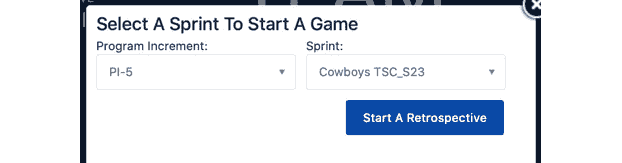
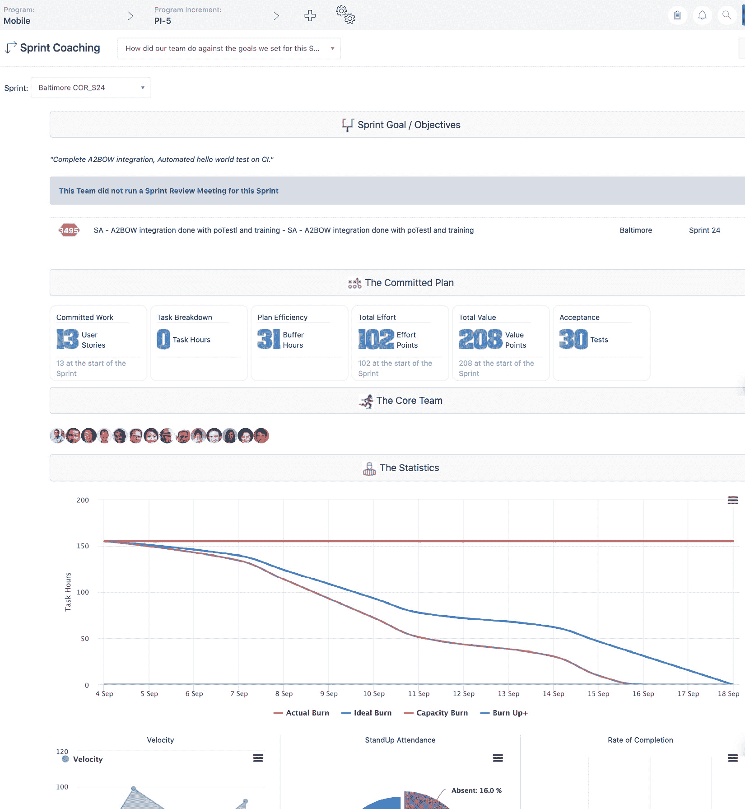
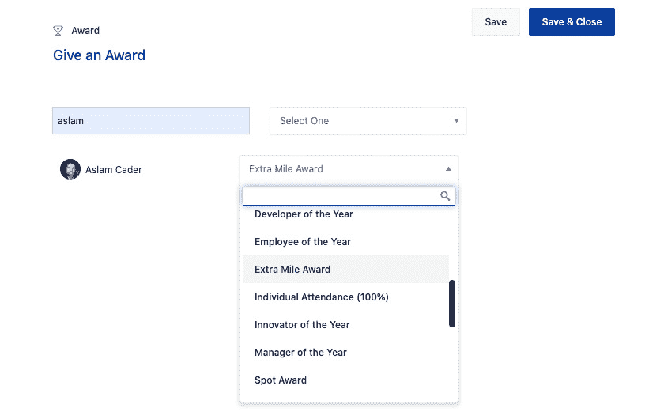

# *第四章*：团队挑战

本章我们将重点讨论团队级的敏捷，这是扩展到企业级的基础。现在，比以往任何时候都更值得投资于团队、他们的敏捷方法以及支持他们的工具。传统上，团队利用协同办公的力量进行有效的面对面沟通和协作（*敏捷宣言*，原则 6）。如今，面对全球大流行等各种约束，团队面临的最大挑战之一是如何在完全远程和地理上分散的情况下保持高绩效和持续改进。如今，工具已成为支持团队规划、协作和执行的必要条件。幸运的是，Atlassian 的产品套件在这一领域表现出色。虽然 Jira Software 是团队敏捷的核心工具，但 Jira Align 提供了额外的功能，帮助团队即使在地理分散的情况下也能进行规划和协作。你将学习到团队如何与 Jira Align 连接和互动。

本章我们将涵盖以下主题：

+   确保团队之间的连接

+   通过估算游戏进行故事大小估算

+   在远程规划期间加载冲刺

+   举行仪式和会议

+   审查冲刺并进行表扬

# 确保团队之间的连接

敏捷团队是将理论付诸实践的地方，是连接的知识型企业完成工作的地方。一个接一个的冲刺，他们精确地聚焦于交付小批量的高优先级用户故事和具有价值的可交付产品增量，直接面向真实客户。借助 Jira Software 作为他们的核心协作工作流引擎，他们能够连接到多种工具，包括用于版本控制的 Bitbucket 和用于持续集成与部署的 Bamboo。为了将工作置于上下文中，团队可以参考来自 Jira Align 推送的诸如项目增量和**为何？**按钮详情，而他们的工作项状态则与 Jira Align 同步，便于汇总报告。

使用 Jira Software 的团队成员被视为 Jira Align 的*集成用户*，这使得他们的数据能够与 Align 同步，并能够访问 Align 的团队级功能。为了确保团队成员能够从 Jira Software 流入，Jira Align 管理员必须首先进入**Jira 设置** | **Jira 配置**，并在**设置**部分将**允许 Jira 为属于某个问题的用户添加到团队**设置为**是**。然而，需要注意的是，这一设置可能会导致重复的用户记录，尤其是当一个集成用户之前已在 Jira Align 中设置过。为防止重复，Jira Software 中的用户电子邮件地址必须公开，以便 Jira Align 能够合并集成用户和原生用户账户。截止目前，安全问题阻止了这一操作的自动执行。

小贴士与技巧

必须在 Jira Software 中公开电子邮件地址，以便 Jira Align 能够合并重复的用户账户。

在 Atlassian Cloud 中，Jira Software 用户可以通过点击他们的个人资料图片，选择 **账户设置**，然后将他们的电子邮件地址设置为**任何人**可见。

在 Jira Server/Data Center 中，Jira 管理员可以通过进入 **Jira 管理** | **系统** | **常规配置**，然后将 **用户邮箱可见性** 设置为 **公开**，从而全局设置这一项。

Jira Align 管理员还可以通过进入 **Jira 设置** | **Jira 配置**，为集成用户设置默认系统角色，并为 **新用户的默认系统角色** 选择一个角色。我们建议选择 **团队负责人** 角色，以便比 **团队成员** 角色拥有稍多的权限，包括使用我们稍后讨论的团队会议模块的权限。

除了集成用户访问权限外，产品负责人和 Scrum Master 通常拥有完整的 Jira Align 许可，以便访问程序级功能，我们将在*第五章*《*程序规划挑战*》中讨论。我们建议这两个角色都拥有完整许可，因为他们通常与产品经理和 RTE 在程序级别紧密合作，我们发现，能够访问更高层次的功能使他们更容易调整方向，并填补程序与团队之间的任何空白。例如，产品负责人可能帮助产品经理将产品组合史诗拆解为特性，协调跨程序的依赖关系，并管理程序风险。Scrum Master 代表他们的团队参加跨团队会议，致力于消除障碍，协调与 RTE 的合作，升级问题和风险，并在程序级别对依赖关系进行对齐。

每当他们的团队被请求依赖关系时，产品负责人和 Scrum Master 会自动收到电子邮件。这确保即使请求团队没有事先与他们沟通，他们也能参与其中，这正是我们所期望的。请注意，这主要适用于功能依赖关系。故事依赖关系通常通过 Jira 中的任务链接功能进行处理。

现在团队级别的用户已连接，他们可以选择登录 Jira Align，使用 Jira 中不可用的团队工具。我们首先将探讨如何通过估算游戏来确定故事的规模。

# 通过估算游戏来确定故事的规模

估算是根据不完整和不确定的输入，预测交付工作项所需最现实努力的过程，这是开发团队面临的典型挑战。敏捷框架利用相对估算来缓解这一挑战。相对估算的力量在于准确性而非精确性。如果我们让你望向窗外并告诉我们街对面的两座大楼有多高，可能你无法提供精确的高度（以英尺或米为单位），但你可以准确地说出一座大楼是另一座大楼的两倍高。相对估算允许团队对用户故事做同样的事情。作为参考，他们从一个小的、简单的、易于理解的故事开始（通常是他们团队在一天内能够构建、测试并部署的内容），并将其称为 1 分故事。然后他们将其他故事相对于 1 分故事进行估算。例如，这些故事是 1 分故事的 2 倍、3 倍、5 倍还是 8 倍，涉及到的工作量、复杂度和不确定性？

团队通常使用修改后的斐波那契数列来对故事进行估算，因为它考虑了较大工作项固有的不确定性：1、2、3、5、8、13、20、40、100。可以把这些点数大小想象成不同的桶。如果一个故事无法放入某个大小的桶，就尝试下一个更大的桶。请注意，最佳实践是，团队在接受故事进入冲刺工作之前，将任何大于 8 或 13 的故事拆分成更小的故事。

现在是乐趣的开始。在他 2005 年的书《敏捷估算与规划》中，Mike Cohn 推广了一款名为计划扑克的游戏，其中每个团队成员都有一套带有斐波那契数列的卡片，用于投票估算故事的大小。在 SM 的主持下，PO 提供故事背景和说明，团队投票、讨论高低投票、揭示新信息，并重新投票，直到达成团队对每个故事的估算结果。

Jira Align 的估算游戏模块允许地理分散的团队远程进行计划扑克游戏。虽然这可以通过聊天功能来完成，但我们建议为这些关键对话开启语音会议桥接。还要注意，团队在不同的时间玩计划扑克。我们建议至少在冲刺计划前进行待办事项细化会议时进行游戏。原因是，如果等到冲刺计划时，PO 就没有足够的时间根据最新的故事估算调整优先级。

要访问估算游戏，请从导航菜单中选择**团队 | 管理** | **估算**。你也可以通过点击**团队会议**页面右上角的**估算**按钮来访问它们。这将带你进入以下界面：

图 4.1 – Jira Align 估算游戏

接下来，选择左侧的**工作量扑克**选项，以传统的计划扑克方式对故事进行大小估算。还有**工作量扑克**选项和简化列表格式选项，可以快速输入工作量和价值。

需要注意的是，故事详情面板中的故事点字段被标记为**LOE**（**工作量**）在 Jira Align 中。可能还有一个字段标记为**LOV**（**价值水平**）。由于在故事级别的价值评分并不是标准的敏捷实践，我们建议 Jira Align 管理员在**管理** | **设置** | **详情面板设置**中禁用 LOV 功能。LOV 功能早于当前在项目层级捕捉计划和实际业务价值的标准，我们将在*第五章*《项目规划挑战》中进行讨论。

游戏开始后，会显示红色的`Baltimore COR_S23`冲刺正在进行。在这里，你可以看到最近的游戏也会显示出来。

要开始游戏，选择程序增量、程序、团队和活跃的团队冲刺，以驱动待估算的故事集：

图 4.2 – Jira Align 估算游戏，冲刺选择

接下来，选择两种玩法之一：

+   **使用故事进行游戏**：选择此选项从任何冲刺中估算故事，包括未分配的待办事项。你需要选择一组故事来开始估算游戏。

+   **使用冲刺进行游戏**：选择此选项来估算已分配给你选定团队和冲刺的故事。这将选择与所选团队冲刺相关的所有适用故事。

开始计划扑克游戏的个人称为**庄家**。庄家拥有以下特殊的游戏权利：

+   庄家可以从左侧的列表中选择一个**故事**（见*图 4.3*）。选择一个故事后，庄家与团队讨论该故事。团队成员随后使用页面底部的扑克牌进行投票，或者点击**跳过**按钮。他们可以通过点击表格上方的相应按钮，查看假设、故事的详情、与故事相关的讨论或验收标准，具体如下截图所示：

图 4.3 – Jira Align 估算游戏，故事投票

庄家可以通过点击用户扑克牌上的**跳过**来跳过某位玩家的投票回合。如果某个团队成员的连接中断或由于任何原因被叫走，这可以让庄家保持游戏的顺利进行并保持游戏的继续。

一旦团队成员投票完成，庄家可以通过点击表格上的**保存投票！**按钮来保存投票，如下图所示：

图 4.4 – Jira Align 估算游戏，保存投票

如果没有达成共识，团队可以通过点击桌面上的**再玩一次**来重新投票。在第二轮或第三轮投票后，经销商可以根据与团队的讨论，点击卡片上正确数字的**最终**来设置估算为最终值。

在游戏过程中，经销商角色可以随时交给参加游戏的其他团队成员。要传递角色，请在右上角选择**传递经销商角色**按钮，然后在出现的参与者列表中选择团队成员的姓名。要退出游戏，请点击页面右上角的**退出**按钮。

现在我们的故事已经分配了大小，团队准备在远程计划中将它们加载到冲刺中。

# 在远程计划中加载冲刺

另一个有助于分散团队规划的好功能是冲刺视图中的待办看板。它为 Scrum 团队提供了一种简单的方式，根据他们的容量在 PI 规划团队分组期间加载冲刺。团队通常会在第一次分组时，根据他们的历史速度（在 Jira Align 或 Jira 软件中可见）和他们在 PI 期间的可用性，估算每个冲刺的容量，同时考虑假期、休假和培训等因素。然后，他们识别并调整可能需要实现程序的最高优先级功能的工作项，并开始将其加载到即将到来的冲刺中。

Jira Align 在冲刺视图中的待办看板允许将故事和任务从右侧的未分配待办中拖动到左侧的程序增量冲刺列中，跟踪每个冲刺的负载情况，以便与容量进行对比。首先，在配置栏中选择您的 PI，然后进入导航菜单，选择**团队** | **待办**。确保在工作区左上角的**查看**下拉菜单中选择了**故事待办**。接下来，点击工作区右上方的**看板**按钮，然后选择**冲刺视图**，如下图所示：

图 4.5 – Jira Align 待办看板按钮

在冲刺视图中，待办看板现在将在工作区中显示。接下来，点击**已选冲刺**框并添加您希望为 PI 计划的冲刺：

图 4.6 – Jira Align 待办看板，冲刺视图

在这里，我们选择了`PI-5`中的五个冲刺。接下来，点击工作区右上方的**未分配待办**按钮。这将打开一个右侧面板，显示尚未分配到冲刺中的故事，如下图所示：

图 4.7 – Jira Align 未分配的待办面板

现在，团队成员可以将故事从右侧的**未分配的待办事项**拖动到左侧项目增量的冲刺列中。列顶部显示已加载到冲刺中的故事点总数，并显示团队在过去五个冲刺中的平均速度。这为每个冲刺的负载提供了一个良好的视觉指示。 在*图 4.7*中，我们看到第一个冲刺列上有一条红色条形，表示该冲刺负载过重。一个**覆盖**按钮允许团队用他们根据可用性和其他因素推导出的容量数据覆盖平均速度：

图 4.8 – Jira Align 冲刺容量

让我们将**故事 8787**从未分配的待办事项中拖动，并将其添加到第二个冲刺列中。注意，加载的点数增加到了**80**，仍然在过去 5 个冲刺的**83**点平均速度范围内：

图 4.9 – Jira Align 待办事项 Kanban

通过这种方式，每个团队可以为项目增量加载冲刺。一旦冲刺加载完毕并且 PI 规划完成，团队就可以开始执行冲刺并进行仪式。

提示和技巧

在 Jira Align 中作为 Kanban 团队工作需要什么？高效且有纪律的敏捷团队通常使用 Kanban 提供稳定的工作项流，无论大小或时间框架。与速度相比，这些团队将周期时间和吞吐量作为他们的绩效衡量标准。

Jira Align 允许您的项目同时拥有 Scrum 和 Kanban 团队。虽然 Kanban 团队可能不会对其工作项进行大小估算（他们的度量标准是基于项目数量，而不考虑大小），但为了汇总报告的目的，建议为其工作项应用标准大小，例如每个项目 1 分。

要将 Kanban 团队的看板连接到 Jira Align，Jira Align 管理员必须在**管理** | **连接器** | **Jira 管理** | **Jira 看板**标签下添加 Kanban 看板。这将创建一个将 Jira Align 团队作为 Kanban 团队类型。

要为 Kanban 团队的工作项设置默认大小，请从导航菜单中选择**团队** | **管理** | **团队**，然后选择团队以打开其详细信息面板。接下来，启用**自动填充估算**切换按钮，并选择一个值以自动应用于创建并分配给团队的工作项。

尽管 Kanban 团队的工作项与冲刺没有直接关系，但它们仍然通过与其故事关联的特性与项目增量相连接。它们也可以在项目看板上为特定冲刺设置交付目标。通过这种方式，尽管它们在项目增量期间不会启动和结束冲刺，但它们仍然可以使用项目的共同冲刺节奏进行沟通。

# 进行仪式和会议

可预测性是敏捷框架（如 Scrum）寻求解决的一般交付挑战。冲刺的节奏使得规划和回顾等事件变得可预测，而同步则允许同时探索和整合多个视角。推动节奏和同步的关键事件被称为*仪式*，它们对敏捷团队的成功至关重要。

Jira Align 提供工具来促进并进行远程互动会议。只需进入导航菜单，选择**团队** | **团队会议**即可打开 Jira Align 会议工作区：

图 4.10 – Jira Align 会议

在这里，你可以管理团队会议并启动回顾和估算游戏。一旦你在配置栏中设置了项目和项目增量，就可以选择两种会议视图：

+   **列表**：在时间线上显示所有团队级冲刺会议。你还可以根据会议类型、日期范围或仅列出今天的会议进一步过滤列表视图。

+   **日历**：显示一个标准日历（按月、周或日查看），列出所有计划的团队级冲刺仪式和假期：

图 4.11 – Jira Align 会议日历

在前面的截图中，`Baltimore` 团队在 `Mobile` 项目中的 `PI-5` 会议显示在日历上。要切换到不同的团队，只需在工作区左上角的下拉菜单中选择另一个团队。处于日历视图时，你还可以点击工作区右上方的**日历矩阵**按钮，以显示整个项目的冲刺规划、回顾和回顾仪式的跟踪网格。

## 冲刺规划

冲刺规划仪式发生在每个冲刺的开始时。它是一个定时的、协作的会议，整个团队共同定义在冲刺中将交付的内容及如何实现。

首先，在列表或日历视图中找到冲刺规划会议，然后点击**开始会议**按钮。对于已经开始的会议，你可以点击**继续会议**按钮。

一旦点击**开始会议**，它将打开冲刺规划会议页面，如下图所示：

图 4.12 – Jira Align 冲刺规划会议

在冲刺规划会议工作区中可以找到多个详细信息。请注意，你需要在工作区中向下滚动以查看以下所有详细信息：

+   **团队**：团队成员按角色分组显示在工作区的左侧。你可以使用开启选项记录团队成员的出席情况。

+   **本次冲刺的目标**：你可以为本次冲刺添加一个目标。目标的完成情况将在冲刺回顾会议中跟踪和验证。

+   **规划笔记**：你可以添加与冲刺相关的额外规划笔记。

+   **冲刺规划步骤**：显示一个检查清单，帮助你遵循一系列步骤来成功举办冲刺规划会议。

+   **依赖项（已承诺但未交付）**：显示分配给团队和冲刺的依赖项及其到期时间。

+   **过去 5 个冲刺的团队速度**：当你向下滚动时，它会列出团队在过去 5 个冲刺中的速度和平均速度。

+   **冲刺范围**：当你向下滚动时，它会列出冲刺中加载的所有故事。

+   **工作量**：当你向下滚动时，会显示任务数、任务小时数、冲刺分配小时数以及未完成/过度情况。

+   **团队共识**：当你向下滚动时，你可以设置团队共识，以确保团队已同意冲刺目标、任务以及计划中的努力。

你可以通过点击工作区右上角的**结束会议**按钮来结束会议。系统会提示你结束会议，如果需要，你可以通过电子邮件发送冲刺计划会议记录。

现在冲刺已经规划好，我们来探索团队如何通过每日协作同步会议推动冲刺执行。

## 每日站会

每日站会，通常称为站立会议，提供了团队同步工作活动的每日机会。这个会议是为团队而设的，不是为了让经理获取状态。访客可以以开放精神旁听，这是 Scrum 的五个核心价值之一。会议有时间限制，建议时间为 15 分钟。每个团队成员简要更新昨天完成的工作、今天承诺完成的任务以及遇到的阻碍问题。Scrum Master 会记录阻碍事项，并有时安排一个快速的后续会议，深入探讨紧急问题。

要开始，首先在会议列表或日历视图中找到指定日期的每日站会，然后点击**开始会议**按钮。对于已经开始的会议，你可以点击**查看会议**按钮。对于已经结束的会议，将显示会议摘要。

一旦你点击**开始会议**，将打开每日站会页面，如下图所示：

图 4.13 – Jira Align 每日站会

在每日站会的工作区中可以看到多个细节。请注意，你需要在工作区中向下滚动才能查看以下所有内容：

+   **团队**：团队成员显示在工作区的左侧，按角色分组。点击每个团队成员，主持人可以在团队成员之间切换，以更新状态。会议页面根据所选团队成员显示信息。你可以点击工作区右上角的**缺席**按钮来记录团队成员的缺席。

+   **团队燃尽图**：点击**团队燃尽图**链接，查看冲刺状态和燃尽图。

+   **用户指标**：查看所选团队成员的已关闭缺陷总数、已完成的故事点进度以及已记录的任务时间总数。

+   **技术领域**：记录每个技术领域的时间（以小时计）。

+   **用户正在做什么**：显示分配给团队成员的故事。

+   **用户拥有的故事**：列出团队成员在当前冲刺中的故事。

+   **任何障碍**：添加在站会上识别的任何障碍。

点击**结束会议**按钮来结束每日站会。

现在，团队已经执行了冲刺，到了回顾他们交付内容的时候。

## 冲刺评审

冲刺评审是一个时间限制的会议，通常持续 1 到 4 小时，在每个冲刺结束时举行，由团队和利益相关者参加。会议期间，产品负责人（PO）或团队成员展示冲刺中完成的工作产品功能。焦点在于*他们交付了什么*，而不是*他们是如何交付的*。

要开始，请在会议列表或日历视图中找到冲刺评审会议，然后点击**开始会议**按钮。对于已开始的会议，可以点击**查看会议**按钮。

一旦点击**开始会议**，将会打开冲刺评审会议页面，如下方截图所示：

图 4.14 – Jira Align 冲刺评审会议

在冲刺评审会议工作区中有几个细节信息。请注意，你需要向下滚动以查看以下所有详细信息：

+   **团队**：团队成员按角色分组显示在工作区的左侧。在这里，你可以通过打开切换选项记录团队成员是否出席会议。

+   **计划与接受趋势**：展示多个冲刺中计划与接受的故事点。

+   **故事列表**：显示计划中的冲刺故事。你可以点击故事左侧的指向符号来展开它，并显示其任务。你可以更改故事的状态，例如，标记故事为完成并接受它。被接受的故事将显示为浅蓝色背景。

+   **团队燃尽图**：点击**团队燃尽图**链接查看冲刺状态和燃尽图。

+   **团队指标**：查看团队的指标，包括已关闭的缺陷总数、已完成的故事点进度和已记录的任务时间总数。

+   **未来冲刺预测**：Jira Align 的冲刺评审会议让你不仅仅展示冲刺中完成的交付内容，还能捕捉团队在结束一个冲刺并开始下一个冲刺时的整体情感。这被称为冲刺预测，类似于天气预报，如下方截图所示：

图 4.15 – Jira Align 冲刺评审，未来冲刺预测

+   **冲刺目标**：向下滚动，记录团队是否达成了冲刺目标。

+   **更新冲刺状态**：向下滚动，将冲刺状态更改为**已完成**。

+   **冲刺回顾清单**：向下滚动，显示一个清单，帮助您一步步进行冲刺回顾。

+   **附加备注**：向下滚动，添加附加备注，例如，追踪团队对迭代进展的情绪。

要结束冲刺回顾会议，请点击工作区右上角的**结束**按钮。

现在团队已经回顾了他们在冲刺中交付的*内容*，是时候反思他们*如何*交付这些内容，以便实现持续学习和改进。

## 回顾

作为冲刺节奏的一部分，团队会花时间反思如何提高效率和效果，公开分享调整和改进的想法（*敏捷宣言*，原则 12）。这一过程发生在有时间限制的冲刺回顾中，冲刺回顾在冲刺回顾会议后，下一次冲刺计划会议之前进行。在 Jira Align 中，回顾时间为 1 小时，如果需要更多时间，可以重新启动会议。在回顾过程中，团队通常会创建改进待办事项，以便在下一个冲刺中实施。

有多种回顾格式，我们建议变换使用它们，以保持团队的参与度和每个冲刺的新鲜创意。最基本的回顾格式是让团队讨论以下内容：

+   做得好的地方

+   可以改进的地方

+   他们承诺在下一个冲刺中改进的地方

首先，点击会议工作区右上角的**回顾**按钮。这将打开团队回顾仪表板，如下图所示：

图 4.16 – Jira Align 回顾仪表板

要开始冲刺回顾，点击**互动团队会议**链接，这将打开一个提示框，如下图所示：

图 4.17 – Jira Align 启动回顾

在这里，您将选择程序增量和冲刺，然后点击**开始回顾**按钮启动回顾室，回顾室如下面的截图所示。会议是通过一系列有时间限制的议程项目创建的，允许团队成员进行互动分享和协作：

图 4.18 – Jira Align 实时团队回顾

以下是回顾会议的步骤，如回顾室左侧所示：

1.  **召集团队**：一旦团队加入，开始回顾会议。

1.  **回顾前一个冲刺**：显示上一个冲刺回顾中的行动项目。主持人如果完成了这些事项，会标记为已完成。

1.  **投票情感**：团队投票评估他们对迭代的感受（包括团队合作、态度和改进情况）。评分范围为 1 到 5，其中 1 是最好，5 是最差。

1.  **投票结果**：团队投票评估他们的表现（包括质量、可预测性和交付情况）。评分范围为 1 到 5，其中 1 是最好，5 是最差。

1.  **讨论拆分**：讨论在迭代过程中拆分故事的原因（例如，由于低估了大小）以及如何避免拆分的想法。

1.  **收集反馈**：收集关于迭代中哪些方面做得好，哪些方面做得不好的反馈。

1.  **提出建议**：探索并分享团队可以在下一次迭代中实施的想法，以提高表现和整体团队满意度。

1.  **投票决定行动**：团队投票决定改进的行动项目。评分范围为 1 到 10，其中 10 是非常好，1 是差。

1.  **达成计划一致**：团队就下一次迭代改进的行动项目达成一致。至少选择 1 项，最多选择 3 项。

1.  **最终报告**：结束回顾会议并分享会议总结。

在会议结束时，Jira Align 会生成一个回顾总结报告。你可以通过点击回顾仪表板上的**回顾团队结果**链接访问此报告。你也可以通过点击**调查 + 团队回顾**链接访问团队回顾会议和调查结果。

现在我们已经学习了如何在 Jira Align 中主持会议，让我们探索如何衡量团队的交付和可预测性，以及如何庆祝团队和个人的卓越工作。

# 回顾迭代并给予表扬

在回顾团队表现时，一些关键的衡量指标包括团队的幸福感、承诺与交付情况，以及可预测性。尽管燃尽图和速率对于团队在 Jira 中的回顾很重要，但 Jira Align 迭代度量报告（M1）为 Scrum Master、RTE、团队负责人等提供了一种查看整个程序增量中每个迭代的度量的方法。这是一个在迭代规划或回顾会议中与团队一起审查的有用报告。它帮助团队看到他们如何朝着团队和项目目标推进。报告的重点是团队的交付和可预测性，而不是速率或团队间的比较。为了最大限度地发挥报告的作用，团队必须使用 Jira Align 会议模块中的仪式，正如前面所讨论的。

首先，进入导航栏，选择**团队** | **跟踪** | **迭代度量**（**M1**）。这将打开 M1 报告，如下图所示。通过点击工作区右上角的**额外配置**按钮，可以为单个团队生成报告，或者为整个项目的所有团队生成报告。通过点击右上角的**捕获**按钮，可以保存并将报告分享出去，如下图所示：

图 4.19 – Jira Align 冲刺指标 M1 报告

M1 报告显示了一系列指标网格。这里我们描述了每个指标、适用的颜色指示器以及填充网格的任何前提条件。如所述，一些指标网格允许你打开冲刺辅导报告，报告突出了承诺的冲刺与实际交付之间的差异，这是敏捷教练在其角色中非常有用的工具。请注意，你需要向下滚动才能看到所有网格。

+   **团队情绪**：使用天气报告的比喻（晴天、部分多云或多云）来显示每个冲刺期间团队的幸福感指标。前提条件：在冲刺回顾时捕捉到团队情绪。

+   **团队目标**：显示一个百分比指标（# 完成的目标 / # 每个冲刺计划的目标）。前提条件：团队在冲刺规划时设定了冲刺目标，并在冲刺回顾时对目标的完成情况进行了投票。绿色 = 100% 或以上，橙色 = 85% 到 99%，红色 = < 85%。点击任何颜色单元格以打开冲刺辅导报告。

+   **故事完成情况**：显示一个百分比指标（# 完成的故事 / # 每个冲刺计划的故事）。绿色 = 100% 或以上，橙色 = 85% 到 99%，红色 = < 85%。点击任何颜色单元格以打开冲刺辅导报告。

+   **计划与接受**：显示一个百分比指标（# 完成的点数 / # 每个冲刺计划的点数）。绿色 = 100% 或以上，橙色 = 85% 到 99%，红色 = < 85%。点击任何颜色单元格以打开冲刺辅导报告。

+   **拆分与丢弃**：显示所有拆分（当故事被拆分时，通常是因为冲刺结束时不完整）和丢弃（当故事被从冲刺中移到待办事项列表或下一个冲刺时）的总和。白色 = 0 次拆分或丢弃，橙色 = 1 次拆分或丢弃，红色 > 1 次拆分或丢弃。点击任何颜色单元格以打开冲刺辅导报告。

+   **团队缺陷**：显示所有缺陷的总和，不管缺陷的状态如何。白色 = 0 个缺陷，橙色 = 1 个缺陷，红色 > 1 个缺陷。点击任何颜色单元格以打开冲刺辅导报告。

+   **目标状态**：指示冲刺目标是否达成。前提条件：团队在冲刺规划时定义了冲刺目标，并在冲刺回顾时投票确认目标是否达成。冲刺目标本身显示在目标状态指标网格下方的一个网格中。

+   **冲刺完成情况**：指示冲刺是否被标记为完成。前提条件：团队在冲刺回顾时标记冲刺为完成。

现在我们知道了 M1 报告网格中捕获的数据，让我们来看看冲刺辅导报告（也称为冲刺总结报告），可以通过点击许多网格中的单元格来访问，如上所述。该报告对 Scrum Master、产品负责人和团队成员评估冲刺整体目标是否达成非常有用。它详细描述了冲刺开始时的团队计划，并与最终结果进行对比，在冲刺回顾时可能会帮助与利益相关者一起回顾。点击 M1 报告中的彩色指示器单元格，或前往导航菜单并选择 **团队 | 跟踪 | 冲刺辅导** 来打开报告，见下图。

图 4.20 – Jira Align 冲刺辅导报告

这里显示了以下信息的部分。请注意，你需要向下滚动以查看所有部分。

+   **冲刺目标/目标**：显示冲刺目标和目标。

+   **承诺计划**：详细描述了冲刺计划期间做出的承诺，包括用户故事数量、初始开发和 QA 任务小时数，以及努力点和价值点。

+   **核心团队**：列出了团队成员。点击或悬停在照片上查看团队成员的姓名和角色。

+   **统计数据****:**

    **燃尽图** 显示在冲刺中任务小时数的消耗情况，与理想值进行对比。如果冲刺尚未完成，则显示预估剩余消耗。

    **速度** 图显示了团队在过去几个冲刺中的速度。

    **站会** **出勤情况** 显示在 Jira Align 中可用的交互式会议的出席情况。

    **完成率** 显示已开发完成的用户故事（橙色）和已测试完成的用户故事（蓝色）。

    **冲刺故事进度**：点击 **显示详细信息** 查看整体冲刺故事进度。你可以看到进度条、故事健康状态和验收标准。这里还显示了价值点、努力点和总计消耗的小时数。

+   **最终得分**：显示交付的内容，包括用户故事、质量指标和未消耗的任务小时数。

+   **天气预报**：显示团队对未来冲刺的感受。天气预测通过在 Jira Align 中使用交互式冲刺回顾会议来设置。

报告描绘了冲刺的整体情况：承诺是否完成？交付了什么？团队的速度如何？团队情绪趋势如何？通过手头的各种图表和图形，团队可以在下一个冲刺中做出调整。例如，你可能需要调整未来冲刺中任务点数/任务小时数，或增加资源以提高团队速度。

提示与技巧

团队通常会参考 Jira Software 中的速度图，这张图展示了多个冲刺中的实际速度与承诺速度的对比。为了获得另一种显示速度差异（当前冲刺的速度与前一个冲刺的速度之比）的可视化效果，请尝试使用 Jira Align 的速度差异报告，方法是前往导航菜单，点击搜索图标（放大镜），然后搜索“`Velocity Variance`”。

现在我们已经回顾了团队在冲刺中的表现，让我们来表彰那些突出的集体和个人贡献。团队协作和协同效应的一个重要部分是表彰个人和团队的成就，如公司周年庆和绩效奖励。这是通过“Shout Out”模块完成的。要访问该模块，请前往导航菜单并选择**团队** | **管理** | **表扬**。

在工作区的左侧，如下图所示，您将看到三个部分来查看奖项：**表扬**按奖项名称列出奖项，**人员**按获奖者列出奖项，**年份**按年份列出奖项。在工作区的顶部，有三个按钮用于显示奖项：**动态**按钮显示最新的奖项，**我的表扬**显示您获得的所有奖项，**排行榜**显示按获得积分排序的获奖者名人堂。您可以通过点击左上角的**表扬奖项列表**链接查看所有可用奖项：

图 4.21 – Jira Align 表扬排行榜

让我们奖励一位在交付高质量可发布的产品增量方面付出 extra mile 的队友。为此，请点击工作区右上角的**发放**按钮，右侧面板将打开，您可以选择个人或团队成员。接下来，选择每个个人的奖项。这里我们选择了**Extra Mile Award**（超越奖）：

图 4.22 – Jira Align 发放奖项

奖项将应用到团队成员的个人资料中。要查看，请前往**用户菜单** | **编辑个人资料** | **您的奖项**。团队成员还会收到如下的提醒通知：

图 4.23 – Jira Align 新奖项通知

您可以通过点击**创建**按钮来创建新奖项，打开下图所示的窗口：

图 4.24 – Jira Align 新奖项创建

在这里，您需要提供以下详细信息：

+   `贡献达人`。

+   `最佳团队贡献者`。

+   **价值**：为奖项添加一个积分值。这些积分将用于排行榜。

+   **图片**：上传一张图片或添加徽章以展示奖项。

表扬有助于创造一种游戏化的氛围，激励团队争取更好的表现。正如*图 1.1*所示，*通过将战略与执行相连接来推动转型的对齐*，表扬进一步塑造了团队文化，并有助于建立一个持续学习的组织。

# 概要

本章中，我们讨论了当今世界中地理分散团队面临的常见挑战，以及 Jira Align 如何通过协作工具帮助保持团队之间的联系。我们审视了促进团队敏捷实践的一些关键功能，如远程规划扑克、Sprint 规划及其他仪式。接着，我们探索了这些仪式如何推动 Sprint 执行以及如何生成帮助指导交付和可预测性的度量指标。最后，我们学习了如何在 Jira Align 中表彰个人的贡献，并通过表扬提升团队士气。

在接下来的两章中，我们将从团队转向团队中的团队。在这里，我们将展开讨论在这一更高层级面临的常见挑战，以及 Jira Align 如何通过实现项目层级的有效敏捷规划和执行来解决这些问题。

# 问题

1.  在 Jira Align 中，如何称呼同步的 Jira 软件用户？

1.  Jira Align 中的两种估算游戏是什么？

1.  在 Sprint 指标（M1）报告中生成的关键度量是什么？

1.  在 Jira Align 中，您可以促进哪些敏捷仪式？

1.  如何在 Jira Align 中奖励团队成员的杰出工作？

# 进一步阅读

+   *Jira 软件基础*，作者：Patrick Li（Packt，2018 年）

+   *专业 ScrumMaster 手册*，作者：Stacia Viscardi（Packt，2013 年）
