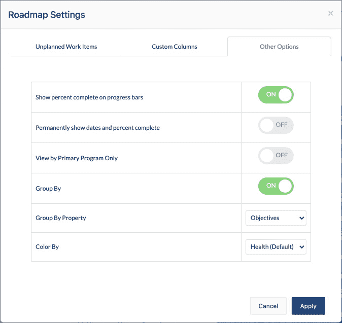
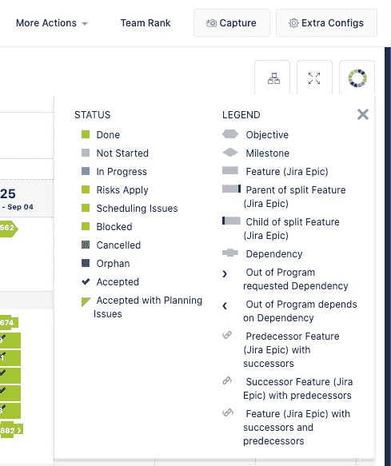

# *第五章*：项目规划挑战

本章重点讨论组织在项目级规划时面临的常见问题，这是敏捷规模化和 Jira Align 的*关键点*。敏捷框架，如 Scrum，非常适用于单一产品开发团队或少数几个通过 Scrum of Scrums 会议定期同步的团队。但如果你有 5 到 12 个敏捷团队在每个业务季度共同工作于一组功能呢？以这种方式交付的团队群体通常被称为*项目*。那么，如果你有多个项目呢？协调团队的工作已经提升为协调团队中的团队。这时，敏捷扩展框架和支持这些框架的工具就派上用场了。不管你选择哪种扩展框架，Jira Align 都能帮助解决这一协调挑战。

当团队在冲刺中交付故事时，项目在每个业务季度交付功能。功能是介于投资组合史诗和故事之间的中等大小的工作项。虽然故事是价值交付的基本构建块，但功能的规模适合在路线图和项目板上展示，并与 Jira Align 中的发布车辆和产品相关联。本章将为你准备下一章的内容，我们将在下一章讨论项目级执行。

本章将涵盖以下主题：

+   构建产品路线图

+   作为一个项目进行价值交付的规划

+   围绕价值组织以减少依赖关系

+   可视化项目速度以便规划和预测

本章探讨的关键构思是项目级规划，即以协调的团队组交付业务价值的规划。在本章结束时，你将了解如何构建工作项和目标的实时产品路线图，如何利用项目板进行季度规划，如何捕捉计划和交付的价值，如何衡量价值交付的可预测性，如何管理风险和依赖关系，以及如何衡量项目速度以便更好的规划。

# 构建产品路线图

我们从 Jira Align 的实时产品路线图开始讨论项目级规划，这些路线图可以从长远的理想性产品规划路线图到更加明确的下一 PI 的功能级路线图不等。与传统的静态路线图不同，这些路线图与实际工作项相连接，提供实时洞察和状态。

作为产品经理的一个重要工具，路线图提供了关键里程碑和交付目标的时间线，用于传达产品方向并对齐利益相关者的期望。路线图可以增强组织与客户和供应商之间的关系，促进透明度和协作规划，推动未来的价值交付。

要查看路线图，首先在配置栏中设置您的上下文，然后进入导航菜单并选择**程序** | **管理** | **路线图**。Jira Align 路线图模块有三种视图：**工作**、**程序增量**和**发布车辆**。这些视图可以从工作区左上角的视图下拉菜单中选择，如下图所示：

图 5.1 – Jira Align 路线图视图

我们将首先探讨工作视图的功能，然后学习如何配置**SAFe**建议的三种特定工作视图路线图。在下一章中，我们将探讨程序增量和发布车辆视图。

## 工作视图路线图

工作视图路线图是一个时间轴，显示计划和/或未计划的工作项列表。时间轴有两种选项：**按程序增量的冲刺**和**按季度的月份**。点击立方体按钮选择前者，或点击日历按钮选择后者：

图 5.2 – Jira Align 路线图时间轴选项

显示的工作项包括功能、组合史诗或主题。可以通过选择**按组合史诗的功能**或**按主题的组合史诗**从上下文下拉菜单中将工作项汇总到其父项下。在以下截图中，我们选择了**按组合史诗的功能**，并将时间轴设置为显示**按程序增量的冲刺**：

图 5.3 – Jira Align 路线图工作视图

请注意，功能行显示在组合史诗行下方。每个组合史诗行最左侧的向下箭头符号表示该行已展开以显示子工作项。点击箭头符号可以折叠子行，仅显示组合史诗。

接下来，我们注意到，工作项列表可以按最早或最晚的开始日期、最佳或最差的健康状态，或程序排名进行排序。要选择这些选项之一，请点击时间轴选项左侧的下拉菜单，查看以下截图中显示的列表：

图 5.4 – Jira Align 路线图按选项排序

只需点击其中一个选项，即可按该选项排序工作项。

我们接下来将探讨的选项是如何包含未计划的工作项，这些工作项没有与 PI 相关联。默认情况下，路线图显示所有分配给 PI 的计划工作项。要将未计划的工作项与计划工作项一起显示，请点击位于工作区中央右侧的**查看配置**按钮，打开如下所示的窗口：

图 5.5 – Jira Align 路线图未计划工作项

在**未计划工作项**标签页中，点击**计划与未计划项**按钮，然后点击**应用**按钮。请注意，未计划的工作项定义上不会在时间线上显示进度条。你可以通过点击并拖动时间线来为未计划工作项设置目标日期，从而为该项目设置进度条。

接下来，通过点击**视图配置**按钮，再点击**自定义列**标签，我们可以向路线图中添加最多六列。显示额外的列可以帮助更快地做出决策，无需深入查看某个项目。建议先使用默认设置，然后根据需要添加或删除列。例如，**故事点**默认列显示所有故事的 LOE 点数总和，这些点数被汇总到父级工作项下。选择你希望添加到路线图的额外列的复选框，然后点击**应用**按钮，如下图所示：

图 5.6 – Jira Align 路线图自定义列

接下来，通过点击**其他选项**标签，我们可以为路线图添加更多的显示选项。在这里，你会找到一些切换按钮，允许你在进度条上显示完成百分比，并根据所有者、父级、主题、业务驱动因素、主要程序、产品、状态、目标、团队和战略驱动因素对工作项进行分组。以下是相关截图：

图 5.7 – Jira Align 路线图其他选项

请注意，**按组**选项仅适用于单层级路线图，不适用于像**按投资组合史诗特性**这样的双层级路线图，如*图 5.3*所示。它是根据关联目标或**OKRs**（**目标与关键结果**）对特性或投资组合史诗进行分组的常用选项。最后，还有一个选项可以根据健康状况、状态、所有者、产品、主要程序、父级、主题或业务驱动因素为路线图项目上色。

现在我们已经修改了路线图的列和外观，接下来让我们进一步优化在路线图上显示的项目范围。为此，请点击工作区右上角的**筛选**按钮，以打开下图所示的窗口：

图 5.8 – Jira Align 路线图筛选器

在这里，我们可以选择添加的属性，并指定值以细化路线图的范围。例如，我们可以将路线图的范围缩小到特定产品和产品所有者。要清除筛选器，请点击窗口左下角的**清除筛选器**链接。

Jira Align 通过将范围设置为特定客户，使得创建以客户为中心的路线图变得简单。为此，请点击位于工作区右上角的**简报**按钮，如下图所示：

图 5.9 – Jira Align 路线图简报

接下来，从列表中选择一个客户来生成路线图。这是一种快速简便的方式，可以生成特定客户的功能交付路线图视图，其中包括实时工作项状态。

提示与技巧

使用**Briefing**选项的前提是，客户必须在工作项详细面板的客户字段中与功能和/或投资组合史诗相关联。

请注意，客户列表管理在**管理** | **设置** | **客户**下。在那里，Jira Align 管理员可以通过点击**添加客户**按钮，输入客户名称，然后点击**保存并关闭**按钮来添加新客户。

现在我们已经学会了如何设置路线图的范围和显示选项，接下来重要的是要讨论一个事实：工作视图路线图本质上是一个*沙箱*，您可以在其中安全地进行调整，而无需担心更改底层数据。这使您能够通过点击工作区右上角的**同步**按钮，回顾并提交您希望反映到底层数据中的更改。这将打开一个窗口，显示所做的任何路线图更改，如下图所示：

图 5.10 – Jira Align 同步路线图更改

在这里，您可以查看对您的路线图数据所做的更改列表，然后点击**同步**按钮将更改永久推送到底层对象。如果有您希望删除的更改，请在同步更改之前点击特定对象右侧的**X**。**健康**复选框使您能够同步您在进度条上设置的对象健康状态。**程序增量/锚定日期**单选按钮允许您同步 PI 和冲刺数据，而**目标开始/目标完成日期**单选按钮允许您同步这些日期。这些同步选项将把相应的值填充到数据库中的实际对象，从而根据指定的参数设置状态。

Jira Align 并不要求您将更改推送到数据库中的底层对象。实际上，您可以创建各种*假设*分析路线图并将其保存以供考虑。为此，请创建可能的路线图更改的独立实例，您可以使用唯一的 URL 将其保存并与其他 Jira Align 用户共享。这使得产品经理和产品负责人能够尝试不同的场景和路线图版本。只需选择工作区右上角的**查看我的实例**菜单，然后点击**创建新实例**选项，如下图所示：

图 5.11 – Jira Align 路线图实例

接下来，为您的路线图的新分离实例添加一个有意义的快照名称，然后点击**创建实例**按钮。您可以通过点击**查看我的实例**选项访问已保存的分离实例，如上图所示。

此时，您需要考虑其他一些重要的属性。也就是说，您可以通过点击工作区右上角附近的**里程碑**按钮，在您的路线图上显示关键事件，如下图所示：

图 5.12 – Jira Align 路线图里程碑按钮

这将打开下图所示的**工作视图里程碑**窗口：

图 5.13 – Jira Align 路线图里程碑设置

在这里，您可以滑动**固定日期里程碑**开关，以显示与投资组合史诗相关的关键日期。请注意，这些日期会被添加到投资组合史诗详细面板的**时间/技能**标签中。这些日期通过颜色编码，并在进度条上使用星形图标显示，如下图所示：**开始/启动**显示为青色，**投资组合需求**显示为紫色，**目标完成**显示为黄色：

图 5.14 – Jira Align 路线图里程碑

接下来，您可以滑动**目标里程碑**开关，显示功能和投资组合史诗的目标日期。请注意，您必须点击每个列出目标旁边的**查看**按钮，才能在您的路线图上显示目标里程碑。任何缺少目标完成日期的目标将在此处显示为不完整。点击**应用**按钮后，选定的目标里程碑将在路线图时间线上显示为旗标。可以在*图 5.16*中看到这些内容。

还有一些其他重要的路线图方面需要指出：

+   时间线上的虚线表示今天的日期。

+   与每个功能相关联的故事数量显示在进度条上。故事数量位置位于与其计划交付冲刺相对应的列中，使您能够监控每个功能的故事流动。

+   如果您将鼠标悬停在故事计数上，将弹出窗口显示故事的 ID 和名称。点击 ID 或名称即可打开故事的详细面板。

一旦以这种方式收集了信息，您可以通过右键单击功能的进度条并选择下图所示的选项来设置功能的健康状况：

图 5.15 – Jira Align 路线图对象健康

请注意，工作项的健康状态是主观的，并且是手动设置的。现在你已更新了路线图，可以将其导出并与没有 Jira Align 访问权限的外部利益相关者共享。只需点击工作区右上角的 **导出** 按钮，并选择 **PNG** 图像或 **CSV** 文件。此时，我们准备好学习如何创建由 **SAFe** 定义的路线图了。

**SAFe** 定义了三种类型的路线图：**短期 PI 路线图**、**长期解决方案路线图**和 **投资组合路线图**。我们将按此顺序进行探讨。

### 短期 PI 路线图

短期 PI 路线图显示了一个程序 ART 或解决方案列车在计划和即将到来的 PI 中的承诺。如下图所示，短期 PI 路线图提供了对下两到三个 PI 固定日期和目标里程碑的预估：

图 5.16 – Jira Align 短期 PI 路线图

要创建短期 PI 路线图，我们将使用已经学到的工作视图路线图并按以下方式配置：

+   `Mobile` 程序及以下三个 PI：`PI-5`、`PI-6` 和 `PI-7`。

+   **设置路线图对象上下文**：选择 **特性** 或 **按投资组合史诗显示特性** 以展示工作项。

+   **设置对象顺序**：选择 **程序排名：升序** 或 **日期：最早开始 - 最晚开始** 以相应地排序工作项。

+   **设置时间尺度视图**：点击立方体符号按钮将时间尺度设置为 **按程序增量显示冲刺**。

+   **设置视图配置**：点击 **视图配置** 按钮，向路线图中添加默认或其他列。

+   **设置里程碑**：点击 **里程碑** 按钮，切换打开 **固定日期** 和 **目标里程碑** 选项，并通过点击 **查看** 按钮选择要显示在路线图上的目标。

现在我们已经知道如何配置短期 PI 路线图，接下来让我们看看如何配置长期解决方案路线图。

### 长期解决方案路线图

长期解决方案路线图显示了解决方案列车在多个程序增量和通常是多个年度中做出的承诺。如下面的截图所示，它展示了在时间推移过程中实现解决方案愿景所需的关键固定日期和目标里程碑：

图 5.17 – Jira Align 长期解决方案路线图

要创建长期解决方案路线图，请按以下方式配置工作视图路线图：

+   `Digital Services` 投资组合及以下 PI：`PI-4`、`PI-5`、`PI-6` 和 `PI-7`。

+   **设置路线图对象上下文**：选择 **按投资组合史诗显示特性** 以展示这些工作项。

+   **设置对象顺序**：选择 **日期：最早开始 - 最晚开始** 以相应地排序工作项。

+   **设置时间尺度视图**：点击日历按钮将时间尺度设置为 **按季度显示月份**。

+   **设置视图配置**：点击**视图配置**按钮，向路线图中添加默认列。此外，你还可以添加**项目增量**列，以查看工作项的 PI（项目增量），以及**阻塞**列，以识别任何被阻塞的工作项。请注意，如果子特性被阻塞，即其详细面板上的**阻塞**字段设置为**是**，则父级投资组合史诗也会被阻塞。

+   **设置里程碑**：点击**里程碑**按钮，打开**固定日期**和**目标里程碑**选项，通过点击**查看**按钮选择要在路线图上显示的目标。

现在我们已经配置了一个长期解决方案路线图，接下来我们准备探索由**SAFe**推荐的第三个也是最后一个路线图——投资组合路线图。

### 投资组合路线图

投资组合路线图显示了跨多个 PI，通常还包括多个年度的投资组合承诺。如下图所示，它显示了跨多个价值流实现投资组合愿景所需的关键固定日期和目标里程碑：

图 5.18 – Jira Align 投资组合路线图

要创建投资组合路线图，请按如下方式配置工作视图路线图：

+   `数字服务`投资组合和以下 PI：`PI-5`、`PI-6`、`PI-7`。

+   **设置路线图对象上下文**：选择**投资组合史诗**以显示这些工作项。

+   **设置时间尺度视图**：点击日历按钮，将时间尺度设置为按**季度显示月份**。

+   **设置视图配置**：点击**视图配置**按钮，向路线图中添加列。例如，添加**主题**列以显示关联的父主题工作项，添加**状态**列以显示投资组合史诗的状态，并可选地添加**所有者**列以显示史诗所有者。

+   **设置分组属性**：前往**视图配置** | **其他选项**，打开**按分组**选项，并选择**战略驱动因素**作为**按分组**的属性。

+   **设置里程碑**：点击**里程碑**按钮，打开**固定日期**和**目标里程碑**选项，通过点击**查看**按钮选择要在路线图上显示的目标。

请注意，投资组合史诗按其战略驱动因素进行分组，如*图 5.18*中的**扩展**、**创新**和**持续**。投资组合路线图提供了跨多个业务季度的史诗交付的战略性和长期方向视图。虽然这是一个有价值的长期视图，但它必须与企业敏捷性和灵活性的目标平衡，以便迅速响应市场节奏和事件。因此，产品经理、史诗所有者和高层管理人员应定期会面，根据持续学习和市场变化更新投资组合路线图。

现在我们已经学习了如何构建工作项路线图，包括**SAFe**推荐的那些，让我们来研究如何量化这些工作项为客户交付的计划价值和实际价值。

# 作为程序的价值交付规划

作为一个协调团队的最佳实践，交付业务价值是捕捉程序级别的计划和实际业务价值。程序通常会从产品待办事项中选择十几个最高优先级的功能，以交付每个业务季度。然后，团队会将功能拆分为故事，将这些故事加载到冲刺中，并确定完成功能的目标冲刺。

团队还会注意到、讨论并达成一致关于依赖关系，例如，当一个团队需要交付由另一个团队主要开发的功能的故事时。请注意，虽然程序本身拥有这些功能，但通常会有一个特定团队负责主导并成为功能交付的主要团队。Jira Align 支持这些团队间的标准依赖关系以及外部依赖关系，例如，当一个功能依赖于外部供应商交付的组件时。

每个团队随后决定其季度程序增量的目标，理想情况下，这些目标是**SMART**的：**具体的**，**可衡量的**，**可实现的**，**现实的**，和**有时间限制的**。

Jira Align 帮助促进的季度规划的几个关键输出将在这里讨论。我们将讨论程序板，作为程序级交付的核心，然后是目标、程序可预测性、风险和依赖关系。

## 程序板

程序板作为一个单一的真实数据来源，表示程序在整个 PI 期间承诺交付的内容。它是一个动态文档，对规划和执行都至关重要。它有 PI 中的冲刺列和程序中团队的行。它显示了关键信息，例如功能和目标的完成目标时间，以及团队之间的依赖关系。要访问程序板，请在导航菜单中选择`Mobile`程序和`PI-5`作为我们的上下文：

图 5.19 – Jira Align 程序板

请注意，程序板如何可视化功能的目标交付冲刺，以矩形显示，以及目标，以六边形显示。与依赖关系用红线标记的物理板不同，Jira Align 通过在团队的游泳道中显示蝴蝶结符号，表示依赖关系，表明其他团队（包括其他 ART 的团队）所依赖的内容。

颜色是整个 PI 期间用于跟踪状态的重要指示符。例如，红色表示某个项目被阻塞，橙色表示调度问题，如报告图例所示。要访问图例，请点击工作区右上角附近的**色轮**按钮，如下图所示：

图 5.20 – Jira Align 程序看板图例

虽然颜色可以快速直观地展示状态，但你可以将鼠标悬停在看板上的某个项目上，以查看屏幕左下角显示的更多详情。如果适用，任何规划问题将通过出现红色或橙色的色块来指示，如下图所示：

图 5.21 – Jira Align 程序看板项目详情

你可以点击看板上的任何项目，打开一个快速查看面板，查看该项目的关键信息，例如其子工作项和相关风险。在快速查看中点击这些项目的 ID，会打开它们的详情面板，允许你进一步了解更多信息。要查看看板上项目的完整详情，可以点击其 ID 和标题，在快速查看面板的顶部打开详细信息面板，获取完整信息。

你可以通过点击颜色轮左侧第二个按钮，即**卡片树**按钮，来更改程序看板的视图。这将展示三种不同级别详细信息的项目显示选项：

+   **普通视图**：项目以包含 ID、标题和报告图例符号的卡片形式显示在看板上，符号包括矩形、六边形和蝴蝶结。

+   **小视图**：项目以报告图例符号的形状和 ID 的形式显示在看板上。这是大多数组织使用的最受欢迎的视图。

+   **热图视图**：项目以缩小版的报告图例符号和 ID 的形式显示在看板上。

你可以通过点击颜色轮旁边的**展开**按钮将程序看板切换为全屏模式。全屏演示视图会隐藏配置栏和导航菜单，从而最大化在大屏幕上展示的信息，适用于规划时使用。

提示和技巧

在规划活动中展示程序看板时，我们建议使用基于浏览器的插件或扩展，以每 30 秒自动刷新一次看板。这可以确保展示最新的信息。你选择的插件或扩展可能会根据操作系统和/或网页浏览器有所不同。你可以与你的 Atlassian 解决方案合作伙伴联系，获取推荐。

下一组显示选项可以通过点击工作区右上角的**附加配置**按钮找到。这将展示一系列选项切换，如下图所示：

图 5.22 – Jira Align 程序看板附加配置

在这里，你可以打开切换开关来显示特定类型的功能、未分配的功能、目标、依赖关系，并进一步按选定的主题、投资组合史诗、战略驱动类别和/或客户筛选程序板。设置好切换开关后，点击**应用**按钮，查看配置的选项在程序板上显示出来。

在规划过程中，当产品负责人为功能编写故事时，这些功能会进入其团队的泳道。然而，没有关联故事的功能仍然可以显示在团队的泳道中。在程序板上操作时，点击工作区右上角的**更多操作**按钮，选择**孤儿**选项，即可打开以下截图所示的窗口。请注意，Jira Align 使用**孤儿**这个术语，指的是没有子项的父项（如这里的情况）以及没有父项的子项：

图 5.23 – Jira Align 程序孤儿

接下来，选择一个或多个团队与某个特定功能关联，该功能将以灰色显示在程序板上冲刺列左侧的未分配列中。在前面的截图中，我们选择了`Baltimore`团队与功能 ID `3971` 关联。以这种方式关联孤儿功能，即使故事尚未编写，也可以让团队为该功能确定一个交付冲刺。这为提前规划提供了一个窗口，让团队在编写故事时可以开始思考相互依赖关系。

提示和技巧

如果在**更多操作**菜单下没有**孤儿**选项，请确保在**额外配置**菜单中关闭**未分配的功能**选项。请注意，**未分配的功能**选项默认是关闭的，如*图 5.22*所示。

现在我们已经看到如何在程序板上显示孤儿功能，接下来让我们来看如何生成一份显示所有功能计划编辑历史的报告。只需点击**更多操作**按钮，然后选择**历史**选项，即可打开以下截图所示的报告：

图 5.24 – Jira Align 程序板历史

当某个功能的计划发生修改时，报告会显示修改该计划的用户、开始的冲刺、结束的冲刺，以及修改发生的时间戳。任何未计划的功能将显示为空的开始和结束冲刺。你可以通过点击蓝色加号**+**图标来筛选报告，显示所有可用的筛选器，包括程序、日期范围、程序增量、投资组合史诗和标签。

程序通常有最多 12 支团队。你可以通过点击工作区右上角的**团队排名**按钮来更改团队在程序板上的显示顺序，如下图所示：

图 5.25 – Jira Align 程序团队排名

在这里，你可以选择一个程序来列出其团队，并通过拖放调整团队在看板上的显示顺序。最后，你可以通过点击**Capture**按钮导出程序看板并生成图像。

对于习惯于使用物理看板的人来说，Jira Align 程序看板可能需要一些适应，尤其是那些用粘性便签和绳子让功能和依赖关系变得具象的看板。然而，尤其是大型公司，早已在亲自进行 PI 规划时使用 Jira Align 程序看板。一个原因是它节省了将物理看板数据输入工具的时间。另一个原因是 Jira Align 的依赖功能强制执行团队之间的合同，这些合同是有记录的，可追踪到解决，并提供可作为管理回顾和问题解决会议输入的可视化。例如，如果一个团队有大量的依赖关系，可能需要重新分配团队成员以减少知识孤岛。依赖关系非常重要，以至于我们将在本章后面专门讨论它们。

## 目标

季度规划的另一个关键输出是每个团队的几个已达成一致的 PI 目标。这些目标通常与一个或多个功能相关联，因为它们代表了交付这些功能后所实现的业务成果。如果你遵循**SAFe**，PI 目标将受到特别关注。业务负责人，即季度增量中所交付内容的利益相关者，会根据 1 到 10 的评分标准为团队的 PI 目标分配业务价值分数，其中 10 代表最高价值。

发布列车工程师或程序级 Scrum Master 然后将团队目标总结为适合管理沟通格式的程序 PI 目标。根据**SAFe**，PI 目标有助于将程序的重点从输出转向成果，从交付工作转向交付价值。如果不遵循**SAFe**，你可以将关键结果与这些目标关联，从而将它们转化为程序的季度 OKR。

在 Jira Align 中，你可以在团队、程序、解决方案和投资组合级别添加目标。这里，我们来看看 RTE 如何查看 PI 的团队目标，并为管理报告目的创建更高级别的程序目标。要查看程序的 PI 团队目标，请在配置栏中设置程序和 PI，然后进入导航菜单并选择**Team** | **Manage** | **Team Objectives**。

要查看计划和实际的业务价值，请点击`Mobile`程序的`PI-5`团队目标，按计划价值排序：

图 5.26 – Jira Align 团队 PI 目标

要创建一个目标，点击工作区右上角的**Add Objective**按钮，并输入以下详细信息：

+   **层级**: 选择目标的层级：**团队**、**项目**、**解决方案** 或 **投资组合**。

+   **名称**: 添加一个有意义的目标名称。

+   **描述**: 添加更多细节来描述目标。

+   **项目**: 选择一个适用的项目。

+   **项目增量**: 选择一个项目增量。

+   **负责人**: 选择一个目标负责人。

+   **主要团队**: 从项目中选择一个主要团队，该团队将负责该目标。

+   **目标同步冲刺**: 选择目标的交付冲刺。

+   **查找父目标**: 如果适用，选择一个父目标。例如，在创建团队目标时，选择一个项目目标作为父目标。

+   **日期**: 如果适用，选择以下日期：**投资组合请求**、**开始/启动** 和 **目标完成**。

+   **状态**: 为目标选择一个状态：**未开始**、**进行中**、**推迟**、**取消**、**错过** 或 **完成**。

+   **健康状况**: 选择一个颜色来表示目标的健康状况：**红色**、**橙色**、**绿色**、**黄色**、**灰色** 或 **蓝色**。

+   **阻塞**: 选择 **否** 或 **是** 来指示该目标是否被阻塞。

+   **类别**: 如果适用，选择 **关键路径** 或 **拓展目标**。请注意，在 **SAFe** 中，由于未知或风险太多，拓展目标是计划的，但团队并未承诺实现。

+   **类型**: 如果适用，选择一个类型：**功能完成者**、**增量交付**、**非代码** 或 **路线图里程碑**。

+   **计划价值**: 从低（**1**）到高（**10**）选择一个值，由业务负责人在 PI 计划活动中评分。

+   **交付价值**: 从低（**1**）到高（**10**）选择一个值，由业务负责人在 PI 系统演示后评分。

+   **备注**: 添加额外的备注。

在项目增量结束时，通常在 *检查* 和 *调整* 事件期间，如果你遵循 **SAFe**，业务负责人将根据 PI 计划期间创建的目标，应用实际交付的业务价值。请注意，这个列表是每个团队的 PI 目标，而不是 RTE 创建的汇总视图，后者通常会将许多相似的目标汇总为一个。实际与计划价值的对比作为可预测性度量，表示交付的计划价值点的百分比。**SAFe** 建议此度量应在团队层级进行捕捉，然后汇总以确定项目层级的可预测性。可预测性是团队常见的挑战，在项目层级上只会加剧，因此这是一个需要考虑的重要度量。

虽然 Jira Align 支持前述的 **SAFe** 实践，你可以选择将业务价值应用于团队和项目目标。要查看 PI 的项目级目标列表，请访问导航菜单并选择 **项目** | **管理** | **项目目标**。

Jira Align 还使得 RTE 能够通过在团队目标的详细面板中分配父目标，轻松将团队目标分组为项目目标。然后，可以通过进入导航菜单并选择 **企业** | **目标树** 来查看目标之间的关系。此模块提供了与高层战略目标之间的相关目标的层级关系的可视化表示。在下面的屏幕截图中，我们点击了蓝色椭圆形 **Jira Align Labs** 图标右侧的第一个按钮，以显示流行的列表视图。点击另一个按钮也可以查看树状层级视图：

图 5.27 – Jira Align 目标树列表视图

请注意，我们在配置栏中设置了 `Mobile` 项目和 `PI-5` 作为我们的上下文，然后选择了 **项目目标** 选项卡以显示该目标层级。我们还点击了列表中第一个目标左侧的指向角度符号，以展开并显示其子目标。此视图中的列显示以下目标和目标信息：

+   **名称和描述**，显示目标的详细信息。

+   **关键结果**，显示分数和目标达成的百分比。

+   **负责人**，对目标负责的人。

+   **对齐的目标或目标的数量**，表示子项的数量。

+   **关键结果进展**：按颜色编码的条形图，显示已完成关键结果的百分比。

+   **工作进展**：按颜色编码的条形图，显示与目标或目标相关的已完成故事的百分比。

+   **得分**：显示目标或目标的得分。尚未设置基准值或在关键结果上未记录进度的目标将显示 **N/S**（未评分）。

请注意，进度和分数是按每个层级应用的，因此更高级别的目标不会合并其下的度量标准。点击目标、目标或关键结果的名称以查看和编辑详细信息。通过展示组织中不同层级的目标与目标之间的关系，本报告帮助 RTE 及其他人员确保子项与下一级目标对齐并正确反馈。每个层级的进度条提供了快速的状态指示器，便于项目/组合领导和企业高层快速了解价值交付情况。

提示和技巧

目前，**目标树**是一个**Jira Align Labs**模块。如果您没有看到它，请与您的 Jira Align 管理员联系，启用此模块。

Jira Align REST API 2.0 支持创建、读取和更新目标和关键结果。请与您的 Atlassian 解决方案合作伙伴联系，以启用您的实例中的 REST API。您可以通过进入用户菜单并选择 **支持** | **文档** | **知识库** | **集成** 来了解更多关于 REST API 的信息。

现在我们已经学习了如何捕获 PI 目标的计划和交付值，让我们来看一下其中一个帮助可视化价值交付的报告。

## 程序可预测性

检查在选定时间段内完成的目标百分比，有助于更好地了解程序的交付业务价值的能力。程序可预测性报告使这一过程变得简单。要访问该报告，请进入导航菜单并选择 **程序** | **转换** | **程序可预测性报告**。如下面的截图所示，它会显示一个按团队/程序划分的折线图，展示所有选定团队/程序的平均值：

图 5.28 – 程序可预测性报告

这里我们查看的是团队目标，因此团队出现在 *x* 轴上。你可以通过点击工作区右上角的**额外配置**按钮，运行其他目标级别的报告。在所有其他级别中，程序出现在 *x* 轴上。

这个报告在 PI 规划过程中非常有用，它帮助团队将承诺的目标与其历史完成目标的平均值进行比较，从而确保交付能力。你可以通过点击图表标题右侧的三个条形图图标来全屏显示或下载该报告。

现在我们已经探索了如何创建、衡量和可视化目标及其价值指标，让我们学习如何记录可能影响工作项和成果交付的风险。

## 风险

跟踪和报告风险是重要的活动，无论你是否遵循 **SAFe**。在 **SAFe** 中，程序风险是 PI 规划的关键输出。在分组讨论中，团队识别出可能影响其达成目标能力的程序级风险和障碍。这些风险会作为一个 ART 进行公开和诚实的审查，并由 RTE 促进，之后会将其分类并显示在 **ROAM** 看板上，该看板可以在 Jira Align 中查看：

+   **已解决**：团队一致认为该问题不再是一个关注点。

+   **已拥有**：由于某个项目无法在会议中解决，程序 ART 中的某个成员负责该项目。

+   **已接受**：有些风险只是事实或潜在问题，必须理解并接受它们。

+   **已减轻**：团队可以识别出减少某个项目影响的计划。

以下截图是 Jira Align 中的一个示例 ROAM 看板：

图 5.29 – Jira Align ROAM 看板

请注意，风险会出现在其相应的 ROAM 类别下，饼图提供了风险数据的汇总。

要添加风险，请进入导航菜单并选择 **程序** | **管理** | **风险**，以打开风险网格。为了根据你的上下文筛选风险，选择相应的程序和 PI。在配置栏中选择后，点击工作区右上角的**添加风险**按钮，打开风险详情面板，如下图所示：

图 5.30 – Jira Align 风险详情面板

使用此面板输入并跟踪以下风险详细信息：

+   **名称**：添加风险摘要。

+   **描述**：添加更多详细信息以描述该风险。

+   **状态**：选择一个状态以识别风险是**开放**还是**关闭**。

+   **发生概率**：使用以下尺度选择风险发生的概率：**关键**、**高**、**中**或**低**。

+   **影响**：使用以下尺度选择风险的影响：**关键**、**高**、**中**或**低**。

+   **关键路径**：选择风险是否影响程序增量执行的关键路径，选择**是**或**否**。

+   **程序和程序增量**：选择与风险相关的程序和 PI。

+   **负责人**：为风险分配负责人，以设定责任。

+   **关系**：选择风险与程序的关系。你可以选择程序增量或工作项（功能、投资组合史诗或主题）。选择工作项将启用附加属性，用于链接受影响的工作项。

+   **解决方法**：通过应用**ROAM**选择解决方法：**已解决**、**已拥有**、**已接受**或**已缓解**。

+   **后果**：添加与风险发生后的后果相关的详细信息。

+   **应急预案**：添加与风险应急计划相关的详细信息，说明如果风险发生，如何应对。

+   **缓解措施**：添加与风险缓解步骤相关的详细信息，以减少风险影响。

+   **解决状态**：添加有关风险在关闭时如何解决的详细信息。

现在，所有详细信息都已捕获，风险将出现在 ROAM 面板上。要访问此面板，请点击风险网格工作区右上方的**更多操作**按钮，并选择**风险 ROAM 报告**。如*图 5.29*所示，它按 ROAM 类别显示风险，你可以点击并拖动风险，将它们从一个类别移动到另一个类别。面板还显示了开盘与关闭、发生风险的可能性以及发生影响的饼图。

你可以通过点击工作区右上角的**额外配置**按钮进一步筛选 ROAM 面板。这允许你按工作项类型（功能、投资组合史诗或主题）或类型中的特定项进行筛选。最后，为了与外部用户共享，你可以通过点击**捕获**按钮导出报告生成图片。

要查看风险如何影响 PI 执行，请通过导航菜单选择**程序** | **管理** | **程序板**。任何关联的风险项将在报告图例中以黄色显示。点击该项可打开其快速查看面板，然后可以点击关联的风险查看完整详情。

请注意，虽然风险通常与工作项相关联，但你也可以将风险与目标关联。为此，请打开目标的详细面板，向下滚动到 **风险** 部分，并使用搜索框选择现有的风险，或者点击 **添加** 按钮添加一个新风险。

现在我们已经在项目板上捕获了功能、目标和风险，让我们回到依赖关系这一重要概念。关注依赖关系可以帮助在规划阶段为项目的成功执行奠定基础。

## 围绕价值组织以减少依赖关系

程序或 ART（敏捷发布列车）是围绕价值交付组织的虚拟团队。因此，重要的是要提前识别你的价值流，以便为这些团队的高效和有效的价值交付做好准备。这就是为什么 **SAFe 实施路线图** 在决定 *实施 SAFe* 后不久就有 *识别价值流和 ART* 步骤。

每个 ART 应该能够独立交付功能，并且对其他 ART 的依赖关系最小。这可能需要几个 PI 来调整，所以请暂时不要对 ART 进行任何组织结构调整。事实上，传统的层级结构可以保持不变，而 ART 作为虚拟的叠加层存在。传统的层级结构旨在保持稳定，而虚拟的团队组合则旨在实现灵活的转变和敏捷性。这两者可以并行工作，共同实现业务的预期目标。

一个常见的陷阱是沿功能线构建 ART——这会产生许多阻碍有效价值交付流动的依赖关系。幸运的是，Jira Align 将团队和项目的依赖关系可视化为矩阵或轮状视图，使你可以点击依赖关系并采取行动。特别是轮状视图，已经帮助组织调整其 ART 结构，以减少依赖关系并改善交付流动。如果轮状视图看起来像蜘蛛网，可能是时候重新评估团队结构了。我们将在下一章中探讨依赖关系的可视化。

在 Jira Align 中，你可以在团队和项目之间创建依赖关系，无论是在一个投资组合内还是跨投资组合之间。你还可以创建对外部实体的依赖关系。要开始，请通过访问导航菜单并选择 `Mobile` 程序和 `PI-5` 来进入依赖关系网格：

图 5.31 – Jira Align 依赖关系网格

请注意，依赖关系网格被分为两部分，顶部显示需要你采取行动的依赖关系，底部显示其他所有依赖关系。在工作区的左上角是一个搜索框，你可以通过 ID 或关键词来搜索依赖关系。你还可以点击以下快捷筛选按钮来细化网格中显示的依赖关系列表：

+   **你的请求**：显示由你提出并等待承诺的依赖关系

+   **待办事项**：显示需要你或你的团队采取行动的依赖关系

+   **全部**：显示与你和你的团队相关的所有依赖关系。

你可以通过点击**显示的列**按钮来定制依赖网格，添加或移除列，然后点击**保存**按钮。点击**应用筛选器**按钮，根据多个可选择的参数来细化依赖关系列表。一旦依赖网格按照你的喜好配置和筛选完成，你可以通过点击**分享**按钮来共享链接。

你可以通过点击工作区顶部的**更多操作**按钮来进一步探索依赖关系，从而打开如下所示的菜单：

图 5.32 – Jira Align 依赖网格，更多操作菜单

在这里，你可以选择以下选项：

+   **导出所有依赖关系**：将所有依赖关系导出到 Excel 文件，以便你通过邮件发送或查看数据。

+   **导出需要行动的依赖关系**：将所有需要行动的依赖关系导出到 Excel 文件，以便你通过邮件发送或查看数据。

+   **故事链接报告**：生成 Jira Software 中所有故事链接的报告，目的是将它们转换为 Jira Align 中的依赖关系。请注意，这需要你的 Jira Align 管理员在**管理** | **Jira 设置** | **管理项目** | **管理自定义字段**下进行配置。此外，我们建议团队级别的依赖关系保持在 Jira Software 中，由团队通过 Jira 的议题链接功能本地管理，而 Jira Align 则保留用于项目级别及更高层次。

+   **孤立故事**：生成所有来自多产品特性的没有相关依赖关系的故事报告。

+   **多团队报告**：生成一个报告，显示横向影响多个团队的依赖关系状态。

+   **管理外部实体**：管理外部利益相关者和负责的内部联系人列表。

我们现在知道如何查看、定制和共享来自依赖网格的信息。在下一章中，我们将探索 Jira Align 的复杂依赖工作流。现在，让我们来看一下如何可视化速度，以便更好地进行项目规划。

# 可视化项目速度以便进行规划和可预测性分析

速度是团队级别可预测性的关键。假设一个特性的大小为 80 个点，团队的平均速度是每个 2 周冲刺 40 个点。那么我们可以预测该特性可以在 2 个冲刺内或 1 个月内交付。就像团队了解自己的速度以预测工作项的交付时间一样，团队间了解其项目速度同样重要。Jira Align 为此提供了几种可视化方式。这里我们重点介绍三种：项目增量速度、项目增量燃尽图和速度趋势报告。

## 项目增量速度

该报告显示了参与选定程序和 PI 的团队的总体速度。报告格式为条形图，横轴为冲刺，纵轴为故事点。该报告为投资组合经理、RTE 和其他人提供了有关 PI 相关工作的总体进展情况。

在 PI 规划会议前后和回顾会议中审查报告是非常有益的。该报告基于配置栏中选择的程序和 PI。在以下截图中，我们选择了`Mobile`程序和`PI-5`程序增量：

图 5.33 – Jira Align 程序增量速度报告

你可以通过访问导航菜单，点击搜索图标（放大镜），然后搜索`Program Increments Velocity`来访问报告。一个常见的误解是，速度应该持续增长。一个健康、稳定的开发组织的标志是，速度以及可预测性保持一致。如果你看到许多波峰和波谷，这可能表明团队不稳定、高干扰环境、不准确的工作估算，或敏捷成熟度的初期阶段。请注意，你可以通过点击工作区右上角的**Capture**按钮快速导出数据。

## 程序增量燃尽

程序增量燃尽报告显示了 PI 的故事点燃尽情况。此外，对于那些以故事点来度量缺陷的团队，它还显示了缺陷的燃尽情况。根据具体的上下文、环境、行业、公司规模及其他变量，团队可能会也可能不会像对待用户故事一样对待缺陷。

这份报告对于投资组合经理和 RTE 来说尤其有用，可以帮助他们了解团队按计划交付故事的能力。如以下截图所示，报告格式是一个组合图表，包括线图的绘制元素，条形图显示了横轴上的冲刺和纵轴上的故事点：

图 5.34 – Jira Align 程序增量燃尽报告

你可以通过点击搜索图标（放大镜），然后搜索`Program Increments Burnup`来访问报告。通过点击**Extra Configs**按钮，可以根据 PI、发布车辆和团队过滤显示。

这份报告对于评估产品开发团队的成熟度和稳定性非常有用。对于刚接触敏捷的组织，冲刺速度会出现波动，随着团队从*做*敏捷转变为*成为*敏捷，在教练、检查和适应的帮助下，波动会逐渐平稳。最后，请注意，你可以通过点击工作区右上角的**Capture**按钮快速导出数据。

## 速度趋势

速度趋势（按团队的计划与实际速度差异）报告突出了指定期间内按团队的计划和实际速度。如以下截图所示，格式为按团队和时间段分组的条形图，横轴为时间段，纵轴为故事点：

图 5.35 – Jira Align 团队速度趋势报告

注意显示已承诺或计划的速度的点，以及显示程序和 PI 所选团队实际速度的条形图。要访问报告，请转到导航菜单并选择 **Program** | **Transform** | **Velocity Trend**。点击 **Extra Configs** 按钮，配置报告视图，以便按年份、季度或程序增量查看。定期查看报告有助于识别高可预测的团队，帮助做出切实可行的工作承诺，并及早发现任何负面趋势。最后，您可以通过点击工作区右上方的 **Capture** 按钮快速导出数据。

在我们已经学习了如何利用 Jira Align 的报告来更好地进行规划和预测之后，让我们在下一章中看看它如何帮助解决项目中的其他关键问题。

# 总结

在本章中，我们学习了如何克服项目级别的规划和协调挑战。我们首先学习了如何为短期、长期和投资组合构建产品路线图。然后，我们探讨了如何有效地进行项目规划和交付，包括使用项目板、目标和 OKRs 以及风险管理。接着，我们介绍了 Jira Align 强大的依赖功能以及它如何帮助项目朝着价值交付对齐。最后，我们覆盖了各种项目速度视图，以协助规划和预测。

在下一章中，我们将专注于项目级别的执行挑战。我们将介绍项目室，作为项目执行的控制中心。然后，我们将继续讨论依赖关系，包括工作流和可视化，接着探索减少不必要工作、管理范围以及沟通 PI 和发布进度的方法。

# 问题

1.  SAFe 推荐的三种路线图类型是什么？

1.  哪份报告可以预测交付商业价值的能力？

1.  SAFe 和 Jira Align 使用哪种风险模型来管理风险？

# 深入阅读

+   《在现代企业中扩展 Scrum》，作者：Cecil Rupp（Packt，2020）
