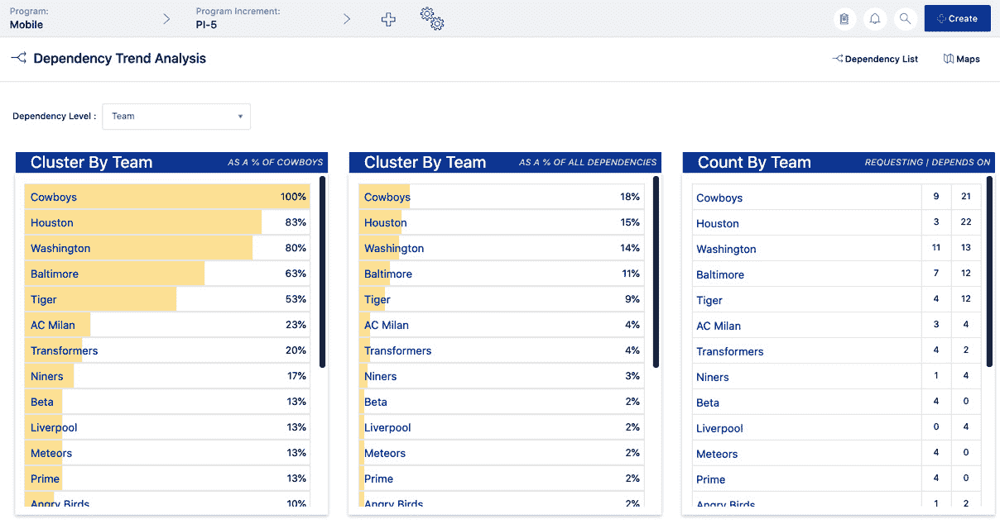
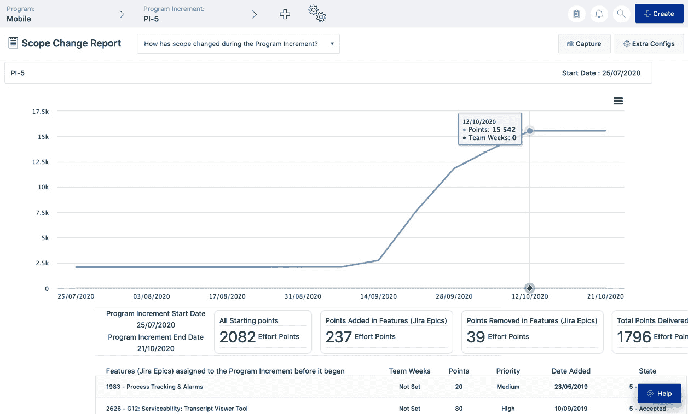

# *第六章*：程序执行挑战

在本章中，我们将继续讨论程序级敏捷，重点是执行。规划和执行是密切相关的。实际上，正如我们在上一章中所看到的，关键规划工具，如路线图和程序板，是支持持续执行的活文档，因为它们与实际交付的工作项相连接。本章将为前一章补充内容，提供将敏捷团队执行扩展到程序所需的关键工具。程序级执行对业务敏捷性至关重要，**敏捷框架**（**SAFe**）在**SAFe 5.0**中称其为**核心**。换句话说，如果你没有在团队层面上交付，那就不算是在遵循**SAFe**。

在本章中，我们将涵盖以下内容：

+   监督程序房间

+   协商和可视化依赖关系

+   减少浪费、管理范围并传达进展

# 监督程序房间

Jira Align 为每个规模级别的团队提供一个名为**房间**的仪表板。程序团队的仪表板是程序房间。它是与程序级别执行相关的所有事项的一站式服务。在这里，发布列车工程师（RTE）、Scrum Master 和其他程序成员可以鸟瞰整个程序增量的进展。要访问它，选择你的程序和 PI，在配置栏中，然后在导航菜单中选择**程序** | **程序房间**。

程序房间高度可配置，但始终有两个数据区域显示冲刺和工作项。这些在以下截图的中间部分显示：

图 6.1 – Jira Align 程序房间

**冲刺**部分显示以下信息：

+   每个 PI 中的每个冲刺都有一个绿色条形图，表示基于接受的故事点的完成百分比。将鼠标悬停在条形图上，可以查看百分比数字。故事必须分配到冲刺中才能被包括在内，但不需要在冲刺内被接受。

+   菱形图标表示发布载体的发布日期。将鼠标悬停在菱形图标上，可以查看发布载体的名称和完成百分比。

+   星形图标表示里程碑和目标完成日期。将鼠标悬停在星形图标上，可以查看目标或里程碑的名称。

工作项列表显示以下信息：

+   所有分配给所选程序和 PI 的功能、能力和投资组合史诗。

+   你可以选择**功能视图**、**按投资组合史诗查看功能**视图，或者如果启用了能力视图，可以选择**按能力查看功能**视图。通过点击工作项列表的标题来选择。

+   请注意，投资组合史诗的数据反映了与所选 PI 相关的部分。

程序房间可配置，有超过十几个小部件，可以通过点击工作区顶部右侧“查看配置”按钮打开。可以通过点击和拖动小部件重新定位它们。在上一张屏幕截图中，我们打开了进度、程序增量负载、团队进度和团队负载与能力小部件，并将它们定位在冲刺和工作项部分的左侧。我们打开了操作、依赖关系和障碍物小部件，并将它们定位在右侧。

以下是各种小部件的描述：

+   **进度**：显示 PI 剩余时间；完成目标的百分比；已接受故事与总故事的数量和百分比；已接受的组合史诗、能力、特性和故事的百分比；以及完成的依赖关系数量占总依赖关系数量的百分比。

+   **操作**：显示选定程序和 PI 的开放和关闭的会议行动项。

+   **聊天**：为 PI 中的任何工作项提供聊天和讨论区域。

+   **依赖关系**：显示选定程序为“请求”或“依赖于”的依赖关系，程序团队之间的依赖关系，以及与 PI 相关或具有 PI 内“需要完成”的日期的依赖关系。

+   **障碍物**：显示团队的障碍物。

+   **目标**：显示 PI 的目标。

+   **程序增量负载**：显示程序过去两个 PI 的平均速度，您可以通过点击“覆盖”手动更改，并显示 PI 负载，默认情况下是基于总特性点的估计负载。您可以点击齿轮图标选择基于总故事点的实际负载。

+   **发布载体**：显示已分配给 PI 的工作项的发布载体（即使发布载体的日期超出了 PI），以及分配给项目的工作项。

+   **风险**：显示分配给所选 PI 的选定项目的风险。

+   **团队负载 vs 能力**：显示程序中每个团队的负载与能力百分比，根据 PI 中加载的团队总故事点除以团队的 PI 能力计算。PI 能力是程序增量中每个冲刺速度的总和。点击行以打开团队详细信息面板，了解更多信息，包括当前和过去的冲刺以及过去五个冲刺的平均团队速度。

+   **程序增量规划检查清单**：提供一个可配置的步骤列表，在开始 PI 之前完成。

+   **团队进度**：显示团队在 PI 中接受的总故事点作为团队 PI 速度的百分比。团队的 PI 速度是其平均速度乘以 PI 中的冲刺数。

+   **跑道**：显示投资组合史诗、能力、特性和故事的跑道，让您可以比较尚未开始的工作所需的时间与您设定的目标。点击齿轮图标进入跑道目标，该目标按故事的冲刺和特性、能力以及投资组合史诗的月份进行衡量，并显示百分比偏差，表示您希望与目标的接近程度。

现在，您已经了解了程序房间的关键数据部分和小部件，它们只是程序房间所提供内容的一部分。以下是其他一些亮点：

1.  点击工作区顶部的**关键指标**按钮，以查看 PI 燃尽/燃起图、团队速度、按确定性划分的速度、按复杂性划分的速度以及 PI 缺陷趋势。

1.  点击**举办会议**按钮启动待办事项细化和 Scrum of Scrums 会议。RTE 可以通过点击工作区右上角的按钮来启动和停止 PI。

1.  点击**查看程序板**按钮以打开程序的核心部分，我们在上一章中已经讨论过。

现在您已了解程序房间，让我们回到至关重要的依赖项话题。

# 协商和可视化依赖项

在上一章中，我们学习了如何查看、定制和共享依赖网格中的信息。接下来，我们将研究 Jira Align 的复杂依赖工作流。之后，我们将学习如何处理外部依赖项。最后，我们将探索基本网格视图以外的各种依赖项可视化。

## 依赖项工作流

Jira Align 的依赖功能通过协作工作流在团队之间执行合同。工作流的第一步是创建一个依赖项。为此，点击依赖网格工作区右上角的**添加依赖项**按钮，打开**新建依赖项**详情面板，如下图所示：

图 6.2 – Jira Align 创建新依赖项

在这里，您可以输入并跟踪依赖项的以下详细信息：

+   **标题**：为依赖项添加一个有意义的标题。

+   **描述**：添加关于依赖项的更多描述性细节。

+   `PI-5`。

+   **这个依赖项是做什么的？**：选择依赖的工作项（特性、能力或投资组合史诗）。例如，选择**特性**，然后将一个特性作为依赖的工作项。依赖工作项是指依赖于另一个团队或程序的工作项。

+   `Baltimore`。

+   `Cowboys`。

+   `Sprint 25`。

接下来，点击**保存**按钮。依赖项状态将设置为**未承诺**，如下图所示：

图 6.3 – Jira Align 依赖项未承诺

接收请求的团队——在这个例子中是`Cowboys`——应通过选择`Sprint 24`来作出响应。如果响应方承诺的迭代为**Needed By**迭代之前的时间，例如**Sprint 25**，则依赖状态将设置为**COMMITTED**，如下图所示：

图 6.4 – Jira Align 依赖已承诺

如果响应方选择承诺一个较晚的迭代——例如，选择`Sprint 26`作为`Baltimore`来考虑。如下图所示：

图 6.5 – Jira Align 新依赖提案

如果请求方现在点击**Accept**按钮，则依赖状态将设置为**COMMITTED**，并更新**Needed By**迭代以匹配新的**Committed By**迭代。如果请求方点击**Decline**按钮，则状态将设置为**NOT COMMITTED**，如下图所示：

图 6.6 – Jira Align 依赖提案被拒绝

小贴士与技巧

请求方与响应方之间的沟通对于商定一个双方都能接受的承诺日期至关重要。我们建议在正式在 Jira Align 中确定协议之前，直接与对方团队进行沟通，商定一个合适的承诺日期。

现在，发起人已拒绝了新提案，轮到响应方采取行动。此时，响应方可以通过点击**Block**按钮并提供阻塞原因来表示他们的团队被阻塞，如下图所示：

图 6.7 – Jira Align 依赖被阻塞

或者，响应方可以点击**Request New**按钮，选择一个**Committed By**的迭代，且此迭代不晚于**Needed By**迭代，从而将依赖状态设置为**COMMITTED**。如果没有这样做，可能需要经过多次往返沟通，双方才会就**Committed By**的迭代达成一致。所有这些活动都可以通过点击详情面板右上角的**Audit Log**链接查看。点击**Subscribe**链接会通知你依赖关系的更改。请注意，默认情况下，相关团队的**产品负责人**（**PO**）和 Scrum 主管会自动收到通知。

随着工作进展，发起人或响应方可以随时通过将下图中的第一或第二个字段设置为**是**并输入阻塞原因来表示他们遇到了阻塞。这将把依赖状态设置为**Blocked**：

图 6.8 – Jira Align 依赖工作状态

一旦工作完成，或者如果发现不需要任何工作来满足依赖团队的需求，可以将上一张截图中的第三个或第四个字段设置为**是**，这将更新依赖状态为**完成**，如下图所示：

](img/Figure_6.9_B16328.jpg)

图 6.9 – Jira Align 无需工作即可完成的依赖

请注意，除了更新**工作完成**字段（见*图 6.8*）之外，响应团队最好将他们的工作项——即请求团队需要的工作项——与该依赖关联。这可以在依赖详细面板的底部完成。这样，在查看依赖详情时，工作项的实时状态可以轻松获取。

你可以通过点击依赖详细面板顶部的**更多操作**按钮来执行其他操作，如下所示：

+   **删除**：通过删除来移除依赖。

+   **拒绝**：取消一个依赖并将其标记为**已拒绝**。

+   **重复**：克隆一个依赖作为类似依赖的基础。

+   **取消提交**：将依赖状态移回**未提交**。

这些选项会根据依赖的状态和你的角色权限而有所不同。请注意，当依赖设置为**无需工作**或**已拒绝**时，系统将要求填写**无需工作/拒绝原因**，如下图所示：

](img/Figure_6.10_B16328.jpg)

图 6.10 – Jira Align 依赖被拒绝

现在我们已经探索了依赖工作流程，让我们来看看如何创建外部依赖。

## 外部依赖

对于团队来说，跟踪影响交付的外部因素是一个常见挑战。在 Jira Align 中，外部依赖默认情况下是未启用的。Jira Align 管理员可以通过访问**管理** | **设置** | **平台**并点击**管理依赖**来启用外部依赖，这会打开如下所示的窗口：

图 6.11 – Jira Align 管理依赖组合窗口

请注意，外部依赖在功能、能力和投资组合史诗级别的切换按钮。管理员可以滑动这些按钮以启用这些级别的外部依赖，然后点击**保存设置**按钮应用更改。

现在外部依赖已启用，让我们通过访问`出版公司`并指派一个内部负责人来添加外部实体，负责人将负责与外部实体的沟通：

图 6.12 – Jira Align 外部依赖实体创建

现在，当您关闭窗口并创建外部依赖关系时，您将在以下屏幕截图的 **Depends On** 部分看到您在 **External** 下拉列表中添加的实体：

图 6.13 – Jira Align 创建外部依赖关系

在此，我们正在为 `Baltimore` 团队在 `PI-5` 中创建一个外部依赖关系，该依赖关系依赖于 `Publishing House` 外部实体，以便在 `30/10/2020` 前完成工作。

现在我们已经探讨了依赖关系工作流程，包括外部依赖关系，接下来让我们来探索各种依赖关系可视化。

## 依赖关系图

Jira Align 将其众多有用的可视化工具称为 **依赖关系图**。要访问它们，我们返回到依赖关系网格，通过导航菜单选择 **程序** | **管理** | **依赖关系**。接下来，点击工作区右上方的 **图表** 按钮来访问可视化工具：

图 6.14 – Jira Align 依赖关系图

显示的选项允许您跟踪、采取行动并报告依赖关系。我们先从 **团队状态** 选项开始。

## 团队状态依赖关系图

此选项允许您按团队查看依赖关系并根据需要对其进行优先级排序。请确保在配置栏中设置您的团队和 PI 上下文。在以下屏幕截图中，我们选择了 `Baltimore` 团队和 `PI-5`：

图 6.15 – Jira Align 团队状态依赖关系图

依赖关系图上的箭头表示以下内容：

+   **右箭头**：表示当前团队需要交付给另一个团队的出站依赖关系。

+   **下箭头**：表示当前团队从另一个团队需要的入站依赖关系。

颜色代码显示在报告图例中，您可以通过点击工作区右上角的颜色轮按钮访问该图例。依赖关系的颜色编码如下：

+   **绿色**：已承诺/已交付

+   **橙色**：未承诺/未交付

+   **蓝色**：拒绝或不需要工作

+   **红色**：阻塞

请注意，依赖关系是通过排序号优先排序的，然后通过点击列表底部的 **保存** 按钮进行排序。点击 **快速筛选器** 按钮以切换基于关联（入站或出站）和状态的依赖关系的开关。最后，您可以通过点击 **捕捉** 按钮导出依赖关系图的快照视图。现在让我们来探索 **增量状态** 选项。

## 增量状态依赖关系图

此选项允许您按程序查看依赖关系，以帮助协调所需的工作量。如以下屏幕截图所示，您可以设置配置栏上下文，以包含一个或多个程序和程序增量。请注意，这是由投资组合内共享共同 PI 节奏的程序最佳实践启用的：

图 6.16 – Jira Align 程序增量状态依赖关系图

在这里，我们选择了`AI`、`区块链`和`移动`程序，以及`PI-5`作为我们的上下文。请注意**依赖关系级别**下拉菜单，我们选择显示**团队**依赖关系。与之前讨论的依赖关系图一样，状态通过颜色编码，便于快速识别需要关注和处理的依赖关系。颜色编码显示在报告图例中，你可以通过点击工作区右上角的颜色轮按钮来访问它。此外，你可以点击**额外配置**按钮，切换显示基于状态和/或目标交付冲刺的依赖关系。你可以通过点击**捕捉**按钮导出依赖关系图的快照视图。接下来，我们将进入**网格视图**选项。

## 网格视图依赖关系图

这个选项以矩阵的形式显示团队和程序之间的依赖关系计数。配置条的上下文设置为包含一个程序和程序增量。在以下截图中，我们将**依赖关系级别**下拉菜单设置为**程序**，以查看程序依赖关系矩阵：

图 6.17 – Jira Align 网格视图依赖关系图

请注意右上角的切换选项，在这里你可以选择显示未关联的团队/程序以及已交付和已承诺的依赖关系。点击**额外配置**按钮，可以根据类型筛选依赖关系——例如，团队/程序依赖关系、多个团队/程序依赖关系、能力外部依赖关系和外部依赖关系。

接下来，点击网格中的任何数字以打开右侧的详细面板。例如，在下面的截图中，我们点击了`5`，位于`Baltimore`行中，查看`Baltimore`从`Cowboys`团队需要的五个依赖项：

图 6.18 – Jira Align 网格视图依赖关系图详细报告

请注意，依赖关系以依赖的工作项显示，状态则根据报告图例进行颜色编码。你可以通过点击**捕捉**按钮导出依赖关系图的快照视图。现在，我们准备探索流行的**轮状视图**选项。

## 轮状视图依赖关系图

该选项允许你查看作为团队/项目之间的线条或字符串的依赖关系。绿色线条表示已交付的依赖关系，蓝色线条表示未交付的依赖关系，红色线条表示被阻塞或未承诺的依赖关系。配置条的上下文设置为包括带有项目增量的项目。点击环形图中的某个团队或项目，会在右侧打开详细面板。例如，在以下截图中，我们点击了**Cowboys**，以查看他们需要其他团队的依赖关系以及其他团队需要他们的依赖关系：

图 6.19 – Jira Align 环形视图依赖关系图

状态采用与字符串相同的颜色编码方式，你可以点击右上角的色轮图标查看颜色说明。请注意色轮上方的切换选项，可以显示与工作项（功能、能力和投资组合史诗）相关的依赖关系、仅相关的依赖关系和非活动依赖关系。你还可以进一步展开工作项以显示具体的依赖关系层级，如以下截图所示：

图 6.20 – Jira Align 环形视图依赖关系图选项

在这里，我们看到与功能相关的依赖关系，你可以开启切换按钮来显示团队、项目和外部依赖关系。你还可以切换显示项目内外的项目信息。对于与投资组合史诗和能力相关的依赖关系，你可以开启切换按钮来显示项目和外部依赖关系。

最后，你可以通过点击**捕获**按钮来导出依赖关系图的快照视图。现在我们准备好探索**分析视图**了。

## 分析视图依赖关系图

该视图允许你通过展示哪些团队和项目拥有最多依赖关系来分析依赖关系集群。这样，你可以找出应该集中精力减少依赖关系的地方。配置条的上下文设置为包括带有项目增量的项目。你可以将**依赖关系级别**下拉菜单设置为**团队**，以查看团队依赖关系趋势，如以下截图所示：

图 6.21 – Jira Align 分析视图依赖关系图

依赖关系按以下方式分组：

+   **按团队/项目群组**，作为拥有最多依赖关系的团队/项目的百分比。

+   **按团队/项目群组**，作为所有依赖关系的百分比。

+   **按团队/项目统计**，针对 PI。

管理和减少依赖关系对于有效执行至关重要。现在我们已经探索了如何创建、跟踪和可视化依赖关系，接下来让我们看看 Jira Align 如何帮助解决项目中的其他关键问题。

# 减少浪费、管理范围和沟通进展

在本章节中，我们将探讨如何掌握项目增量（PI）的工作范围，减少重复工作，并有效地传达交付状态。我们将从流行的**工作树**视图开始，这一视图帮助许多组织应对这些挑战。接下来，我们将分析两个报告：程序增量进度和范围变更、功能拆分特性，最后，PI 和发布车辆路线图。所有这些工具一起帮助确保有效的项目级执行。

## 工作树

在上一章中，我们看到了工作视图路线图和程序看板中实时工作状态更新的好处。另一个重要的实时信息可视化工具是工作树，它的额外优势在于展示了工作项如何自上而下、以及自下而上的相互连接。它是分析跨组织工作的重要工具，并关注减少工作量，这符合*敏捷宣言原则 10*：*简化——最大化不做工作的艺术——至关重要*。举个例子，我们已经看到，在一个单一程序 ART 和单一 PI 中，通过避免重复工作，节省了 75 万美元的成本。没有跨组织的全企业级工作可视化，这样的成本节省是不可能实现的。

首先，前往导航菜单，选择以下截图中的`Mobile`程序和`PI-5`程序增量：

图 6.22 – Jira Align 工作树

接下来，点击工作区右上角的**额外配置**按钮，进入视图下拉列表，如下图所示。在这里，我们关注两种视图：**自上而下的投资组合史诗视图**和**自下而上的故事视图**：

图 6.23 – Jira Align 工作树额外配置

如果你需要一个更广泛的视图，可能有助于识别更大范围的重复工作项，可以选择自上而下的视图。该视图从与选定 PI 相关的投资组合史诗开始，然后向下追溯，包含所有附加到史诗上的子工作项和孙工作项，甚至包括那些不属于该 PI 的项。这个视图展示了较少的孤立故事和更多的较大工作项。

如果你希望识别更多孤立故事而不太关注较大的工作项，可以选择自下而上的视图。该视图从所有与选定 PI 相关的故事开始，向上追溯到投资组合史诗。它展示了更多的孤立故事，但相较于自上而下的视图，较大的工作项较少。

要仅显示所选 PI 的工作项，请在**额外配置**下的**缩小筛选报告**切换上滑动。请注意，视图下拉列表中的**团队视图**选项与自下而上视图相同，只是允许您仅为您的团队过滤工作树。这对 Scrum Master 和产品负责人来说是一个不错的选择。

现在我们已经学习了分析组织内部相互关联工作的技术，让我们来探索两个关键报告，用于跟踪 PI 的工作进展。

## 程序增量进度

程序增量进度报告帮助理解所选 PI 的工作是否按计划进行。它展示了功能和故事的燃尽图和燃升图。燃尽图对于投资组合经理和 RTE（Release Train Engineer）来预测 PI 的所有工作何时完成非常有用。它显示了故事点在垂直轴上的剩余工作量与水平轴上的时间。燃升图则提供了关于团队按计划交付功能和故事能力的见解。它显示了已完成工作和故事点的总工作量在垂直轴上的时间。水平轴。

要访问报告，请转到导航菜单，选择`Mobile`程序，并在以下截图中选择`PI-5`程序增量：

图 6.24 – Jira Align 程序增量进度报告

请注意，由于`PI-5`尚未完成，在工作区顶部的燃尽图上有三条预测线延续自橙色接受线。这些基于当前接受率预测 PI 剩余工作的正常、乐观和悲观趋势。

单击工作区右上方的**燃烧详情**按钮以打开一个面板，显示计算中使用的预测每日燃烧速率和底层团队速度，如以下截图所示：

图 6.25 – Jira Align 程序增量进度报告燃烧细节

请注意，Scrum Master 和产品负责人可以通过单击工作区顶部右侧的**额外配置**按钮并从下拉列表中选择他们的名称来轻松过滤其团队的报告。

还有各种选项可通过单击位于工作区右上方中心旁边的**深入钻取**按钮来深入数据。在这里，您可以按程序或主题查看图表，然后深入到查看程序的团队或主题的投资组合史诗。在以下截图中，我们已深入到查看程序团队的燃尽图：

图 6.26 – Jira Align 程序增量进度报告按团队

最后，请注意，任何图表都可以通过点击图表标题右侧顶部的三条横线来全屏显示或下载。现在我们已经了解了 Scrum Master、RTE 和其他人如何监控和预测工作交付，接下来让我们看看他们如何识别和审查影响选定 PI 的任何范围变更。

## 范围变更

此报告可视化了在 PI 期间添加或移除的功能，便于组合管理者和 RTE 了解范围变更。要访问此报告，请进入导航菜单，点击搜索图标（放大镜），然后搜索 `Program Increments Scope`。确保在配置栏中设置好上下文。在以下屏幕截图中，我们选择了 `Mobile` 项目和 `PI-5` 项目增量：

图 6.27 – Jira Align 范围变更报告

报告的第一部分是一个折线图，显示了范围变化，纵轴为总故事点，横轴为 PI 日期标记。理想情况下，所有范围应在 PI 开始时添加。折线图或统计数据上轻微的上升趋势是正常的。然而，下降趋势则表示团队过度承诺，必须从 PI 中移除故事点。

接下来的部分显示了 PI 范围变更的统计数据汇总，最后一部分提供了功能的列表，按以下类别划分：在 PI 开始时的范围、开始后添加到 PI 的范围以及开始后从 PI 中移除的范围。显示了功能被添加或移除的日期以及它们的当前状态。这使得产品经理和 RTE 能够评估在 PI 期间所做的权衡，为持续学习和未来 PI 的更好规划提供输入。

现在我们已经了解了如何在 PI 中监控范围变更，让我们来看看 RTE 如何通过使用 PI 清理报告来确保 PI 准备关闭。

## PI 清理

项目增量清理是一个综合审计报告，显示了所选 PI 中所有未关闭、未接受或未交付的待完成项。对于项目领导和 RTE 来说，在 PI 即将结束时，甚至在 PI 完成后，运行该报告可以查看哪些项目仍未完成。

要访问报告，请进入导航菜单，点击搜索图标（放大镜），然后搜索 `Program Increments Cleanup Report`。确保在配置栏中设置好上下文。在以下屏幕截图中，我们选择了 `Mobile` 项目和 `PI-5` 项目增量：

图 6.28 – Jira Align 项目增量清理

在这里，您可以点击任何项目的 ID，在右侧打开其详细信息面板。报告通过一系列滚动部分显示数据，具体如下：

+   **目标未完成**：所有在 PI 中到期但尚未完成的目标

+   **未关闭的风险**：所有在 PI 中到期且尚未关闭的风险

+   **未关闭的障碍**：所有在 PI 中到期且尚未关闭的障碍

+   **未接受的故事**：所有在 PI 中到期且尚未被接受的故事

+   **未接受的特性**：所有在 PI 中到期且尚未被接受的特性

+   **未关闭的行动项**：所有在 PI 中到期且尚未关闭的行动项

+   **未接受的组合史诗**：所有在 PI 中到期且尚未被接受的组合史诗

+   **未交付的依赖项**：所有在 PI 中到期且尚未交付的依赖项

+   **没有分配史诗的独立特性**：所有在 PI 中到期的孤立特性，且没有父级组合史诗

+   **没有分配特性的故事**：所有在 PI 中到期且没有父级特性的孤立故事

整体扫描报告将迅速提供所选程序 PI 健康状况的概览。特别是在 PI 结束时查看该报告，能够确保在 PI 结束之前处理好未完成的事项。在某些情况下，事项可能需要移至下一个 PI，或转移到未分配的待办事项中，或者进行拆分，这是我们接下来要探讨的功能。

## 处理未完成的工作

现在我们已经了解了 PI 清理报告如何关注程序中的未完成工作，接下来我们将学习如何最好地处理这些工作。就像团队在冲刺结束时将未完成的故事拆分，以便获得更准确的速度指标一样，程序也会在 PI 结束时拆分未完成的特性。这个做法确保了更准确的程序速度，并且只保留未完成的部分工作。

Jira Align 使拆分未完成的特性变得简单。只需点击待办事项、程序板或其他位置中的特性，打开其详细面板。接着，点击右侧的**拆分**链接，该链接位于**在 JIRA 中查看**按钮下方七个位置处。这将打开如下截图所示的窗口：

图 6.29 – Jira Align 拆分特性

请注意，Jira Align 会为原始特性名称添加建议的`(Split Part 2)`后缀，你可以对此进行修改。接下来，选择一个未来的 PI 或未分配的待办事项，将新特性及原始特性中的未接受故事一起移到那里。最后，点击**拆分**按钮执行特性拆分。

一旦拆分，原始特性将显示到新特性的链接，如下截图所示：

图 6.30 – Jira Align 拆分特性链接

请注意，原始特性被标识为父级，而新拆分的特性被标识为子级。你可以点击链接从父级打开子级，反之亦然。

现在我们已经看到了一些更好地监控 PI 范围和交付的方法，接下来我们将回到路线图模块，看看产品经理、发布经理和 RTE 如何通过 PI 和发布来有效沟通交付期望。

## PI 路线图

程序增量视图路线图根据配置栏设置的上下文显示 PI 卡片。要访问它，请进入导航菜单，选择**程序** | **管理** | **路线图**，然后从工作区左上角的下拉菜单中选择**程序增量**。确保在配置栏中设置好上下文。

在下面的截图中，我们选择了`数字服务`投资组合和以下 PI：`PI-5`、`PI-6`和`PI-7`：

图 6.31 – Jira Align 路线图程序增量视图

请注意，PI 结束日期以钻石形状显示在时间轴上。每个 PI 卡片上都显示一个进度条，基于 PI 已接受的故事点百分比，并配有多个可配置的详细信息部分。要配置 PI 卡片，请点击**查看配置**按钮以访问以下选项：

+   **照片**：启用此切换按钮以显示每个 PI 卡片的图片。要上传图片，将鼠标悬停在卡片上，然后点击**替换图片**按钮。

+   **日期**：启用此切换按钮以显示内部、外部或程序增量日期。

+   **成本与价值**：启用此切换按钮以显示 PI 的估算成本和实际成本。

+   **描述**：启用此切换按钮以显示 PI 描述。

+   **亮点**：启用此切换按钮以选择要在亮点部分显示的主题、投资组合史诗或功能。点击 PI 卡片上的**添加亮点**链接，选择您想要在该部分引起注意的工作项。

+   **目标**：启用此切换按钮以选择要在目标部分显示的目标。点击 PI 卡片上的**添加目标**链接，选择您想要在该部分引起注意的目标。

+   **显示已完成的 PI**：启用此切换按钮以显示已完成 PI 的统计数据。

在实时路线图中随时查看前述信息，可以帮助项目级别的工作人员（如 RTE）获取并分享 PI 执行的实时状态，并提供有针对性的交付亮点。接下来，我们将查看一个面向发布管理人员的路线图。

## 发布载体路线图

发布载体代表一组已发布给实际客户的功能和/或故事。发布可以随时发生，遵循持续部署和按需发布的敏捷实践。发布载体路线图根据所选的投资组合/程序和 PI 显示相关的亮点信息。要访问它，请进入导航菜单，选择`数字服务`投资组合和以下 PI：`PI-5`、`PI-6`和`PI-7`：

图 6.32 – Jira Align 路线图发布车辆视图

请注意，发布日期以钻石形状显示在时间轴上。每张卡片显示一个进度条，基于接受的故事点百分比，以及若干可配置的详细信息部分。要配置发布车辆卡，请点击**查看配置**按钮，访问以下选项：

+   **日期**：启用此切换开关以显示内部、外部或程序增量日期。

+   **程序增量**：启用此切换开关以显示发布在程序增量期间进行。

+   **重点**：启用此切换开关以选择缺陷、故事或功能在重点部分显示。在发布车辆卡上点击**添加重点**链接，以选择您希望在此部分引起注意的工作项。

+   **显示已完成**：启用此切换开关以显示已完成的发布车辆的统计数据。

在实时路线图上随时获取前述信息，有助于程序级别的人员，如发布经理，获得并分享发布准备情况的实时见解，并提供有针对性的交付重点。

恭喜，您现在已经学会了如何构建各种类型的路线图，从上一章开始的工作项路线图到我们在这里研究的 PI 和发布车辆路线图。这些，以及我们在此过程中的所有学习，必定帮助您在各个维度上实现对齐：人员在一段时间内交付工作，以实现预期结果。

# 总结

在本章中，我们学习了如何克服程序级别的执行挑战。我们首先了解了执行指挥中心——程序室。然后，我们学习了依赖工作流以及如何处理外部依赖关系和使用依赖图。最后，我们探讨了减少不必要工作的方式，管理范围并沟通 PI 和发布进度。

在下一章中，我们将讨论常见的投资组合级别挑战，**精益投资组合管理**（**LPM**）如何将思维方式从项目转向产品，以及如何将业务战略与执行连接，以实现组织对齐。

# 问题

1.  哪个程序室小部件显示程序的平均速度？

1.  哪些依赖图允许您可视化外部依赖关系？

1.  工作树模块如何帮助减少浪费？

# 进一步阅读

+   *在现代企业中扩展 Scrum*，作者：Cecil Rupp（Packt，2020 年）

图 6.32 – Jira Align 路线图发布车辆视图
