# 第八章：*第七章*：企业与投资组合挑战

本章重点讨论组织最高层级（企业及其投资组合）所面临的常见问题和挑战。根据规模，企业可能有一个或多个投资组合。我们将学习企业如何设定战略，以及投资组合在将战略与执行连接起来时发挥的关键作用。接着，我们将解释**精益投资组合管理**（**LPM**）方法的好处，以及 Jira Align 如何支持这一方法。最后，我们将介绍多种提升创新的方式。

本章将涵盖以下主题：

+   将战略与执行连接起来

+   实施 LPM

+   促进创新

在本章结束时，你将了解如何以及为何访问战略和投资组合室，创建战略快照，确立投资组合愿景，制定投资组合目标和 OKRs，使用如*按主题投资*和*投资与实际对比*等报告，利用创意功能，等等。

# 将战略与执行连接起来

Jira Align 专为将战略与执行连接起来并提供可见性和一致性而设计。通常，将战略与执行连接起来是一个自上而下、自下而上、相互融合的过程。我们已经从自下而上的角度在*第二章*中介绍了基础知识，*实施 Jira Align*，从连接到 Jira Software 开始，那里是团队级工作项的战术执行发生的地方。故事与功能（Jira 史诗）连接，再到能力、投资组合史诗和主题在 Jira Align 中。连接这些工作项层级后，你就可以利用 Jira Align 强大的报告能力。例如，你可以通过*投资与实际对比*报告查看按主题的支出，或通过财务状态报告跟踪预算。接下来，我们将从自上而下的角度探讨，首先从战略室开始。

## 战略室

战略室是 Jira Align 中的最高级别模块。它是你建模组织的使命、愿景和价值观的地方，并明确长期目标，使各个工作项层级及其相关成果与这些目标对齐。它使高管能够确保执行与公司战略一致，同时赋能团队成员理解他们工作的价值，以及这些工作如何为企业目标作出贡献。

首先，进入导航菜单并选择**企业** | **战略室**。接着，从下拉菜单中选择一个战略快照以加载相关的工作项和成果。战略快照位于 Jira Align 时间维度的最高层级。实际上，每个快照包含一组程序增量。在下图中，我们选择了**公司战略 2020**战略快照：

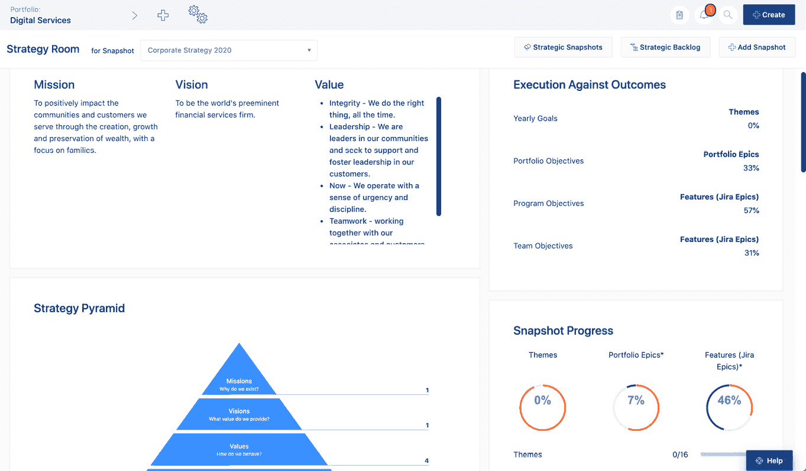

图 7.1 – Jira Align 战略室

在这里，你可以通过点击左上角的使命、愿景和价值观进行查看或编辑。右上角的**执行成果**部分显示每个层级工作项完成的百分比，这些工作项为成果做出了贡献。点击如**年度目标**等成果层级可以查看和编辑项目。下方的**快照进度**部分显示每个层级工作项的完成百分比，无论它们是否与成果相关联并做出贡献。

接下来，让我们查看**战略金字塔**部分，以便可视化战略对齐。你可能需要向下滚动以查看整个金字塔，例如以下截图所示：

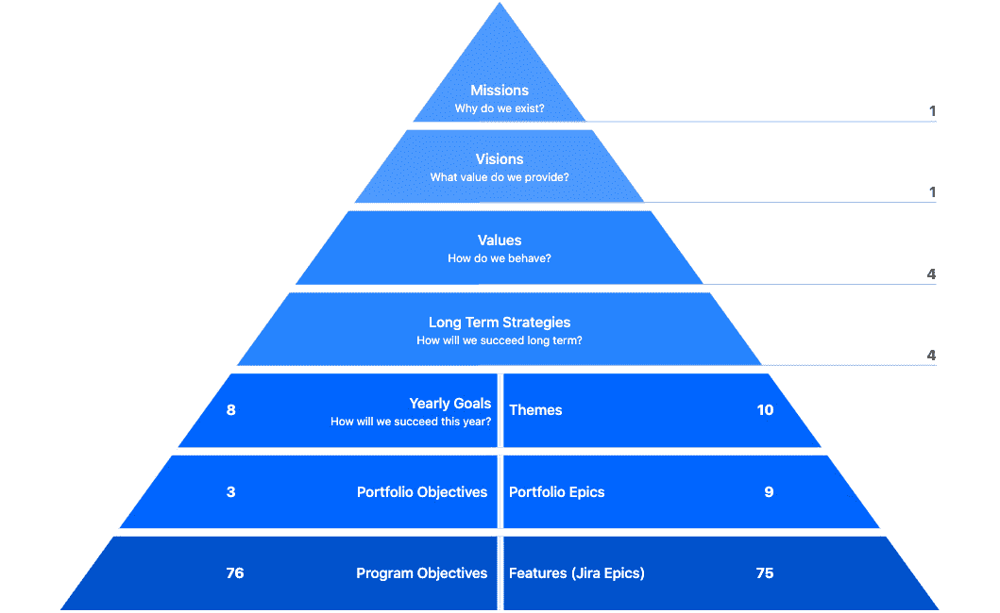

图 7.2 – Jira Align 战略金字塔

金字塔显示了从上到下的战略层级以及每种项目类型的数量。例如，在前面的图示中，有四个长期战略项目。请注意，底层右侧的工作项数量表示与左侧显示的成果相关联并为其做出贡献的项目数量。例如，有 10 个主题与 8 个年度目标相关联，但可能还有其他未关联的主题。点击金字塔中的战略、目标或任务类型，可以创建和编辑这些项目。

请注意，金字塔是可配置的，既可以调整层级数量，也可以修改每个层级的成果名称。Jira Align 管理员可以在**管理** | **设置** | **平台术语**下重新命名成果层级，并向下滚动到**自定义金字塔显示**来切换层级的开关。

默认情况下，金字塔有九个层级。然而，根据我们的经验，极少有组织需要所有九个战略层级。因此，我们在截图所示的 Jira Align 环境中关闭了两个层级，**北极星**和**长期目标**。

战略室侧重于结果而非产出。例如，可以通过向下滚动查看位于战略金字塔下方的热力图来评估 OKR 的健康状况，如以下截图所示：

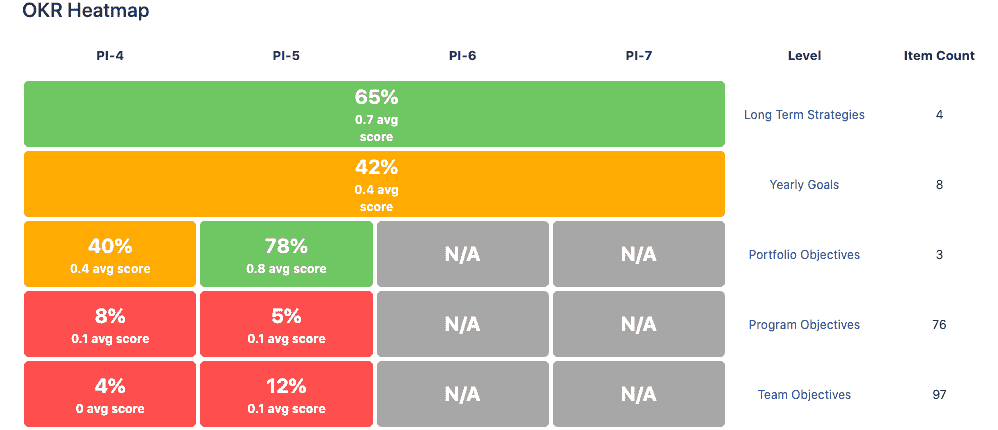

图 7.3 – Jira Align OKR 热力图

热力图的颜色指示和统计数据为你提供了一个快速的视觉展示，展示你在达成右侧显示的不同战略目标和任务的各个层级时的进展情况，以及它们的项目数量。点击目标会将你带到该层级的战略积压区，点击任务则会将你带到任务网格。

与战略快照相关的程序增量显示在热图的顶部，你可以通过配置栏进一步细化它们。热图的行包含每个 PI 中每个结果层级的统计数据。由于战略目标未与 PI 关联，它们显示为一个跨越所有 PI 列的单一块。

每个块显示在战略目标或目标层级上，关键结果的平均进展百分比。对于最低三个层级中的目标块，进展仅计算与 PI 关联的目标的关键结果。

这些块根据该层级目标或战略目标的关键结果平均得分进行颜色编码（精确到最近的 0.1），并显示在块的底部，如下所示：

+   灰色 = 未评分（N/A）。这表示目标或目标层级的关键结果尚未评分。如果至少有一个关键结果已评分，则未评分的关键结果在平均计算中将被赋予零分。

+   红色 = 0.3 及以下。

+   黄色 = 0.4 至 0.6。

+   绿色 = 0.7 及以上。

在我们已经探讨了它的一些关键功能后，接下来让我们看看如何创建推动战略室的战略快照。

## 战略快照

战略快照为战略室提供了时间维度，使你能够按月、季度或年规划并跟踪公司战略的进展。要管理快照，请点击战略室右上角的**战略快照**按钮，或转到导航菜单并选择**企业** | **管理** | **战略快照**。这将打开如下所示的战略快照网格：

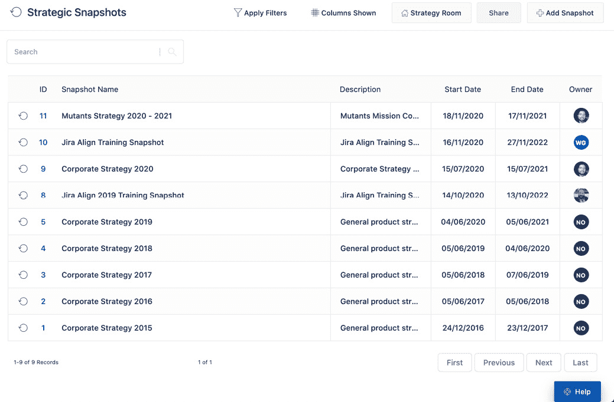

图 7.4 – Jira Align 战略快照

要创建战略快照，请点击工作区右上角的**添加快照**按钮，打开如下所示的面板：

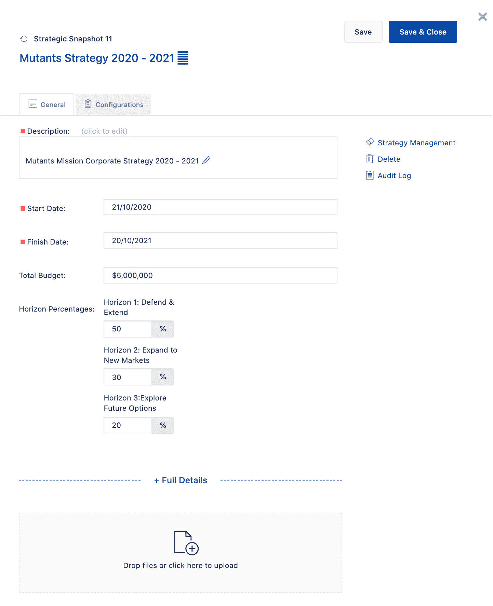

图 7.5 – Jira Align 战略快照详情

接下来，输入以下快照属性。请注意，红色方框表示必填字段：

+   `Mutants Strategy 2020 - 2021`。

+   **描述**：添加战略快照的详细描述。

+   **开始日期**：为快照添加开始日期。

+   **结束日期**：为快照添加结束日期。

+   **总预算**：可选地，为快照持续期间添加总预算。

+   **视野百分比**：可选地，为以下三个视野添加百分比分配：**视野 1：防守与扩展**，**视野 2：扩展至新市场**，和 **视野 3：探索未来选项**。

输入快照属性后，点击**保存**按钮，然后点击**配置**标签页，提供以下可选的详细信息：

+   **战略团队成员**：添加战略团队成员，例如**LPM**团队。

+   **产品**：添加与快照相关联的产品（如果适用）。

+   **项目增量**：添加与快照相关联的项目增量。虽然这是推荐的，但不是必须的。

+   **组织结构**：如果适用，添加与快照相关的组织单元。

点击**保存**按钮返回到**常规**标签页，然后向下滚动并点击**+ 完整详情**以展开该部分。在这里，你可以设置通知偏好、资金审批，并将总预算分配到与快照相关联的每个组织单元。有关如何设置通知和资金审批规则的详细信息，请参阅*第三章*，*导航 Jira Align*，*图 3.36*。

现在我们已经创建了时间维度，让我们学习如何管理推动战略室的其他元素。这些元素可以在战略待办事项中找到。

## 战略待办事项

如前所述，我们提到了使命、愿景、价值观和目标这些基本元素。它们是战略层级的一部分。要管理这些及其他元素，请点击`数字服务`组合：

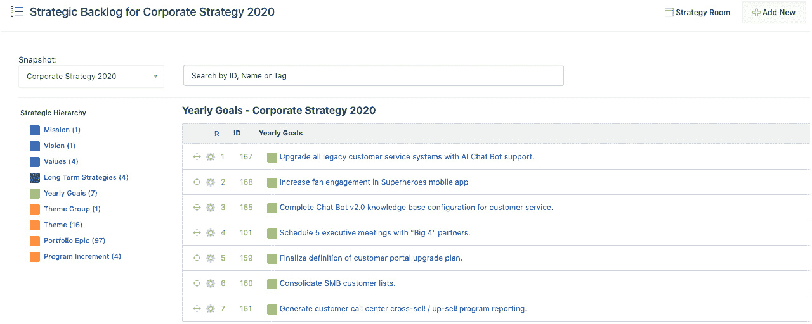

图 7.6 – Jira Align 战略待办事项

接下来，回想一下，主题是 Jira Align 中的最高级别工作项。默认情况下，它与最低级别的战略目标——年度目标相关联。如前所述，贵组织的 Jira Align 管理员可以配置目标的层级数量及其名称。

小贴士和技巧

虽然主题是 Jira Align 中的最高级别工作项，但它们可以被归类到更高层次的主题组中，用于在过滤报告和视图（如工作树）时使用。

作为前提，必须在**管理** | **设置** | **平台** | **组合标签** | **启用主题组**下启用此功能。

要创建主题组，请进入战略待办事项，点击左侧的**主题组**级别，然后点击**添加新建**按钮。或者，Jira Align 管理员可以在**管理** | **设置** | **主题组**下创建主题组。

要将新目标添加到战略待办事项中，请点击左侧的目标级别，然后点击**添加新建**按钮，打开如下所示的详情面板：

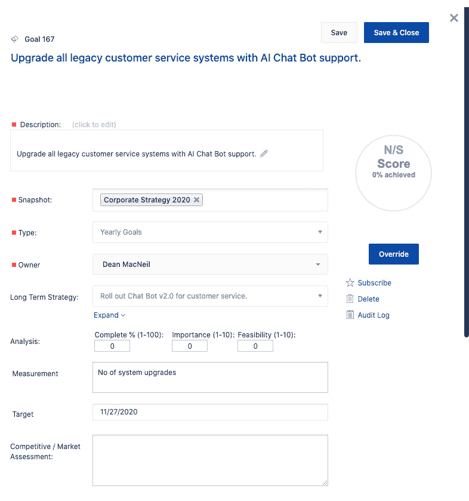

图 7.7 – Jira Align 新目标

在这里，我们通过输入以下详细信息为**2020 企业战略**快照添加年度目标。请注意，屏幕截图中的红色框表示必填字段：

+   **描述**：添加描述以总结你的目标。

+   `2020 企业战略`。

+   `年度目标`。

+   **负责人**：将目标分配给一个负责监控状态和进展的个人。

+   **长期战略**：将目标与父目标关联。在这种情况下，年度目标的父目标是长期战略。

+   **分析**：记录预计的**完成百分比**，以及在 1 到 10 的范围内，目标对组织的**重要性**和**可行性**。

+   **测量**：添加用于衡量目标完成度的成功标准。

+   **目标**：添加目标完成的目标日期。

+   **竞争/市场评估**：添加相关的竞争或市场分析。

+   **附件**：添加与目标相关的任何附件。

填写这些详细信息后，点击**保存**按钮以添加目标。点击**保存**后，底部的详细信息面板还会提供附加部分，在这些部分中可以添加以下可选信息：

+   **关键结果**：添加将用于衡量目标成功的关键结果。请注意，您可以将关键结果与任何层级的目标或目标相关联。根据定义，带有关键结果的目标或目标可以视为 OKR。

+   **主题**：将目标与主题关联。

+   **链接**：添加与目标相关的外部链接。

现在我们已经学会了如何添加目标，让我们来看看如何管理投资组合目标。

## 投资组合目标

目标代表在各个层级的工作项结果：团队、项目、解决方案和投资组合。你可以通过导航菜单访问每个层级的目标网格。我们在*第五章*《项目规划挑战》中学到了，团队目标如何反映季度规划目标，并汇总到项目层级。在这里，我们将探讨投资组合层级的目标，为下一节做铺垫，届时我们将详细介绍关键的投资组合概念。

我们先通过导航菜单选择**投资组合** | **管理** | **投资组合目标**，打开下图所示的网格：

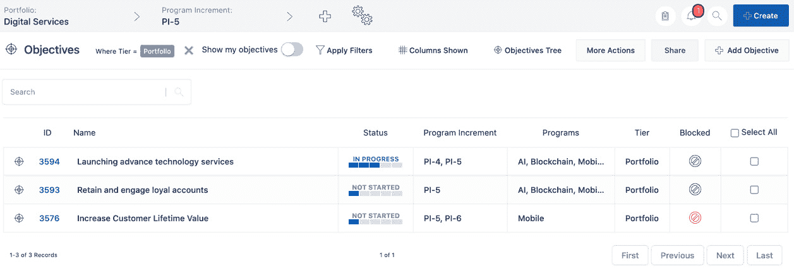

图 7.8 – Jira Align 目标网格

在这里，我们看到与`数字服务`投资组合和`PI-5`关联的投资组合目标。点击目标的 ID 或名称以打开其详细信息面板。在工作区的右上角点击**添加目标**按钮以添加新目标。

目标按层次结构排列，并在目标树中可见。要访问它，点击目标网格上方、正中央右侧的**目标树**按钮，或者通过导航菜单选择**企业** | **目标树**。在下图中，我们看到从投资组合层级到下层的**提高客户生命周期价值**投资组合目标的层次结构。

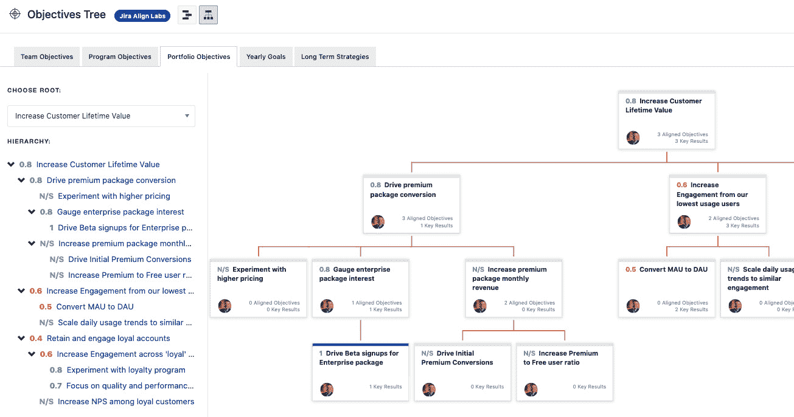

图 7.9 – Jira Align 目标树

在这里，我们看到所选的投资组合目标位于层级结构的顶部，并且其关联目标在每个层级上有所体现，从解决方案到项目，再到团队层级。

每张卡片顶部的蓝色条形表示相关关键成果的累积进展。将鼠标悬停在卡片上并点击其一侧，允许你折叠或展开邻近的卡片，以便根据需要配置目标树。你可以从树形层级切换到列表视图，如*第五章*中所述，*项目规划挑战*，*图 5.27*。

现在我们已经了解了企业战略是如何在战略室中设定并通过投资组合连接到团队层级执行的，让我们探讨一种现代方法，用以解决传统投资组合层面上的挑战。

# 实施 LPM

**LPM**是 SAFe 的核心能力之一，旨在通过将精益和系统思维方法应用于三个领域：战略和投资资金、敏捷投资组合运营和治理，来实现战略与执行的对齐。自 2019 年秋季 SAFe 推出 LPM 认证以来，LPM 的受欢迎程度不断上升。它为克服传统投资组合管理方法的挑战提供了方法，这些方法在软件和数字化颠覆的时代已经不再适用。在公司面临更大不确定性的情况下，同时被推动以更快速度将更具创新性的解决方案推向市场。 本节内容揭示了几个投资组合管理的挑战，以及 Jira Align 如何支持 LPM 实践来克服这些挑战。

## 识别价值流

LPM 的前提是识别价值流。一般来说，SAFe 将价值流定义为一系列持续的步骤，用于创造价值，从概念到为客户交付具体的结果。在这个大致定义中，有两种类型的价值流——运营价值流和开发价值流。运营价值流交付最终客户价值，而开发价值流则构建支持运营价值流的系统和能力。

例如，一家音乐公司的运营价值流中的一个步骤是通过传统和数字营销方法将音乐推向市场。因此，我们识别出了一个与单一项目团队对齐的数字营销开发价值流，负责为在线粉丝互动竞赛、社交媒体营销活动、向商业伙伴交付数字营销资产等交付系统。

关于“价值流”这个词需要小心——它可能是模糊的，因为在不同的语境中有不同的含义。在此之后，当我们使用该术语时，指的是开发价值流。SAFe 本身通过将现在的大型解决方案层称为 SAFe 4.0 中的“价值流”层，进一步复杂化了问题。Jira Align 也通过将驱动看板的过程步骤称为“价值流”来增加了混乱。因此，我们在平台术语中将**价值流**改为**过程步骤**。

小贴士与技巧

为了避免在 Jira Align 中出现术语混淆，我们建议在**管理** | **设置** | **平台术语**下将**价值流**更改为**过程步骤**。

在 SAFe 5.0 中，价值流存在于投资组合层级，并且影响范围广泛。从这个意义上说，它们类似于主题，尽管它们不像 SAFe 的主题那样基于目标，也不像 Jira Align 的主题那样是工作项。尽管如此，由于在 Jira Align 中目前并不存在价值流对象，因此基于主题的报告（如按主题投资报告）可以作为 Jira Align 中价值流预算的合理替代。这确实是一种变通方法，但它允许你捕捉广泛的预算分配，并按百分比将预算分配到多个项目上。我们将在稍后检查此报告。

现在我们已经掌握了价值流的概念，可以讨论一下管理它们的群体——投资组合。

## 定义投资组合

一个典型的投资组合管理挑战是人员按职能孤岛组织，造成过多的依赖关系和延迟时间。LPM 围绕价值组织人员，并应用基于节奏的计划来改善价值流动和创新。它将方法从职能孤岛和临时项目团队转变为长期存在的项目团队，持续交付价值流。简而言之，它是将工作带给人，而不是把人带到工作上。

在 SAFe 中，投资组合是由多个开发价值流组成的，每个价值流负责构建、维护和支持交付给内部或外部客户的解决方案。发现和定义价值流时，一个有用的工具是价值流画布。Jira Align 使得创建价值流画布变得简单。要创建价值流画布，请前往导航菜单，然后选择**企业** | **画布**。接下来，给你的画布命名，并从模板下拉菜单中选择**价值流画布**，如下图所示，然后点击**创建新画布**按钮：

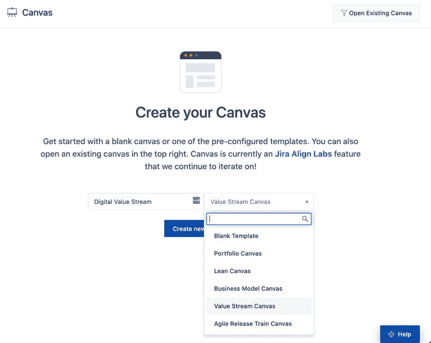

图 7.10 – Jira Align – 创建你的画布

在围绕价值组织人员时，有三种变化方式：每个项目一个价值流，每个项目多个价值流，以及每个价值流多个项目。从工具使用的角度来看，第一种方式是最简单的，因为你可以直接使用项目预算作为价值流预算，而另外两种方式则需要追踪额外的属性，以便在多个价值流之间分配预算。

要查看 Jira Align 中的项目预算，请通过导航菜单进入投资组合房间的财务视图，然后选择**投资组合** | **投资组合房间**。接着，点击工作区右上角的**额外配置**按钮，选择一个战略快照。投资组合房间的右侧面板将显示关键信息，包括项目预算，如下截图所示：

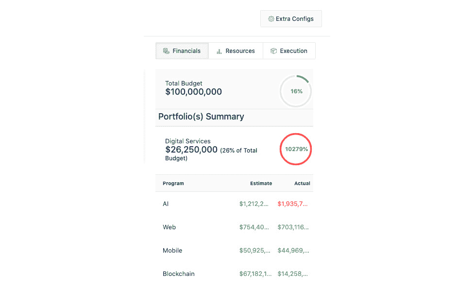

图 7.11 – Jira Align 投资组合房间，右侧面板

在这里我们可以看到以下信息：

+   **总预算**：显示所选战略快照中**总预算**字段的数值。圆形图显示到目前为止的实际支出，以已接受故事的点数为基础，作为总快照预算的百分比。

+   **投资组合汇总**：显示与投资组合中的项目相关的 PI 预算的汇总，作为总快照预算的百分比。

+   **项目总结**：显示投资组合中每个项目的预算总和，以故事级别的估算和实际花费为基础，转换为基于团队速度和混合费率的美元数额。

这只是投资组合房间的一个方面。欲了解更多信息，请参考[`help.jiraalign.com/hc/en-us/articles/115000095234-10X-Portfolio-Room`](https://help.jiraalign.com/hc/en-us/articles/115000095234-10X-Portfolio-Room)。

如前所述，“按主题分类的投资报告”对预算编制项目和/或价值流非常有用。它展示了投资组合如何通过主题分配预算和工作量来实施业务战略。要访问该报告，请进入导航菜单，选择`Mobile`项目和`PI-5`：

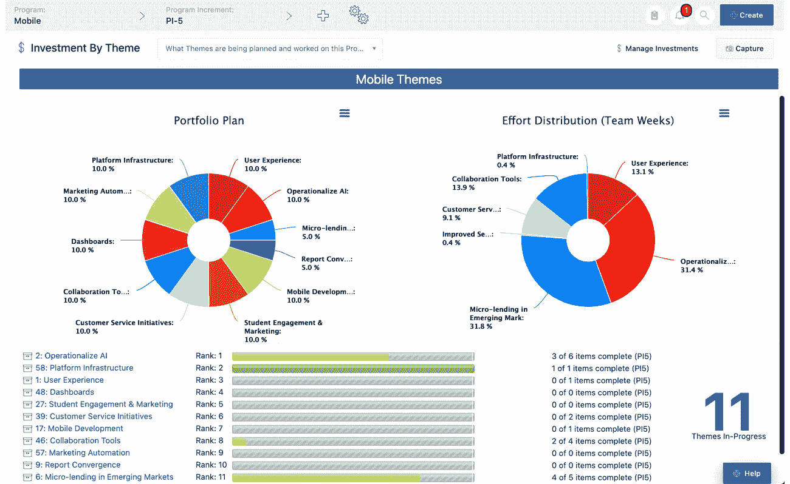

图 7.12 – Jira Align 按主题分类的投资报告

左侧饼图展示了投资组合如何在各个主题之间分配预算。操作方法是点击工作区右上角的**管理投资**按钮，打开**主题规划视图**面板，在此处可以设置每个主题的总 PI 投资百分比。右侧图表展示了实际的工作分配情况，使得投资组合领导层能够看到实际执行与计划预算分配之间的吻合度。

报告的底部列出了正在进行的主题，进度条显示了完成的百分比。将鼠标悬停在进度条上查看详细信息。每个主题完成的史诗和独立功能的计数显示在进度条的右侧。将鼠标悬停在计数上查看详细信息。

另一个有用的预算报告是投资与实际对比报告，它展示了每个主题的 PI 分配、估算支出和实际支出。要访问此报告，请前往导航菜单，然后选择 `Digital Services` 投资组合和 `PI-5`：

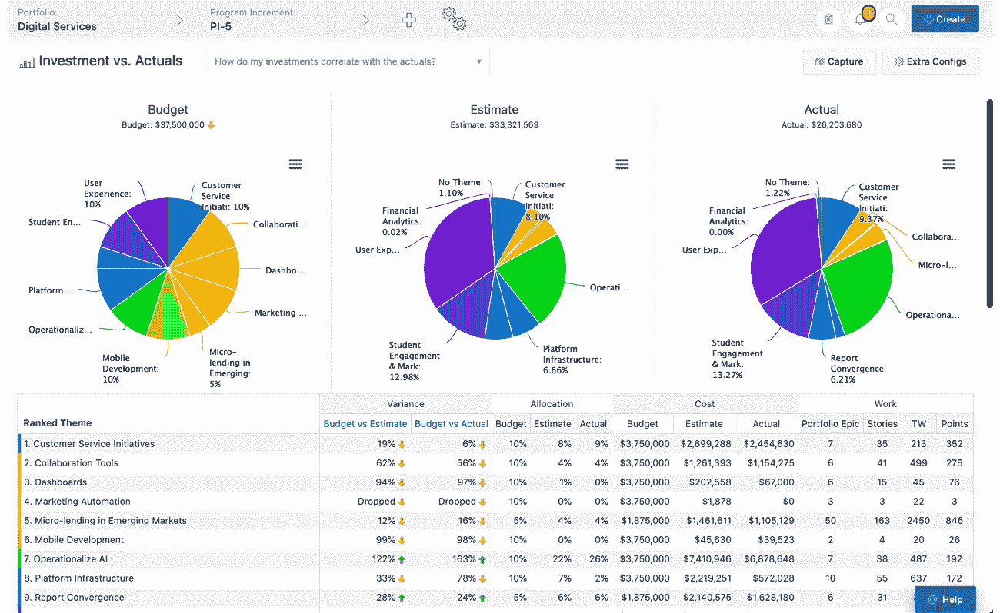

图 7.13 – Jira Align 投资与实际对比报告

让我们从左到右检查这三个图表：

+   **预算**：图表上方的数值表示程序增量预算或投资组合史诗预算的总和，这取决于通过点击工作区右上角的 **Extra Configs** 按钮所做的设置。图表显示了我们之前看到的各主题的相同百分比分配，这个分配是通过进入“按主题分配投资”报告并点击 **管理投资** 按钮来设置的。将鼠标悬停在饼图的各个部分上以查看美元值。

+   **估算**：图表上方的数值是根据 PI 中的总故事点和每个点的成本估算的投资组合史诗成本总和。每个点的成本是通过将每个冲刺的平均团队成本除以平均速度得出的。图表显示了每个主题在 PI 中的投资组合史诗成本占总估算投资组合史诗成本的百分比。将鼠标悬停在饼图的各个部分上以查看美元值。

+   **实际**：图表上方的数值是根据 PI 中与投资组合史诗相关的已接受故事的总故事点和每个点的成本，计算出的实际故事成本总和。每个点的成本是通过将每个冲刺的平均团队成本除以平均速度得出的。图表显示了每个主题的实际故事成本占总实际故事成本的百分比。将鼠标悬停在饼图的各个部分上以查看美元值。

报告的底部显示了每个主题的多个其他数据点，包括方差、分配、成本和工作量。现在我们已经看了一些有用的报告，帮助投资组合领导层规划和监控投资，接下来让我们看看投资组合如何将执行与企业战略连接起来。

## 将投资组合与企业战略连接起来

企业战略是基于多个输入形成的，包括使命、愿景和价值观；商业驱动因素；财务目标；以及竞争分析。企业战略的输出是投资组合预算和战略主题。

在 SAFe 中，主题是驱动投资组合未来状态的差异化业务目标，将投资组合与企业战略连接，并为投资组合愿景和精益预算提供背景。根据 SAFe 的定义，主题最好通过 OKR 形式来描述，其中目标即为主题，关键成果则是衡量主题进展的量化指标。虽然 SAFe 将主题视为一种目标，但我们遵循 Jira Align 支持的方法，在这种方法中，主题代表一个大的工作项，OKR 代表其对应的业务成果。这提供了一种一致的方法，文档化于 *第二章*，*实施 Jira Align*，*图 2.9*，其中每个规模层级都包含一组人员、工作、时间和成果维度。

以下截图提供了 Jira Align 中的主题如何与 OKR 对应的示例：

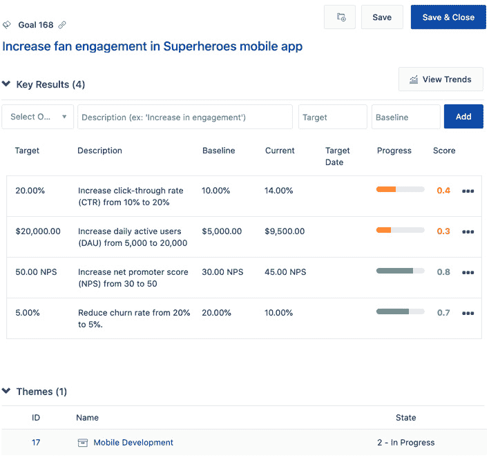

图 7.14 – Jira Align OKR 与主题的关联

在这里，我们设定了一个年度目标：“**增加超级英雄移动应用的粉丝互动**”，并与之关联了关键成果和主题。

LPM 的一个关键功能是明确工作方向和目的，以便将战略与执行相连接。清晰度使得去中心化的决策成为可能，从而在各个层级提高价值流动。OKR，例如前面截图中的年度目标，有助于总结驱动工作的方向和目的。

主题及其对应的 OKR 会影响投资组合战略，并为决策提供背景。它们影响投资组合愿景、投资组合史诗待办事项和看板、项目、解决方案及团队级别的待办事项、价值流预算以及精益预算守则。现在，让我们来审视一下投资组合愿景。

## 维护投资组合愿景

在 SAFe 中，投资组合画布定义了投资组合的领域和开发价值流，是创建和维护投资组合愿景的关键输入。Jira Align 使得创建投资组合画布变得简单。首先，进入导航菜单并选择 **Enterprise** | **Canvas**。然后为您的画布命名，并从列表中选择 **Portfolio Canvas**，再点击 **Create new Canvas** 按钮。这将打开一个空白画布，包含空内容块。在下面的截图中，我们已经为 **Mutants** 投资组合创建了一个画布：

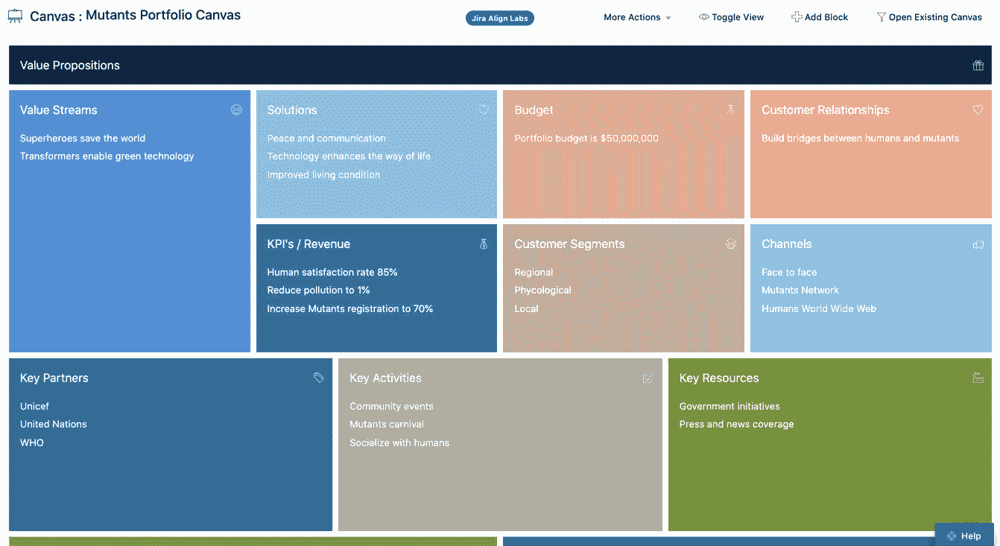

图 7.15 – Jira Align 投资组合画布

在这里，我们可以看到一些内容块，用于定义投资组合的价值主张、价值流、预算等。将鼠标悬停在某个块上，可以执行以下操作，以配置画布的外观和感觉：

+   编辑标题。

+   更改背景颜色。

+   更改图标。

+   添加内容，包括链接。

+   选择一个状态以反映内容状态：**未开始**、**进行中**或**已完成**。当您点击工作区右上角的**切换视图**按钮，从**完整视图**切换到**备注视图**时，状态将显示为颜色编码的图标（分别为灰色、红色和绿色）。

+   拖放以移动区块或调整其大小。

+   删除该区块。

要创建内容区块，请点击工作区右上角的**添加区块**按钮。然后，点击工作区顶部中间的**更多操作**按钮，访问以下选项：点击**编辑画布**以重命名画布，点击**删除画布**以移除画布，或者点击**创建新画布**。请注意，如果删除画布，将无法恢复。您可以通过点击工作区右上角的**打开现有画布**按钮来打开现有画布。

现在我们知道如何创建投资组合画布，接下来我们来看一下投资组合如何利用精益预算来改善结果。

## 建立精益预算和护栏

传统项目资金分配方法的典型挑战是，它会造成摩擦、额外成本和延迟。LPM 通过资助价值流并遵循预算护栏来解决这一问题，从而提高价值交付的速度。

其中一个护栏是通过地平线指导投资。SAFe 建议以下地平线：

+   **Horizon 3 – 探索**：投资以评估潜在的新解决方案。

+   **Horizon 2 – 新兴**：来自 Horizon 3 的解决方案。

+   **Horizon 1**：提供的价值大于其成本的解决方案。Horizon 1 有两个子类别：

    **投资**：需要大量持续投资的解决方案。

    **提取**：提供高价值并且需要最小新投资的稳定解决方案

+   **Horizon 0 – 退役**：投资以退役解决方案。

我们建议 Jira Align 管理员将前述地平线添加到投资组合史诗详细面板上的**战略驱动因素**下拉菜单中。为此，管理员需转到**管理** | **设置** | **平台**，然后点击**下拉菜单**标签，选择**战略驱动因素**以管理字段值。

小贴士和技巧

标准的**战略驱动因素**下拉选项包括**创新**、**扩展**、**维持**、**控制**、**退出**和**未知**。我们建议将现有选项重新命名，以便标识不同的地平线，如下所示：

**Horizon 3 - 创新**

**Horizon 2 - 扩展**

**Horizon 1 - 维持**

**Horizon 1 - 控制**

**Horizon 0 - 退出**

以这种方式设置投资地平线，可以为 LPM 功能提供几个有用的可视化，我们稍后将探讨。在此之前，请注意，Jira Align 有一个名为**战略地平线**的标准下拉菜单。然而，使用该菜单来捕捉投资地平线存在三个缺点：

+   它只有三个选项，这些选项无法编辑：防守与扩展；扩展到新市场；探索未来选项。

+   你不能像**战略驱动器**那样，根据这些字段对组合史诗路线图进行分组。

+   你不能像**战略驱动器**那样，根据这些字段生成报告。

因此，我们建议使用**战略驱动器**来查看视野。要查看组合史诗积压中的视野，进入**列显示** | **组合史诗**，然后选择**战略驱动器**，如下图所示：

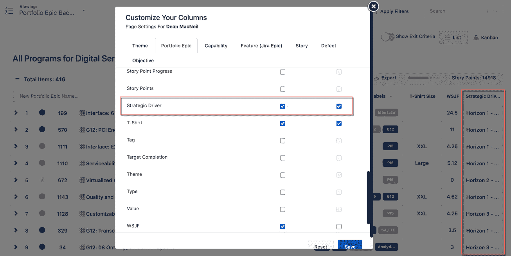

图 7.16 – Jira Align 组合史诗积压与战略驱动器

要按视野创建组合史诗路线图，需要执行以下步骤：

1.  进入导航菜单，选择**程序** | **管理** | **路线图**。确保在配置栏中选择了 PI，并从下拉菜单中选择**工作**和**组合史诗**。

1.  接下来，点击工作区顶部的**查看配置**按钮，位于中心右侧。

1.  然后，点击**其他选项**标签，在**按属性分组**下选择**战略驱动器**。

现在，你将看到按视野分组的组合史诗路线图，如下图所示：

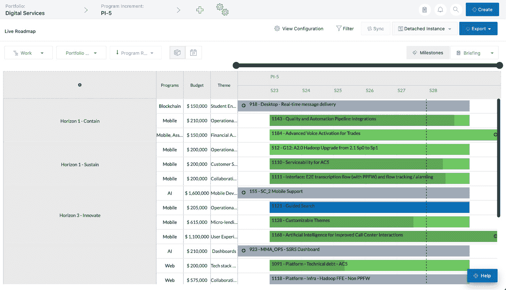

图 7.17 – Jira Align 组合史诗路线图与战略驱动器

请注意，路线图泳道按战略驱动器分组，这些驱动器反映了左侧的视野。前提是必须在每个组合史诗的详细面板中选择一个战略驱动器。

另一个预算控制框架是按活动类型确定并应用容量分配。Jira Align 支持通过使用类别字段在功能工作项级别捕获活动类型。标准类别包括**客户资助**、**增长/保护基础**、**创新**、**新市场/产品**、**研发**、**技术投资**和**技术债务**。Jira Align 管理员可以通过进入**管理** | **设置** | **平台**，点击**下拉菜单**标签并选择**功能类别**来编辑此列表。请注意，类别必须通过进入**管理** | **设置** | **详细面板设置**，从**组合**下拉菜单中选择组合，从**工作项**下拉菜单中选择**功能**，然后打开**类别**开关来启用。

要查看按视野（horizon）划分的百分比分配，进入导航菜单，点击`strategic driver`。点击搜索结果以打开**战略驱动器报告**，如下所示的截图：

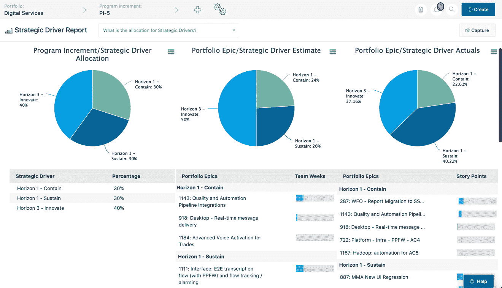

图 7.18 – Jira Align – 战略驱动器报告

在这里，你可以看到 PI 的计划、估算和实际分配情况，针对每个战略驱动。这使得投资组合领导可以判断计划的战略分配是否与团队实际正在做或计划做的工作相一致。例如，如果领导计划将季度工作投入的 25%用于拓展新市场，而图表显示只有 10%会投入，那么投资组合可能会错失收入目标。

左侧图表基于在 PI 详细面板中设置的百分比分配。要设置这些，请进入导航菜单，选择**项目** | **管理** | **项目增量**。然后，点击网格中的一个 PI 以打开其详细面板。最后，点击**+ 完整详情**，然后点击**管理战略驱动分配**。

中间的图表基于投资组合史诗对 PI 的估算，右侧图表基于与 PI 中的投资组合史诗相关联的已接受故事的实际故事点。图表下方的进一步详细信息包括按时间范围分类的投资组合史诗和进度条。将鼠标悬停在进度条上以查看详细信息。该报告还显示了多个 PI 在配置栏中选择时的分配趋势。这可以通过向下滚动来查看。

提示和技巧

如果你的报告搜索没有返回战略驱动报告，你可以请求 Jira Align 管理员为你的角色启用该报告。

要做到这一点，管理员需要进入**管理** | **访问控制** | **角色**，选择你的角色，点击**附加选项**展开该部分，然后在**报告**下启用**战略驱动分配**选项。

LPM 的另一个预算防线是，需要对重大举措进行审批，也就是说，需要对投资组合史诗进行审批。投资组合的愿景是通过投资组合史诗来实现的，同时也鼓励持续的业务所有者参与。这可以通过定期举行的会议形式来落实，例如 SAFe 推荐的投资组合同步会议。

在使用 LPM 时，传统的**可资本化费用**（**CapEx**）和**运营费用**（**OpEx**）类别依然适用。Jira Align 支持在投资组合史诗级别追踪 CapEx。要将投资组合史诗指定为 CapEx，请进入该投资组合史诗的详细面板，点击**+ 完整详情**以查看**资本化**下拉框。选择**是**表示 CapEx：

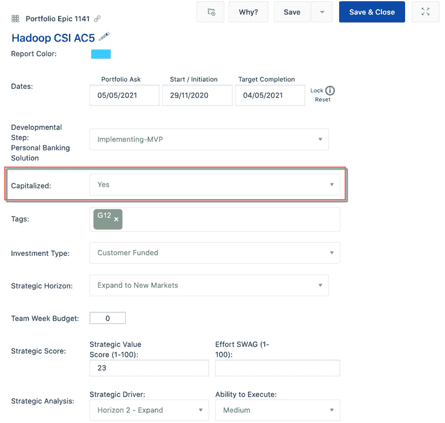

图 7.19 – Jira Align 投资组合史诗 – 资本化

你可以通过点击待办事项工作区顶部的**显示列**按钮，然后点击**投资组合史诗**选项卡并选择**资本化**复选框，来将此列添加到你的投资组合史诗待办事项中。为了将 CapEx 和 OpEx 的计划预算总额添加到投资组合史诗中，请点击详细面板中的**财务**选项卡，如下图所示：

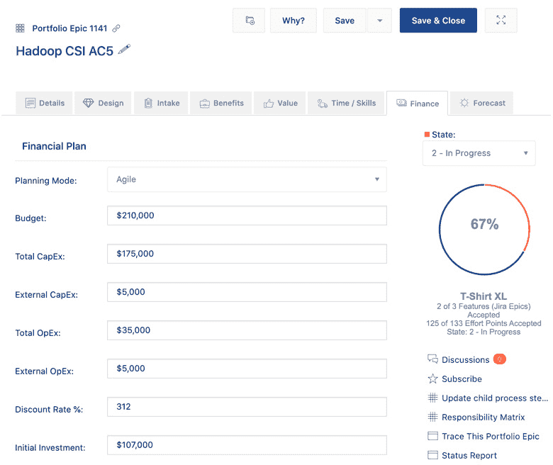

图 7.20 – Jira Align 组合史诗 – 财务

在这里，您可以输入并跟踪资本支出（CapEx）和运营支出（OpEx）数据。该数据的一个有用的可视化方式是状态报告，财务视图。要访问它，请前往导航菜单，选择**企业** | **跟踪** | **状态报告**。接下来，点击**组合**按钮，然后选择您的组合。最后，点击工作区右上角附近的**查看财务**按钮。

状态报告，财务视图提供了按所选 PI（程序增量）进行细分的组合史诗财务、状态和健康信息。点击一个程序、组合史诗或其相关主题以深入了解更多信息。数据列非常多，因此您需要水平滚动以查看以下截图中显示的 CapEx 和 OpEx 列：

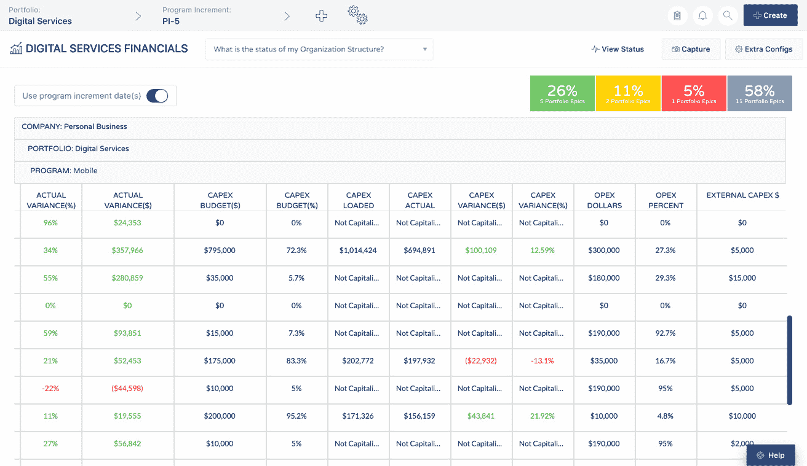

图 7.21 – Jira Align 状态报告，财务视图

现在我们已经探索了组合预算报告和防护措施，接下来让我们看看如何建立组合流动。

## 建立组合流动

传统组合管理的另一个挑战是，需求和**在制品**（**WIP**）的控制不当会降低产出。LPM 的解决方案是将需求与能力匹配，从而增加价值流动。

组合看板使 LPM 功能能够根据在制品（WIP）限制将需求与能力匹配，实时可视化每个过程步骤中的瓶颈，并发现持续改进的机会。看板还包括各个过程步骤中关于组合史诗进出的一些规定。

要创建组合看板，首先需要指定基础的过程步骤。首先，前往导航菜单，选择**组合** | **管理** | **过程步骤**，然后点击**添加过程步骤**按钮以打开如下截图所示的面板：

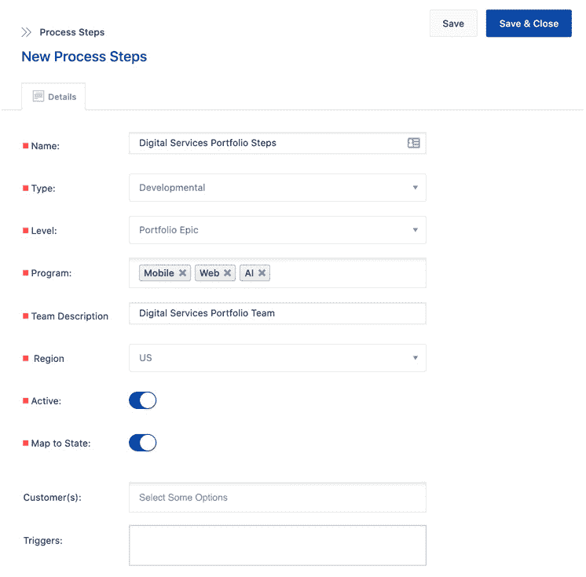

图 7.22 – Jira Align 组合 – 新的过程步骤

接下来，输入以下详细信息：

+   **名称**：为您的组合看板添加一个有意义的名称。

+   **类型**：选择以下两种类型中的一种：

    **开发**：开发新产品、系统或服务能力所需的步骤。选择此选项将允许您将过程步骤映射到 Jira Align 的工作项状态。这是大多数情况下的标准选项。

    **运营**：提供商品或服务给客户所需的步骤，无论是内部还是外部的。这对于建模未来的业务运营可能有用，但很少使用。

    提示和技巧

    如果您在下拉菜单中看不到**运营**类型，请请求 Jira Align 管理员启用运营价值流。

    为此，管理员需要前往**管理** | **设置** | **平台**，点击**解决方案**标签，将**启用操作流程步骤**下拉框设置为**是**，然后点击**保存设置**按钮。

+   **级别**：选择工作项级别——主题、投资组合史诗、能力、特性或故事。这里我们将选择**投资组合史诗**。

+   **团队描述**：添加负责看板的团队描述。

+   **区域**：选择适用于看板的区域。

+   **激活**：指定看板是否处于激活状态并可用。

+   **映射到状态**：如果您选择了**开发**类型，则可以开启此选项，将流程步骤映射到工作项状态。

此外，您可以添加以下可选信息：

+   **客户**：列出相关客户。

+   **触发器**：指定触发价值流动的事件；例如，客户下订单或请求新功能。

+   **输入**：指定任何必要的输入。

+   **输出**：列出任何相关的输出。

+   **包括**：提供有关流程步骤范围的额外信息。

最后，点击**保存**按钮。您现在会看到**流程步骤**标签，在这里您可以为看板添加步骤，并将其与状态关联，如下图所示：

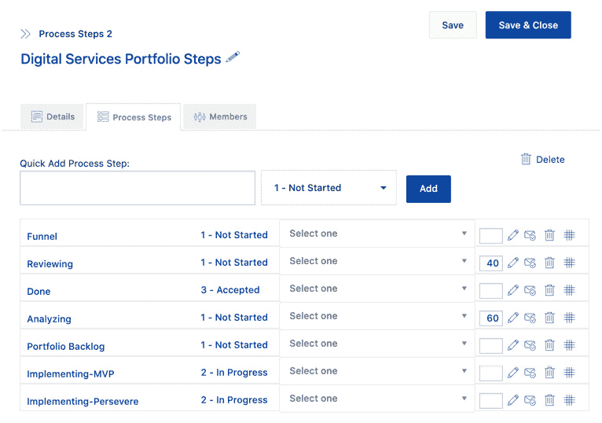

图 7.23 – Jira Align 投资组合 – 流程步骤

在这里，我们添加了 SAFe 推荐的投资组合看板步骤，并将其映射到 Jira Align 的工作项状态。例如，**漏斗**映射到**1 - 未开始**。请注意，如果某个流程步骤映射到您组织的功能区域，您可以从工作项状态右侧的下拉框中选择它；不过，这种情况较少使用。

提示与技巧

要维护功能区域列表，请前往**管理** | **设置** | **功能区域**。

作为前提，Jira Align 管理员必须在**管理** | **访问控制** | **角色** | **管理** | **其他设置**下启用您的角色的**功能区域**。

请注意，**功能区域**通常在**管理** | **设置** | **平台术语**中被重命名为**业务单元**。

在**流程步骤**标签的最右侧，点击矩阵图标以维护**RACI**（**负责**、**有责任**、**咨询**、**知情**）矩阵。通过点击垃圾桶图标删除流程步骤。通过点击电子邮件图标开启/关闭电子邮件提醒通知。点击每个步骤旁边的铅笔图标以添加或编辑详细信息，包括退出标准，如下图所示：

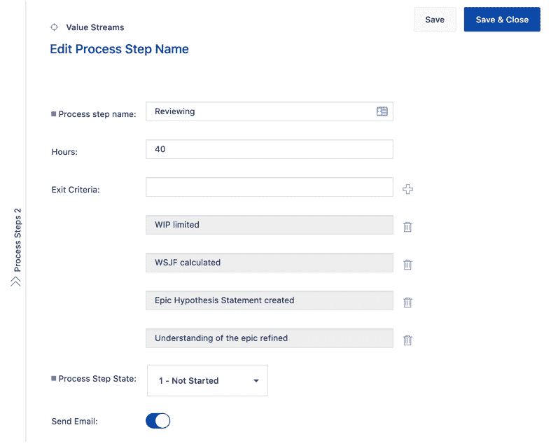

图 7.24 – Jira Align，编辑流程步骤

在这里，我们正在编辑`40`作为估计的流程步骤时间（以**小时**为单位）。这些数据用于衡量效率，效率定义为每个步骤的总估计小时数除以每个步骤的实际总小时数，这些数据可以在《在制工作》报告中查看。

小贴士和技巧

要查看流程步骤指标，包括效率，前往导航菜单并选择**投资组合** | **跟踪** | **在制工作**。确保你的上下文已在配置栏中设置。

接下来，点击工作区右上角的**价值流视图**按钮，并滑动**统计数据**开关。

最后，从**流程步骤**下拉菜单中选择你的看板名称，然后点击右侧箭头符号展开它。你可以选择多个看板进行显示，然后展开或折叠它们。

在每个泳道的顶部，你将看到之前提到的**效率**，以及**吞吐量**（过去 30 天内进入最后步骤的项目数量）和**周期时间**（过去 30 天内项目进入最后步骤所需的平均小时数）。

接下来，注意我们为**审核**流程步骤添加了四个**退出标准**，将其映射到**1 - 未开始**状态，并启用了电子邮件通知。在此标签页编辑完成后，点击**保存**按钮。最后，点击**成员**标签，添加**数字服务投资组合团队**的团队成员，然后点击**保存并关闭**按钮。

现在我们已经创建了流程步骤，可以查看投资组合看板来可视化投资组合流。这通常在投资组合同步期间进行，投资组合同步是一个基于节奏的事件，用于审查和管理投资组合看板上的史诗。每个投资组合史诗在看板上通过流程步骤的推进由史诗负责人协调。

要查看投资组合看板，请首先通过导航菜单选择**投资组合** | **待办事项**进入投资组合史诗待办事项。接下来，点击工作区右上角的**看板**按钮，然后选择**流程步骤视图**选项以查看看板，如下图所示：

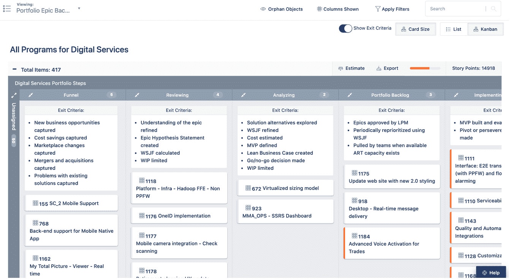

图 7.25 – Jira Align 待办事项流程步骤看板

在这里，我们查看的是**数字服务**投资组合的看板。你可以在配置栏中设置上下文，按程序和/或程序增量进行筛选。注意我们在工作区顶部右侧启用了**显示退出标准**选项，这会显示我们之前为每个流程步骤添加的退出标准。点击**卡片大小**按钮，然后选择**正常**、**小**或**热图视图**。点击每列的箭头，可以折叠或展开它们，以便更好地可视化从头到尾的流程。在前面的截图中，我们折叠了**未分配**列。

现在我们可以可视化组合流动，让我们查看*流程步骤周期时间*报告，评估组合史诗如何通过各个流程步骤流动。要访问该报告，进入导航菜单，点击搜索图标（放大镜），搜索`流程步骤周期时间`，然后点击搜索结果。接下来，从**流程步骤**下拉菜单中选择看板名称，并在相应字段中输入日期范围。请注意，当你在配置栏中选择了 PI（Program Increment）时，日期范围会自动填充。这将生成如下截图所示的报告：

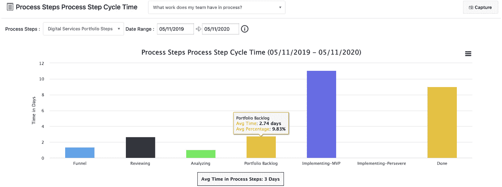

图 7.26 – Jira Align 流程步骤周期时间报告

对于此报告，我们在配置栏中选择了**数字服务**组合，并设置了 1 年的日期范围。当你向下滚动时，你会看到三个关键统计数据：

+   **流程步骤周期时间**：柱状图显示工作项在每个流程步骤中停留的平均时间。柱状图下方是一个折线图，允许你通过点击并拖动来更改日期范围，以突出显示你想查看的时间段。然后，你可以点击右上角的**重置缩放**按钮以重置时间轴。

+   **流程步骤 WIP**：另一张柱状图显示每个流程步骤中的工作项平均数量。下方是显示工作项在每个流程步骤中随着时间变化的折线图。点击并拖动折线图以突出显示你想查看的时间段，然后点击右上角的**重置缩放**按钮以重置时间轴。

+   **周期时间控制图**：以折线图的形式显示以下信息：

    **滚动平均值**：在看板上，所有工作项在流程步骤中停留的平均天数，针对特定日期。

    **整体平均值**：所有每日滚动平均值的总和除以图表中的天数。

    **已完成工作项**：在流程步骤中花费的天数总和除以当天完成的工作项数量。当工作项移入最终流程步骤时，它被视为完成。

该报告有助于识别瓶颈和延迟，找出在某个流程步骤中停留时间过长的工作项。它帮助建立对端到端交付流程的理解，并展示如何在速度、质量和市场时间方面进行改进。

## 应用精益治理

我们将在本节中提到的与传统组合管理相关的最终挑战是，年度规划和严格的预算周期妨碍了对变化的响应能力。组合史诗的预先大规模规划和预算做法是无效的，通常会导致工作项在交付时变得不相关。

LPM 的解决方案是滚动波规划和动态预算，以便快速响应变化。这种方法的一个方面是，仅预算验证假设所需的投资组合史诗部分。例如，可以通过减少安全漏洞来验证假设，即史诗交付将增强安全性。我们将在下一节中进一步讨论这个方面。

# 促进创新

各种规模的组织都在寻求像初创公司一样进行创新，以实现真正的业务敏捷性。*Eric Reis*（2011 年）在《精益创业》中概述的方法，随着时间的推移，已获得了越来越多的认可和流行。例如，SAFe 已将这些方法融入其 LPM 方法中。简单来说，精益创业的构建-测量-学习周期促进了创新。

遵循 SAFe 方法时，精益创业周期从新定义的投资组合史诗和假设声明开始。然后为该史诗定义**最小可行产品**（**MVP**）。MVP 代表了验证假设声明是否有效所需的投资组合史诗的最小部分。MVP 通过投资组合看板流动至**实施**状态。根据 MVP 是否验证了假设，投资组合团队决定要么调整方向，进入新的投资组合史诗和假设，要么坚持并继续开发该投资组合史诗。当投资组合团队的监督不再需要时，他们会将投资组合史诗移至**完成**状态。

提示与技巧

SAFe 提供了史诗假设声明的 Word 模板。你可以轻松选择 Word 模板中的所有内容，然后将其粘贴到基于 Web 的 wiki 中，如 Confluence。接着，你可以在投资组合史诗详情面板的链接部分添加史诗假设声明的链接。

Jira Align 通过投资组合史诗看板可视化价值流，并提供了高级功能，用于跟踪从假设声明到决定是否调整或坚持的最小可行产品（MVP）。关注的重点是结果而非输出。要跟踪和衡量结果，请打开投资组合史诗的详情面板，然后点击下图所示的**价值**选项卡：

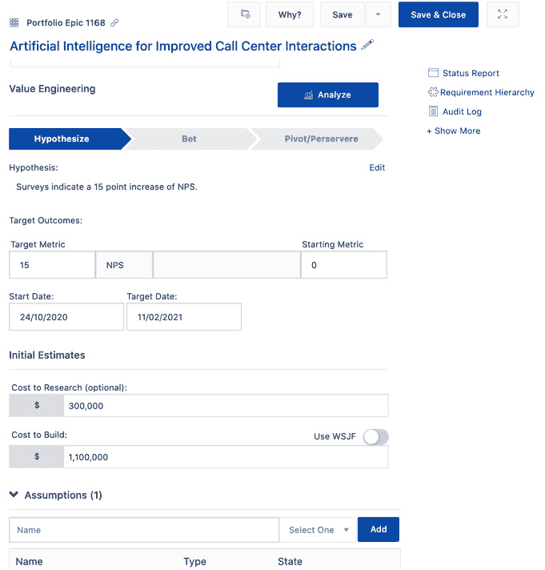

图 7.27 – Jira Align 价值工程假设

该选项卡为价值工程提供了强有力的支持。它允许你定义一个假设，并通过最小的投资确保工作能够达成预期的结果。如果未能实现，它还提供了调整方向的机会。

在这个例子中，我们认为可以通过`300,000`美元的研究费用和`1,100,000`美元的建设费用来验证我们的假设。我们可以通过添加开支来进行研究并跟踪预算支出，如下图所示：

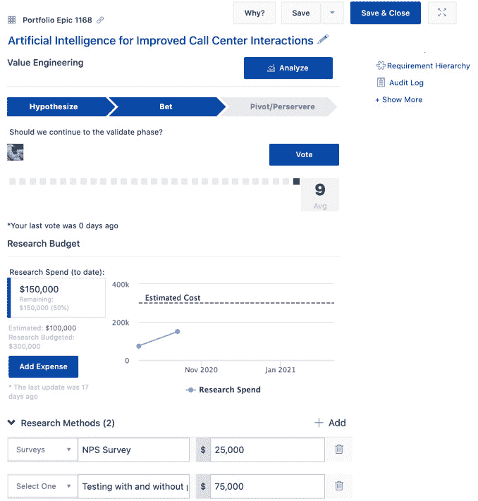

图 7.28 – Jira Align 价值工程赌注

这使我们能够追踪实际的开发成本，并将其与实现的价值进行对比。投资组合领导层可以每天投票决定是否继续进入验证阶段。一旦我们进入下一个阶段，我们可以决定是调整方向还是继续投资并坚持下去：

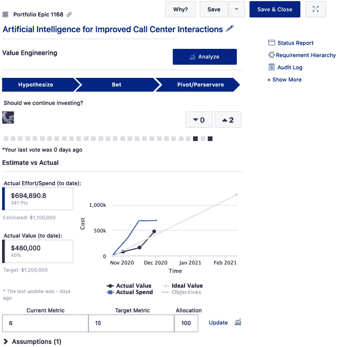

图 7.29 – Jira Align 价值工程调整方向/坚持

Jira Align 会自动计算交付一个故事点的成本，并将该成本汇总到特性，然后是投资组合史诗，以告知我们迄今为止交付了 **341** 个故事点，花费了 **$694,890**，并实现了 **$480,000** 的价值。

这里的价值衡量标准不是收入，而是 **净推荐值**（**NPS**），因为在假设阶段，我们将每个 NPS 增量点与美元价值关联。我们不仅可以分析这个特定的投资组合史诗的表现，还可以分析我们正在开发的所有投资组合史诗的表现，然后根据情况决定是否调整方向或坚持下去。

现在我们已经学会了如何追踪和衡量从假设到调整方向或坚持的 MVP，让我们回过头来看看如何直接从我们的客户以及组织内的其他人收集新创意。

## 收集创意

Jira Align 的创意模块允许产品管理团队收集来自客户（包括内部和外部客户）以及其他各方的未来产品和功能创意。首先，我们通过导航菜单选择 **产品** | **创意** | **创意发想**。在这里，您可以提交创意，比如对现有产品的改进请求，或者一个问题。您还可以对创意进行投票，如下图所示：

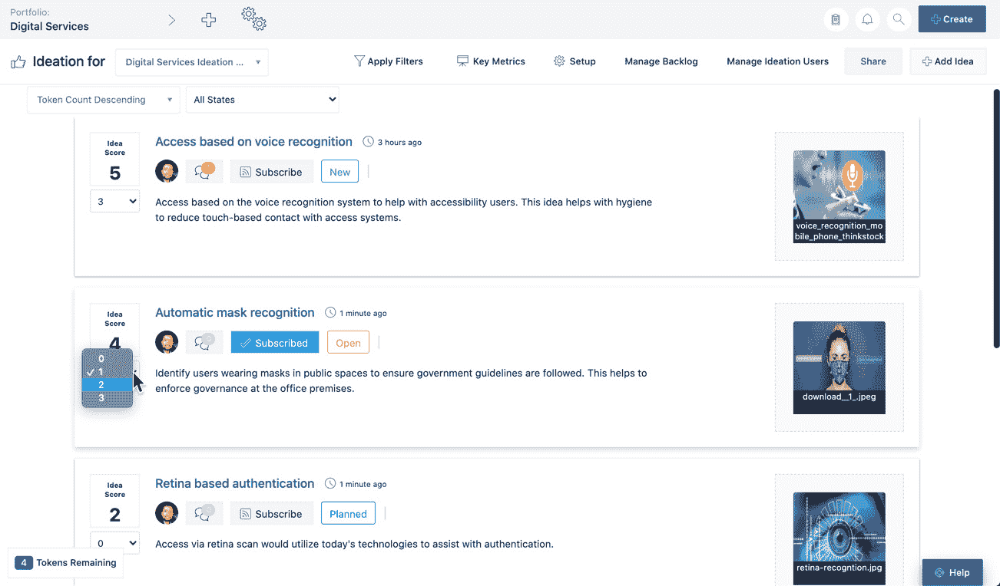

图 7.30 – Jira Align 创意发想

点击工作区右上角附近的 **管理创意用户** 按钮，以授予或撤销对创意模块的访问权限。通过点击靠近中央顶部的 **关键指标** 按钮，监控创意的提交和投票结果。点击右上角的 **共享** 按钮，生成一个内部链接，分享工作区的内容。

一个典型的创意发想流程从收集与特定产品或产品线相关的创意开始，通常会在固定的时间段内进行，如 PI 或业务季度。首先，创建或修改现有的创意小组。为此，点击工作区顶部居中的 **设置** 按钮，打开以下截图所示的小组详情面板：

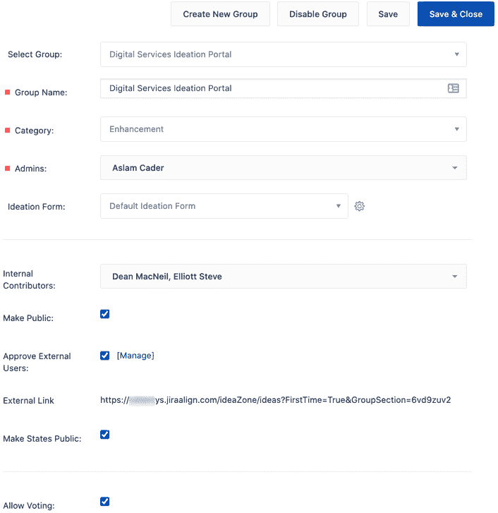

图 7.31 – Jira Align 创意发想活动

请注意，红色方框表示必填字段。要创建一个新活动，请点击面板顶部中间的**创建新组**按钮。点击**禁用组**按钮暂停或停止活动，然后点击**启用组**按钮重新激活活动。以下是你可以输入和跟踪的活动组属性：

+   **选择组**：在创意组之间切换。

+   **组名称**：为你的创意组或活动提供一个名称。

+   **类别**：选择你想在活动中收集的类别：**增强**、**问题**或**票务**。

+   **管理员**：选择谁将管理该活动。

+   **创意表单**：选择一个创意表单，或者点击齿轮按钮创建新表单，或者向现有表单中添加字段以收集更多细节。

+   **内部贡献者**：选择活动的内部贡献者或参与者。

+   **公开状态**：启用外部访问创意组。

+   **批准外部用户**：管理并批准外部用户对创意组的访问（必须选择**公开**复选框）。

+   **外部链接**：当选择**公开**时，显示一个链接供你提供给外部用户。

+   **公开状态**：使创意状态对外部用户可见。

+   **允许投票**：启用对创意的投票。默认情况下，你可以选择投赞成票（+1）或反对票（-1）。

+   **令牌投票**：启用基于令牌的投票，如*图 7.30*所示。

+   **每个创意最大投票数**：设置每个创意可投的最大令牌票数（必须选择**令牌投票**复选框）。

+   **总用户令牌数**：设置每个用户将获得多少令牌（必须选择**令牌投票**复选框）。

点击**保存并关闭**按钮提交更改并返回工作区。现在，你可以通过点击右上角的**添加创意**按钮，以内部用户身份创建创意。这会打开如下所示的新创意面板：

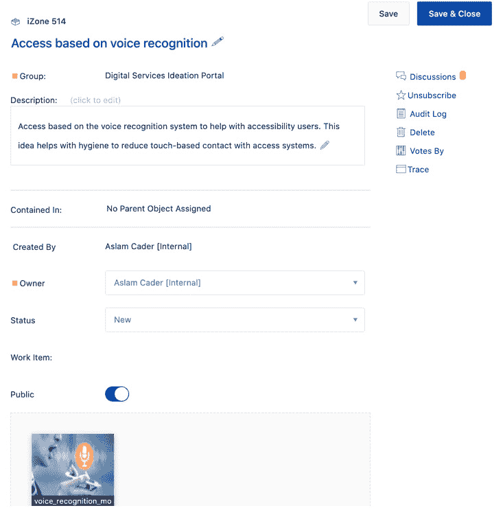

图 7.32 – Jira Align 新创意

这里展示了一个提交给**数字服务创意门户**活动的创意。以下是你可以输入和跟踪的创意默认属性。这些可能会有所不同，其他属性如**产品**或**客户**可能会出现，具体取决于为活动选择的创意表单：

+   **组**：如果你有多个创意组的访问权限，选择一个创意组。

+   **标题**：添加创意的总结。

+   **描述**：添加更多相关的细节。

+   **包含于**：创意被提升后，显示与之关联的工作项链接。我们稍后会讨论如何提升创意。

+   **创建者**：默认显示创建该创意的用户。

+   **所有者**：选择创意的所有者。

+   **状态**：选择**新建**表示一个新的创意，稍后可以在创意待办事项中移动到以下状态：**开放**、**计划**、**完成**和**搁置**。

+   **类别**：选择创意的类型：**增强**、**问题**或**票务**。

+   **公开**：使这个想法对外部用户可用。

+   **附件**：在点击**保存**按钮提交创意后，可以添加附件。

产品管理和活动管理员在创意积压中管理创意。在创意工作区的右上角点击**管理积压**按钮以打开积压，如下图所示：

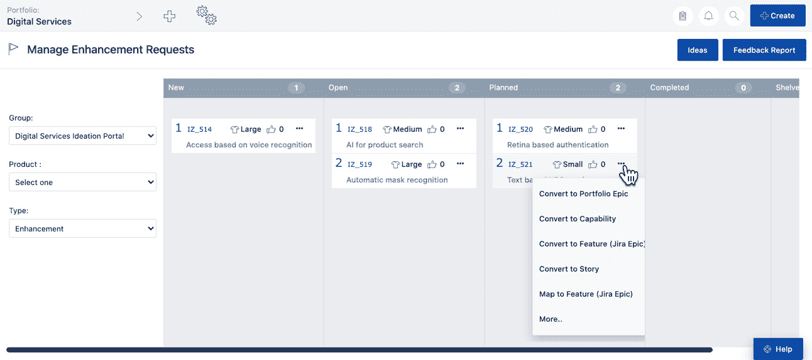

图 7.33 – Jira Align 创意积压

在这里，你可以点击并拖动创意来调整其排名，或者将其在看板上移动至不同的状态。点击省略号可以通过将创意转换为故事、特性、能力或投资组合史诗来提升其优先级，如截图所示；或者点击**更多**为创意分配不同的组或给它一个 T 恤尺码。你可以使用左侧下拉菜单按照**组**、**产品**和**类型**来筛选看板。

除了收集创意外，创造能够培养创新文化的空间同样重要。这对于实现业务敏捷性至关重要，意味着整个组织，而不仅仅是工程或开发团队，都参与到比竞争对手更快速地交付创新业务解决方案的持续主动过程中。此外，考虑到当前远程工作的趋势，团队协作中可能出现的障碍以及对创新的阻碍，需要更高水平的纪律性。

小贴士与技巧

Jira Align 提供了强大的功能来支持创新，借助如**思维导图**、**头脑风暴**和**创新**等工具。这些工具为更好的团队协作创造了空间，从而推动创新文化。你可以在导航菜单的**产品**|**创意**部分访问这些模块。

本书中我们讨论的两家公司或许能为此提供一些灵感。Atlassian 通过每个季度举行一次名为*ShipIt*的 24 小时团队黑客松活动来培养创新文化。这个活动的重点是将团队聚集在一起，提升协作，并促进创新。你可以在[`www.atlassian.com/company/shipit`](https://www.atlassian.com/company/shipit)上阅读更多信息。SAFe 的创始公司 Scaled Agile, Inc.通过将每个 PI 的一个迭代专门用于**创新与规划**（**IP**）来践行其理念，推动创新文化。你可以在[`www.scaledagileframework.com/innovation-and-planning-iteration/`](https://www.scaledagileframework.com/innovation-and-planning-iteration/)上阅读更多信息。

# 概述

在本章中，我们考察了如何在 Jira Align 中广泛地将战略与执行连接起来。接着，我们探讨了 LPM 方法如何解决传统投资组合管理中的问题，以及 Jira Align 如何支持这些方法。最后，我们讨论了创新这一重要主题，它对于现代数字化环境中的企业至关重要。通过这些话题的帮助，你现在可以有效地应对组织在投资组合层面常见的挑战。

在接下来的最后一章，我们将讨论一些特殊的使用案例，并发现 Jira Align 是如何支持这些案例的。从混合瀑布/敏捷开发到政府报告需求，我们都为你准备好了。

# 问题

1.  在 Jira Align 中，推荐使用哪个字段来跟踪投资视野？

1.  投资与实际报告如何支持投资组合领导？

1.  组合看板视图使用哪种方式来管理投资组合看板？

1.  如何将创意模块扩展到外部用户？

1.  为什么培养创新文化如此重要？
