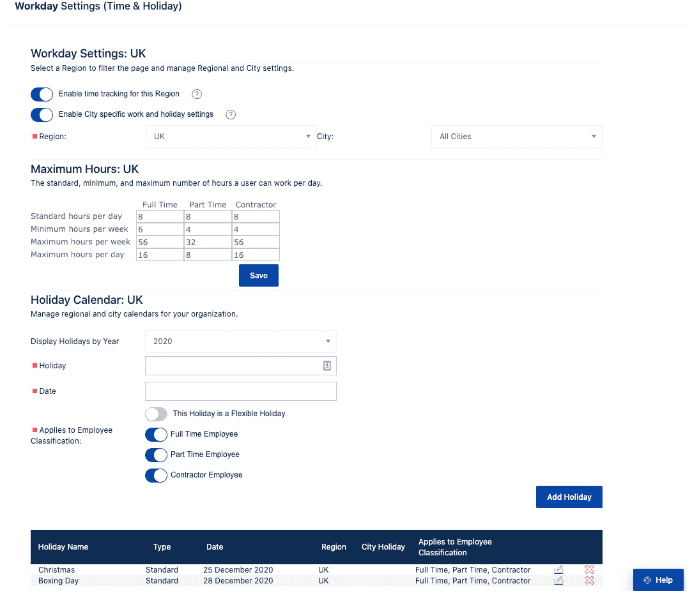

# 第九章：*第八章*：双模开发、高级数据安全与分析

在本章的最后，我们将探讨一些特殊的用例，这些用例可能会对需要在同一工具中追踪瀑布和敏捷交付的组织、需要本地托管提供的高级安全性、以及需要高级**商业智能**（**BI**）功能的组织感兴趣。

本章内容包括：

+   双模开发产品

+   处理时间追踪

+   高级数据安全

+   政府报告

+   与 BI 和其他解决方案的集成

到本章结束时，你将学会如何支持双模开发，如何向需要瀑布风格报告的高层管理人员报告敏捷项目，如何用 Jira Align 的插件替代传统的时间追踪系统，如何在本地托管 Jira Align，如何使用敏捷方法进行已赚价值的报告，以满足政府项目的报告需求，并与 BI 及其他解决方案进行集成。

# 双模开发产品

Garter 在建议公司采用更具创新性和灵活性的产品交付方式时，首次提出了“*双模*”这一术语。模式 1 是传统的瀑布开发方法，周期较长。模式 1 的类比是马拉松跑者。模式 2 代表的是更新的敏捷产品开发方法，周期较短。模式 2 的类比是短跑运动员。

目前许多公司尚未在整个组织中全面采用敏捷方法。有些公司在瀑布管理下拥有敏捷团队，另一些公司在某些领域使用敏捷，在其他领域则采用瀑布方法。此外，敏捷并不是“一刀切”的方法。敏捷的最佳应用场景是复杂和非常复杂的领域，当*目标*和/或*方式*尚不明确或未达成一致时。当你所开发的内容和开发方式都已经被充分理解并达成一致时，瀑布方法是一个很好的选择。因此，Jira Align 被设计成可以支持双模开发。

这里有一句有用的格言：你可以将敏捷工具“*瀑布化*”，但不能将瀑布工具“*敏捷化*”。因此，专注于传统甘特图项目计划和方法的工具，往往无法处理诸如燃尽图和速度图等内容，更别说项目看板和 OKR 树了。接下来，我们将介绍一些支持双模开发的 Jira Align 功能。

首先，建立一个双模操作协议非常重要。这包括一个共同的词汇表，尤其是对于人员、工作、时间和结果的定义。例如，一个实践敏捷的投资组合可能被定义为一组开发价值流，而实践瀑布的投资组合则可能将其定义为一个拥有自己利润与损失（P&L）表的业务单元，或是一个产品线。同样，一个敏捷项目是一个由多个敏捷团队组成的团队，而一个瀑布项目则可能代表着在某个产品线中的一个特定产品上的工作人员。

## 工作与结果维度

对于工作维度，我们建议使用投资组合史诗来表示瀑布模型下业务部门的资助项目。尽管敏捷团队会将假设陈述与史诗关联，并将其拆解为功能和故事，但瀑布投资组合可以将业务需求文档与史诗关联。许多公司在**管理** | **设置** | **平台术语**中将“投资组合史诗”更改为更通用的术语“倡议”。这样，倡议可以代表敏捷投资组合中的史诗，也可以代表瀑布投资组合中的项目。

投资组合史诗支持几种流行的瀑布实践，例如基于里程碑的计划和执行。只需点击待办事项中的投资组合史诗以打开其详细面板，然后点击**时间/技能**选项卡输入**固定日期里程碑**。在下一个图中所示的相同选项卡中，您可以指定执行工作的所需技能集，另一个常见的瀑布实践：

图 8.1 – Jira Align 投资组合史诗时间/技能选项卡

在这里，我们可以看到每个技能集在每个冲刺中的请求的**成员周数**（**MW**）。您可以通过点击**管理技能集**按钮来管理技能集，添加或移除技能。

接下来，我们看到如下的固定日期里程碑字段：

+   **投资组合需求**：请求方希望交付项目的日期。此日期与开发团队的计划交付日期或目标交付日期无关。

+   **开始/启动**：用于战略规划的预计开始日期。这不是基于第一个故事完成时的实际开始日期，而是开发团队打算开始工作的日期。请注意，该日期与实际工作或时间对象无关。

+   **目标完成**：用于战略规划的预计完成日期。它是开发团队打算完成工作的日期。请注意，该日期与实际工作或时间对象无关。

请注意，正如我们在*第三章*中看到的，*导航 Jira Align*，*图 3.8*，人们将技能添加到他们的个人资料中。要管理技能库存，请前往导航菜单并选择**企业** | **管理** | **技能库存**。接下来，点击**预测**选项卡，按团队、项目和项目增量预测所需的努力。这里的度量单位是“团队周”，我们稍后会提供更多信息。

我们在*第七章*中查看的投资组合史诗状态报告、财务视图，*企业和投资组合挑战*，*图 7.21*，对于敏捷和瀑布流程的受众都很有用。除了财务数据，包括资本支出（CapEx）和运营支出（OpEx），它还提供了预算、人员、质量、风险和进度的常用**RAG**（**红色**，**琥珀色**，**绿色**）报告指标。

对于结果维度，OKR 是敏捷和瀑布开发团队中常见的做法。我们建议为习惯使用甘特图的高层提供一份路线图，流行的做法是按 OKR 对投资组合史诗进行分组。为此，按照*第七章*中的说明操作，*企业与投资组合挑战*，*图 7.17*，但在**按属性分组**下选择**目标**。我们还建议在**视图配置** | **自定义列**下添加**项目**，以提供更多投资组合史诗的背景信息。

## 人员和时间维度

对于人员维度，我们建议敏捷和瀑布团队分别汇总到不同的投资组合中，并且投资组合应为单一模式，而非双模态。然而，敏捷和瀑布团队仍然可以合作。主题是可以跨投资组合的工作项，因此可以利用主题将敏捷和瀑布投资组合中的史诗进行整合，然后生成主题状态报告，查看跨投资组合的汇总数据。

要查看主题状态报告，进入导航菜单，选择**企业** | **跟踪** | **状态报告**，然后点击**主题**按钮。确保在配置栏中设置了你的上下文，然后点击你的主题查看报告，在报告中，你将找到按投资组合和程序划分的工作项状态。浏览报告，寻找带有红色状态指示器的偏离轨迹的项目，然后点击一个项目查看其具体状态，查看风险、依赖关系和其他关键信息。

对于结果维度，OKR 是敏捷和瀑布开发团队中常见的做法。我们建议为习惯使用甘特图的高层提供一份路线图，流行的做法是按 OKR 对投资组合史诗进行分组。为此，按照*第七章*中的说明操作，*企业与投资组合挑战*，*图 7.17*，但在**按属性分组**下选择**目标**。我们还建议在**视图配置** | **自定义列**下添加**项目**，以提供更多投资组合史诗的背景信息。

对于时间维度，我们之前讨论过的最佳实践是，投资组合中的所有项目都应遵循相同的节奏。对于敏捷投资组合，程序增量由与 Jira 软件同步的短冲刺（sprints）组成，代表共享的敏捷团队节奏。对于瀑布式投资组合，可以创建一个程序增量，其中的短冲刺代表项目的通道门或阶段。这些增量将与 Jira 软件中的短冲刺同步，且这些短冲刺的名称和日期与 Jira Align 中的阶段相匹配。

估算是我们将要讨论的最后一个双模方面。Jira Align 提供了三种工作项估算方法：T 恤尺码和点数用于敏捷估算，团队周用于传统估算。**团队周**（**TW**）类似于**成员周**（**MW**），只是它与团队级别相关，而非个人级别。请注意，团队周是与团队规模无关的时间度量。因此，如果一个投资组合史诗的大小为 30 TW，无论是由 5 人还是 11 人的团队来完成工作，容量都是相同的。每个投资组合可以有自己的估算方法。选择可以在**管理** | **设置** | **平台** | **投资组合** | **估算系统**中进行。

现在我们已经介绍了 Jira Align 的双模功能，让我们更深入地探讨时间跟踪。

# 处理时间跟踪

虽然对于处于敏捷成熟初期阶段的团队来说，将故事拆分成任务，并在任务级别提供预估时间和实际时间是有帮助的，但时间跟踪通常不被视为敏捷方法的核心部分。由于正在转型为敏捷或以双模方式运作的组织可能需要在故事点估算的同时进行时间跟踪，Atlassian 为 Jira Align 提供了一个时间跟踪模块。这不仅限于从 Jira Software 流入的任务小时的汇总，还包括时间卡、将时间分配到不同的成本中心等内容。

在 Jira Align 中处理时间跟踪的主要好处如下：

+   **提交治理**：强制执行时间表提交窗口和跟踪，适用于受监管的企业和合规性要求。

+   **资本支出和运营支出会计**：使您能够对投资进行分类，以优化公司财务。

+   **输出衡量**：允许您衡量并报告实际的工作输出。敏捷方法关注结果而非产出，并不意味着产出跟踪应该被忽视。

    提示与技巧

    要查看您的 Jira Align 实例是否启用了时间跟踪，请转到**管理** | **支持** | **版本**，并查看**时间跟踪**是否设置为**True**。如果没有，您可以与您的 Atlassian 解决方案合作伙伴讨论如何为您的用户授权使用时间跟踪。

## 访问时间跟踪

时间跟踪模块的访问权限是基于角色的，由 Jira Align 管理员在**管理** | **访问控制** | **角色** | **时间跟踪角色**下进行维护，如下图所示：

图 8.2 – Jira Align 时间跟踪角色

在这里，管理员为三个默认时间跟踪角色启用各种权限切换：

+   **时间管理员**：能够配置和管理时间跟踪设置；具有最高级别的时间跟踪权限。

+   **时间审批人**：能够审批时间表；在团队时间跟踪角色权限下启用。

+   **时间录入**：能够录入时间；在团队时间跟踪角色权限下启用。

请注意，具有时间跟踪管理员角色的用户可以配置**时间跟踪**和**工作日**设置，这些设置可以通过导航至**管理** | **设置**部分进行访问。

提示和技巧

Jira Align 管理员可以通过导航至**管理** | **访问控制** | **角色** | **Jira Align 角色**将时间跟踪权限与系统角色（如超级管理员）关联。然而，我们建议将时间跟踪角色与系统角色分开，以便更好地进行维护和控制。

大多数组织发现默认角色对于时间跟踪已足够。但是，如果你需要额外的角色，例如仅查看报告用途的角色，你的 Jira Align 管理员可以通过进入**添加新角色**部分并在**时间跟踪角色**部分下向下滚动来创建带有选择性权限的自定义角色，如*图 8.2*所示。

现在时间跟踪角色已经配置，让我们来看一下 Jira Align 管理员如何授予时间跟踪模块的访问权限。

为了提供访问权限，Jira Align 管理员需要为每个用户账户添加时间跟踪角色，如下图所示。请注意，红色方框表示必填字段，并且你需要向下滚动才能看到所有选项：

图 8.3 – Jira Align 时间跟踪用户账户设置

以下是维护的时间跟踪用户设置：

+   **查看时间跟踪设置**：启用时间跟踪模块。所选用户区域需要在**管理** | **工作日**下启用。

+   **包括工时**：指定是否将用户的工时包括在财务系统中。例如，你可以选择忽略非计费用户的时间录入。

+   **用户是经理**：你可以将用户设置为经理，这样他们将在其他用户的**经理**下拉菜单中显示。

+   **经理**：从列表中选择用户的经理，或者选择**经理不在 Jira Align 中**选项。

+   **时间跟踪开始日期**：指定时间跟踪的开始日期；此项对于具有时间录入权限的用户是必需的。

+   **时间审批人**：选择一位具备时间审批人角色的用户来审批该用户的时间，例如他们团队的 Scrum Master；此项对于具有时间录入权限的用户是必需的。

+   **假期日历**：选择适用的假期地区。

+   **假期城市**：选择适用的假期城市。

+   **合规经理**：启用此开关以指示该用户是合规经理，例如，审计期间批准时间跟踪的人。

+   **时间跟踪角色**：为用户选择适用的时间跟踪角色：**时间管理员**、**时间审批人**和**时间录入**。

+   **时间跟踪设置**：为用户选择一种员工分类：**全职**、**兼职**或**承包商**。

现在，用户已经获得了时间跟踪的访问权限，他们将在导航菜单的底部看到一个秒表图标，如下图所示：

图 8.4 – Jira Align 时间跟踪模块

根据*图 8.2*中时间跟踪角色的配置，用户可以通过点击工作区左上方的按钮来访问视图：**时间录入**、**时间审批**、**时间项目**和**报告**。

在*图 8.4*中，我们点击了**报告**按钮，展示了为用户的时间跟踪角色配置的报告。让我们花点时间了解关键的时间跟踪报告及其提供的筛选条件：

+   **时间提交指标**：提供一个时间跟踪指标仪表板，帮助您决定何时进行数据提取，并管理组织内的待处理事项。您可以根据时间提交指标筛选报告，指标包括时间段、附加筛选条件和员工分类。

+   `.xls`文档。您可以根据时间段、企业层级、时间审批者、经理、承包商经理、用户、用户成本中心、时间项目成本中心和时间项目名称筛选报告。

+   **PTO 导出**：显示组织内团队成员的**个人休假**（**PTO**）。您可以根据时间段、管理代码或企业层级筛选报告，并可以按经理或承包商经理进行分组。

+   **时间项目关闭导出**：显示每个月已完成并可以关闭的时间项目。您可以根据年份和月份筛选报告。

+   **时间表导出**：允许您导出您组织内用户的时间表。您可以根据时间段进行报告筛选，也可以按用户或与用户相关的筛选条件进行筛选。

+   **项目属性导出**：显示时间项目及其详细信息列表。您可以根据时间项目类型、时间项目所有者、显示名称、时间段日期、企业层级、成本中心、修改者、修改日期范围、资本化和工作代码筛选报告。

+   **用户属性导出**：显示筛选后的 Jira Align 用户列表及其属性，您可以将用户与系统记录进行比较。您可以根据用户的开始日期范围和所有用户相关的属性进行筛选。

+   **无“启动日期”导出**：显示任何已超过预期完成日期且没有**启动**日期的时间项目。您可以根据所有者、年份和月份筛选报告。

+   **考勤合规导出**：显示您组织内各小组的合规度指标，以确保时间已按时提交和批准，并且您的团队成员符合规定。您可以根据时间段、合规性、企业层级、按经理分组、时间跟踪员或时间批准员来过滤报告，并将结果汇总到企业层级。

现在我们已经了解了如何配置和分配时间跟踪角色，并且介绍了报告功能，让我们来看看如何配置时间跟踪和工作日设置。

## 配置时间跟踪

如前所述，拥有时间跟踪管理员角色的用户可以配置时间跟踪和工作日设置，这些设置可以通过导航到**管理** | **设置**部分进行访问。在下图中，我们正在查看**时间跟踪设置**：

图 8.5 – Jira Align 时间跟踪设置

在这里，时间跟踪管理员可以查看和配置以下设置。请注意，您需要向下滚动以查看所有选项：

+   **财年开始**：设置您组织的 12 个月会计周期的开始时间。根据您所在国家的不同，可能会有所不同；例如，英国的财年从 4 月开始。

+   **时间跟踪周**：指定一周的开始和结束时间。这会影响时间跟踪周期、考勤表和数据导出。

+   **电子邮件通知的一般设置**：开启电子邮件通知，用户在考勤表被批准、拒绝或召回时会收到通知。

+   **时间提交和批准合规性**：设置考勤表提交和批准的合规规则。这使您可以对未提交的考勤表进行报告。

+   **时间跟踪术语**：配置您的时间跟踪术语，以匹配您组织的流程。

+   **一般时间跟踪设置**：创建和关联自定义时间跟踪任务。例如，创建一个会议任务集，并为规划、站会、演示和回顾添加时间跟踪任务。此外，管理每个地区的弹性假期数量，并启用记录未来时间的功能。

+   **一般时间跟踪设置** | **时间批准员**：设置时间批准的范围；例如，批准员可以批准任何时间跟踪员的时间，或者仅批准其企业层级内的时间。此外，您还可以要求批准员必须是内部员工，排除承包商。

+   **一般时间跟踪设置** | **管理代码**：将管理员时间代码与成本中心和/或操作工作代码关联。

+   **一般时间跟踪设置** | **时间项目**：将时间项目与发布载体、投资组合史诗或独立时间项目关联。启用成本中心、识别码和产品字段。启用在发布后的启动日期编辑。自动关闭已启动的时间项目，并在时间项目超过到期日期时设置警告。

    提示和技巧

    将时间与投资组合史诗关联有助于简化资本支出（CapEx）和运营支出（OpEx）时间报告。为此，请为你的 Jira Software 用户获得许可，使其能够在 Jira Align 的时间跟踪模块中输入时间。

    如果你需要在任何低于投资组合史诗级别的时间跟踪和报告，建议探索结合使用 Jira Software 和市场应用程序。

    为了考虑那些与投资组合史诗或发布载体无关的时间，例如用于支持活动的时间，可以在 Jira Align 中将时间与独立时间项目关联。

+   **时间跟踪周期**：设置将要跟踪的时间周期。锁定已完成的时间周期，以便可以将数据提取并加载到财务系统中。

+   **管理代码**：创建公司假期、个人假期、病假、陪审员义务等的内部工作代码。这些代码可以与员工分类关联，并会出现在用户的时间表上。

+   **自定义员工分类**：管理员工分类，如全职、兼职和承包商，并添加额外的分类。大多数自定义时间跟踪配置都基于员工分类。

+   **混合费率**：根据员工分类设置混合费率，以便从系统中获得准确的会计数据。费率按小时计算，可以设置为单一费率、按地区或按角色设置。

+   **管理识别码和工作代码**：管理时间跟踪识别码和工作代码。要查看代码，你需要先进行搜索。

    提示和技巧

    管理工作代码的权限由系统角色授予。Jira Align 管理员通过进入**管理** | **访问控制** | **角色** | **Jira Align 角色**，从下拉菜单中选择系统角色，展开**管理**部分，滑动**工作代码管理员**开关，然后点击**保存**按钮来授予该权限。请注意，用户需要退出再重新登录，才能使更改生效。

    工作代码还可以通过 REST API 从外部业务应用程序导入到 Jira Align 中。请与您的 Atlassian 解决方案合作伙伴讨论集成需求。

现在我们已经检查了时间跟踪设置，接下来让我们看看工作日设置，在这里你可以按地区设置员工工作时间和公司假期。这一点很重要，因为时间跟踪的访问权限是根据地区启用的。你还可以根据特定城市进一步细化设置，具体如下图所示：

图 8.6 – Jira Align 工作日设置

现在我们已经了解了如何配置时间追踪和工作日设置，接下来我们来看看如何管理工时表。

## 管理工时表

让我们从创建一个时间项目开始。为此，请进入导航菜单并选择**时间追踪**。接下来，点击工作区左上角附近的**时间项目**按钮，然后点击右上角的**添加时间项目**按钮，打开下图所示的面板：

](img/Figure_8.7_B16328.jpg)

图 8.7 – Jira Align 时间项目

这里我们将创建一个独立的时间追踪项目，并跟踪以下属性。请注意，红色方框表示必填字段：

+   **所有者**：选择一个用户作为时间项目的负责人。

+   **类型**：指定时间项目是独立的，还是与投资组合史诗或发布车辆相关。这里我们将创建一个**独立**的时间项目。请注意，如果选择了**投资组合史诗**或**发布车辆**，则会出现一个搜索框供您选择关联的项目。

+   **显示名称**：为您的时间项目提供一个有意义的名称。这将在工时表中显示，供时间输入使用。

+   **任务集**：选择包含相关时间任务细分的任务集模板。

+   `是`，如果该时间项目需要审批。

+   `非活动`或`活动`。设置为**活动**可以让您设置时间项目的状态。

+   `未开始`、`已开始`、`已启动`、`已关闭`或`已取消`。必须将状态移至`已开始`，才能让时间项目出现在工时表上。将状态移至`已启动`确保填写`启动日期`字段，并锁定资本支出（CapEx）成本类别任务上的时间输入。将状态移至`已关闭`或`已取消`会将时间项目状态设置为`非活动`，并填充`已关闭/已取消`日期字段，工时表上的时间输入将被关闭。

+   **开始日期**：为时间项目和工时输入添加开始日期。

+   **预计完成日期**：为时间项目和工时输入添加结束日期。

+   **允许资本化**：指定是否允许资本支出（CapEx）工作代码。

+   **运营工作代码**：提供运营支出（OpEx）工作代码。

+   `是`，然后提供资本支出（CapEx）工作代码。

+   **项目**：选择适用于时间项目的项目。

+   **团队**：选择适用于时间项目的团队。

+   **可计费**：指定时间项目是否为可计费项目。

+   **客户**：选择一个客户与时间项目关联。

接下来，点击**保存并关闭**按钮以创建时间项目。属于该时间项目的团队用户现在可以为其添加时间。为此，他们需要进入导航菜单，选择**时间追踪**，然后点击**时间输入**按钮以打开下一个截图所示的时间输入工作区：

](img/Figure_8.8_B16328.jpg)

图 8.8 – Jira Align 时间输入

在这里，我们看到时间被记录在与一个投资组合史诗相关的时间项目中，"用于改善呼叫中心交互的人工智能"。请注意关联的任务集，其中任务被分类为**运营**费用或**资本化**。根据时间追踪设置中的合规规则，提交截止日期显示在右侧的时间表上方。

通过右侧工作区的**选择周次**面板，在各周次时间表之间进行切换。在右上方的工具栏中，点击**保存时间**按钮保存时间条目，或点击**保存并提交时间**按钮提交时间表。点击**召回时间**按钮召回已提交的时间表，或点击**已提交的时间表**按钮查看所有已提交的时间表。

接下来，让我们来看一下如何审批时间表。作为时间审批员，你将收到团队提交的时间表以供审批，如下图所示：

](img/Figure_8.9_B16328.jpg)

图 8.9 – Jira Align 时间审批

你将看到所有当前周的时间表提交，你可以通过工作区左上角的下拉框切换周次。点击**批准**或**拒绝**按钮对时间表进行审批操作。你可以选择在审批或拒绝时间表时添加评论，以告知用户下一步操作。点击**全部批准**按钮可以批准某一周所有的时间表。该按钮下方，注意根据时间追踪设置中的合规规则显示的审批截止日期。

工作区右上角的快速筛选下拉框允许你根据状态筛选时间表：**开放**、**已提交**、**已召回**、**已拒绝**和**已批准**。如果你无法审批时间表，你可以通过点击工作区右上角的**分配代理人**按钮，将时间审批任务委派给其他时间审批员。

现在我们已经了解了时间追踪的细节，以及它如何支持组织的财务和会计报告，让我们看看 Jira Align 如何支持高级数据安全。

# 高级数据安全

Jira Align 是一个高度安全的基于云的**SaaS**（**软件即服务**）产品。Atlassian 采取基于标准的安全方法，并持有行业认可的认证。Atlassian 持有 SOC 2 Type 2 和 SOC 3 认证，这些认证经过外部第三方审核，审核周期较长。包括审计报告的详细信息可以在[`www.atlassian.com/trust/compliance`](https://www.atlassian.com/trust/compliance)找到。

Atlassian 的信任中心是所有与合规相关内容的来源，可以在[`www.atlassian.com/trust`](https://www.atlassian.com/trust)找到。针对安全相关的问题，Atlassian 已经完成了由云安全联盟发布的通用**共识评估计划问卷**（**CAIQ**）。CAIQ 的详细信息可以在[`www.atlassian.com/trust/security/vendor-security-risk-response`](https://www.atlassian.com/trust/security/vendor-security-risk-response)找到。

Atlassian 使用**亚马逊网络服务**（**AWS**）和**微软 Azure**提供物理安全措施、环境保护措施、基础设施支持与管理以及存储服务。此外，正如我们接下来要讨论的，您可以根据安全需求选择两种部署选项之一。

## SaaS 部署

Jira Align 的标准 SaaS 部署选项使用多租户数据库应用程序的常见数据架构模式，这些应用程序运行在**虚拟专用云**（**VPC**）环境中。多租户 VPC 具有底层 SQL 结构，将每个 Jira Align 客户的数据在数据库服务中分离到不同的数据存储中。

应客户要求，Atlassian 可以创建“专用”VPC，这意味着 VPC 网络不与其他客户共享，从而为额外的安全性提供专用数据库。这种方法还允许客户管理静态加密密钥、随时审计、进行渗透测试以及提高容量开销。

对于需要最高安全性的组织，还有另一个选择，接下来我们将讨论。

## 本地部署

即使有行业公认的 SOC 2 类型 2 审计、CAIQ 和信任概述，仍然有一些组织需要最高级别的安全性。直到 2016 年，一些大型财富 500 强公司仍然不愿使用标准的 SaaS 部署，而选择将 Jira Align 部署在本地。此本地部署选项价格较高，并且需要组织自己的工具团队每两周应用 Jira Align 发布的升级。额外的许可和内部维护成本可能会累积。因此，我们看到这些财富 500 强公司在三年内转向了 SaaS 产品。

然而，也有一些组织可能永远无法接受云部署。像美国**国防部**（**DoD**）这样的政府机构，作为 Jira Align 和 SAFe 的客户，将 Jira Align 部署在本地，因此这可能仍将是一个长期存在的选择。近年来，敏捷实践和支持这些实践的工具在政府组织中越来越受欢迎。

为政府提供合同服务的组织也是一种适合规模化敏捷方法的候选者。作为方法论的 SAFe 和作为工具的 Jira Align 都支持政府合同要求的已赚值报告，我们将在下文讨论。

# 政府报告

** earned value management**（**EVM**）是一种方法论，整合了范围、时间和成本，用以客观衡量绩效和进展。绩效通过确定已完成工作的预算成本来衡量，也称为**已赚值**（**EV**），并将其与已完成工作的**实际成本**（**AC**）进行比较。进展通过将已赚值与**计划值**（**PV**）进行比较来衡量。

另外两个重要的 EVM 指标是**成本绩效指数**（**CPI**）和**进度绩效指数**（**SPI**）。CPI 是已赚值与实际成本的比率（EV 除以 AC）。SPI 是已赚值与计划值的比率（EV 除以 PV）。

政府使用 EVM 起源于 1960 年代的国防部（DoD），并且至今许多机构都必须依法使用它。一些机构为采用敏捷交付方法的承包商使用 EVM 提供指导，并且在线有许多适用于政府的 SAFe 资源。因此，Jira Align 提供敏捷 EVM 报告也就不足为奇了。

要开始，请确保您的 Jira Align 管理员已经填充了`Web`程序和`PI-5`下的 EVM 字段：

](img/Figure_8.10_B16328.jpg)

图 8.10 – Jira Align 已赚值报告

该图表表示`PI-5`中的所有投资组合史诗和独立功能，纵轴为团队周数，横轴为 PI 周数。

该图表显示了已完成团队周数与计划团队周数的对比。与燃尽图不同，该报告捕获了成本信息，使您能够验证团队是否能够在既定的进度和预算内完成 PI 中计划的所有工作。

**已完成团队周数**是所有团队周数在每个 PI 天数中已接受的投资组合史诗和独立功能上的总和。**计划团队周数**是所有团队周数在 PI 中所有计划的投资组合史诗和独立功能上的总和，表示为从 PI 开始日期到 PI 结束日期的理想上升趋势。理想情况下，已完成团队周数线应与计划团队周数线紧密匹配。

请注意图表左侧上方的 SPI 和 CPI 指标。等于或大于 1 的值表示有利条件，显示为绿色。小于 1 的值表示不利条件，显示为红色。滚动到工作区底部可以查看更多的 EVM 指标。

现在我们已经了解了 Jira Align 如何满足政府报告的需求，让我们来看看它的数据如何用于高级分析。

# 与 BI 及其他解决方案的集成

Jira Align 是一种解决方案，为每个层级的规模提供不同的功能。从企业到团队层级，有超过 165 种报告。然而，每个组织都不可避免地有一些独特的分析需求，幸运的是，这些需求可以通过 Jira Align 的一个附加组件——Enterprise Insights 来满足。

如果您在寻找标准报告集中没有提供的特定见解，Enterprise Insights 允许您使用当前的 BI 工具（如 Power BI、Tableau 等）以高度结构化的表格数据模型连接 Jira Align 中的数据。这使您能够探索来自 Jira Align 单独或结合来自整个组织的数据的高级分析、关键绩效指标（KPI）和度量。通过 Enterprise Insights，您的团队可以专注于分析和报告，而不是复杂的数据集成和转换工作。它利用现有的数据可视化能力，并确保不会影响您的 Jira Align 事务性系统性能，同时将大规模查询（包括机器学习）定位到专用数据仓库中，如下图所示：

图 8.11 – Jira Align Enterprise Insights

Enterprise Insights 数据仓库和表格语义模型构建在 Azure 平台上。数据仓库通过**ETL**（**提取**、**转换**和**加载**）过程从 Jira Align 接收数据。通过 Azure SSO、SQL 身份验证和 REST API，可以从现有的 BI 解决方案连接到 Enterprise Insights。该 BI 解决方案使您能够实时可视化来自多个系统的仪表板和报告，将您组织的企业数据湖连接起来，帮助您做出成功的商业决策。

您可以与您的 Atlassian 解决方案合作伙伴联系，开始您的 Enterprise Insights 之旅。现在，让我们来看看您如何将 Jira Align 与关键业务系统进行集成的其他方式。

## 通过 API 进行集成

Jira Align 提供了一个**表现状态转移**（**REST**）**应用程序编程接口**（**API**），它暴露了人员、工作、时间和结果维度中的关键对象。REST API 允许您执行通过 Jira Align 用户界面可用的大多数操作，并简化用户管理、大规模更新工作对象，以及开发 Jira Align 与其他关键业务应用程序之间的集成。

您可以通过 URL `https://ORGANIZATION-NAME.jiraalign.com/rest/align/api/docs/index.html` 获取 Jira Align 实例的完整 REST API 文档，其中`ORGANIZATION-NAME`应替换为您组织的子域名。下图展示了提供访问 Jira Align REST 资源的最新版本的 REST API 文档，以及 HTTP 响应和示例请求：

图 8.12 – Jira Align REST API

小贴士和技巧

Jira Align 的 REST API 默认情况下是隐藏在功能标志后面的，无法访问。如果您有兴趣使用 REST API，请与您的 Atlassian 解决方案合作伙伴联系或联系 Atlassian 支持团队，以在您的 Jira Align 实例中启用它。

`https://ORGANIZATION-NAME.jiraalign.com/rest/align/api/2/<resource-name>`。REST API 使用 JSON（JavaScript 对象表示法）作为其通信格式，并使用标准的**HTTP**（**超文本传输协议**）方法，如 GET、PUT、POST 和 PATCH。Jira Align 的 REST API 通过 URI 路径提供对资源（数据实体）的访问。要使用 REST API，其他业务应用程序将发出 HTTP 请求并解析响应。

Jira Align REST API 2.0 支持以下对象类型：主题、投资组合史诗、能力、功能、故事、任务、缺陷、目标、关键结果、投资组合、价值流、程序、团队、用户、发布/PI、冲刺、产品、客户、区域、城市和创意。要了解更多关于 Jira Align REST API 的信息，请进入用户菜单，选择**帮助** | **知识库** | **集成** | **10X: API 2.0**，然后点击**开始使用 REST API 2.0**。

REST 授权基于经过身份验证的用户，并使用 API 令牌进行身份验证。令牌可以通过进入用户菜单，点击**编辑个人资料**页面，然后点击**API 令牌**按钮生成，如下所示：

图 8.13 – Jira Align API 令牌

当调用 REST API 时，访问权限与用户通过用户界面访问数据和页面的权限一致。例如，如果用户被分配了**团队成员**角色并且对单个投资组合中的投资组合史诗具有只读权限，则用户无法通过 API 创建或更新投资组合史诗，只能读取该单一投资组合中的投资组合史诗。

为确保不会影响平台性能并保持实例稳定，Jira Align APIs 有调用频率限制。目前，如果来自同一 IP 地址的请求超过每 60 秒 600 次，系统会阻止请求 60 秒。当达到此阈值并且请求被阻止时，你将收到 HTTP **429 请求过多**错误状态响应。建议使用行业标准技术来限制调用、缓存结果，并负责任地重试请求。

Atlassian 正在不断投资未来，带来更多 REST API 功能，可能扩展其 REST 到对象属性，如字段等。

# 总结

在本章中，我们学习了双模产品开发、时间追踪、数据安全、政府报告以及与 BI 和其他解决方案的集成基础。这些主题展示了 Jira Align 的高级功能，并完善了我们在本文中所学的内容。有了这些内容的帮助，你将能够解决一些 Jira Align 部署中的常见边缘案例。

这个敏捷平台正在持续改进，因此我们预计未来会更新此文档，以便为你提供最新的实践和工具视角上的理解，支持你在追求业务敏捷性的过程中。此外，我们建议你加入 Jira Align 社区，与其他社区成员分享文章、讨论和问题，以便保持最新动态：[`community.atlassian.com/t5/Jira-Align/ct-p/jira-align`](https://community.atlassian.com/t5/Jira-Align/ct-p/jira-align)。

恭喜你，现在你已经具备了从团队到企业级别实施 Jira Align 所需的基础知识。我们很高兴为你提供了 Jira Align 的见解，帮助你在这条道路上前行，并祝愿你在敏捷转型中一切顺利。

# 问题

1.  Jira Align 提供哪些部署选项？

1.  Jira Align 中提供哪些政府规定的报告？

1.  默认的三个时间跟踪角色是什么？

1.  何时应该考虑通过 Jira Align REST API 进行集成？
